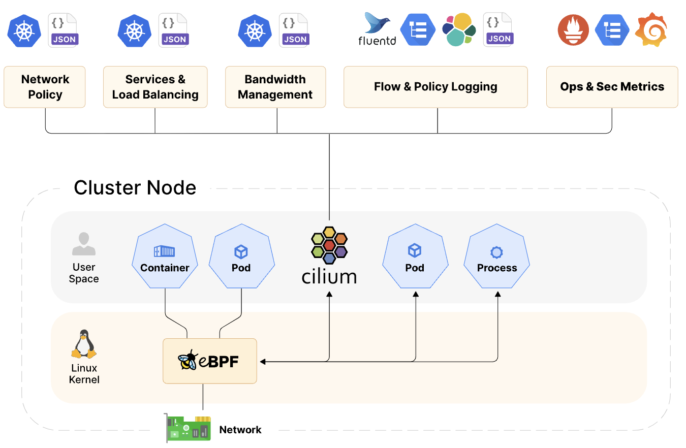
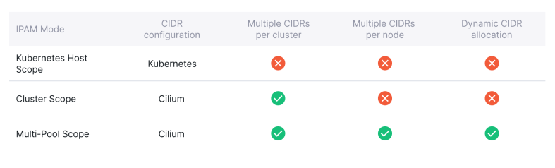
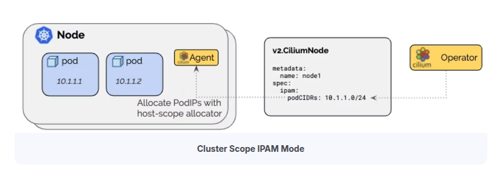

## Cilium

- Cilium은 eBPF 기술을 이용해서 쿠버네티스의 네트워크와 보안 기능을 구현한 쿠버네티스의 CNI Plugin 이다.

- eBPF는 리눅스 커널의 소스코드를 변경하지 않고도 커널 내부에서 샌드박스 프로그램을 실행시켜 커널의 기능을 효율적으로 확장시킬 수 있는 기술이다. [ [BLOG](https://zerotay-blog.vercel.app/4.RESOURCE/KNOWLEDGE/OS/eBPF/) ]

  
  <span style="font-size: smaller; color: grey;"><p>출처: Getting started with Cilium for Kubernetes networking and observability</p></span>

### 1. Cilium 구성요소


<span style="font-size: smaller; color: grey;"><p><a href="https://www.spectrocloud.com/blog/getting-started-with-cilium-for-kubernetes-networking-and-observability">출처: https://velog.io/@baeyuna97/Cilium</a></p></span>

#### Cilium Operator

- Deployment로 배포되어 쿠버네티스 클러스터 단위에서 한 번씩 처리해야 하는 작업을 관리한다.

- Operator는 네트워킹 과정에 깊게 관여하지 않아 일시적인 중단에도 클러스터 동작에 영향을 미치지 않는다.

  - 설정에 따라서 IPAM Pool의 고갈 시 신규 IPAM Pool을 노드에 할당한다.

  - Operator의 장애로 신규 IPAM Pool 할당이 안될 경우 신규 Pod 생성이 실패한다.

#### Cilium CNI Plug-in (Node Level 작업)

- 노드에 Pod가 예약되거나 종료될 때 마다 노드에 구성된 kubelet에 의해 호출된다.

  - Operator, Agent, Envoy와 같이 컨테이너로 동작하지 않고 필요할 때만 kubelet의 자식 프로세스로 실행된다.

  - Binary 파일(`/opt/cni/bin/cilium-cni`)로 각 노드에서 관리된다.

- Pod 생성/삭제 시마다 네트워킹(NIC 설정, IP 할당/해제) 설정과 로드 밸런싱, 네트워크 정책 제공에 필요한 라우팅 경로를 업데이트한다.

#### Cilium Agent (Kernel Level 작업, L3-4 계층)

- 데몬셋으로 배포되어 각 노드에서 파드로 실행된다.

- 쿠버네티스 API 서버의 요청을 수신해 L3-4 계층의 네트워킹, 네트워크 정책 설정, 서비스 부하분산, 모니터링 등을 설정한다.

- 커널에서 컨테이너 네트워크 액세스를 제어하도록 eBPF 프로그램을 관리한다.

- eBPF 프로그램을 커널 내부에 로드하고, 파드의 네트워크 트래픽을 처리하며, 네트워크 정책을 시행한다.

  - Kernel에서 수행될 코드를 ByteCode로 Injection하여 패킷 필터링, 라우팅, 트래픽 모니터링 등을 수행한다.

  - 사용자가 네트워크 정책(L3-4 계층)을 통해 파드간의 트래픽을 제어할 수 있는데, 이 정책이 eBPF Program으로 변환하여 실행된다.

#### Envoy Proxy (UserSpace 작업, L7 계층)

- Cilium L7 계층 관련 기능(Ingress, Gateway API, L7 Network Policies, L7 Protocol Visibility)을 사용하는 경우, Envoy Pod를 이용해 L7 트래픽을 관리한다.

- 요청을 라우팅하고, 로드 밸런싱을 수행하며, 모니터링 및 로깅 기능을 제공한다.

> [!TIP] Cilium Agent & Envoy
>
> - L3-4 계층의 패킷은 Agent에서 관리하고, L7 계층의 패킷은 Envoy에서 관리한다.
> - Cilium은 MetalLB의 지원 없이 직접 LB, Ingress의 External IP 할당을 관리할 수 있다.
> - Envoy는 Ingress에 적용된 규칙에 맞춰 라우팅 하는 기능과 L7 계층 Network Policy를 구현하는데 사용된다.

### 2. 네트워크 구성 정보 : _<span style="font-size: smaller; color: Aquamarine;">cilium host, cilium net, cilium health</span>_


<span style="font-size: smaller; color: grey;"><p><a href="https://arthurchiao.art/blog/ctrip-network-arch-evolution/">출처: Ctrip Network Architecture Evolution in the Cloud Computing Era</a></p></span>

#### cilium_host

- Cilium이 관리하는 호스트 네트워크 인터페이스

- 클러스터 내의 Pod와 외부 네트워크 간의 연결을 처리 (Pod가 외부 네트워크와 통신할 때 이 인터페이스 사용)

- Pod에서 나가는 트래픽과 외부에서 들어오는 트래픽을 처리하는 데 사용

- 외부에서 들어오는 패킷을 Pod로 전달하는 Reverse NAT 기능을 포함

#### cilium_net

- Cilium에서 관리하는 가상 네트워크 인터페이스

- Cilium의 eBPF 프로그램을 통해 네트워크 트래픽을 처리하고 제어

- Pod 간 통신 관리(보안 정책 적용, 패킷 필터링, 네트워크 성능 측정 등)를 위해 cilium_net 사용

- cilium_net 인터페이스는 각 Pod에 대해 생성되며, Pod의 IP 주소와 연결

- 이 인터페이스는 eBPF 프로그램이 패킷을 검사하고 처리할 수 있도록 해준다.

#### cilium_health (lxc_health)

- 컨테이너의 상태 확인에 사용하는 인터페이스

#### lxcxxxx

- 컨테이너에 할당되는 eth 인터페이스와 호스트의 인터페이스와 맵핑되는 가상 인터페이스

#### Control 노드에 할당된 인터페이스 정보 확인

```bash
$ ip -c -br addr show
lo                      UNKNOWN        127.0.0.1/8 ::1/128
eth0                    UP             10.0.2.15/24 metric 100 fd17:625c:f037:2:a00:27ff:fe6b:69c9/64 fe80::a00:27ff:fe6b:69c9/64
eth1                    UP             192.168.10.100/24 fe80::a00:27ff:feec:70c4/64
cilium_net@cilium_host  UP             fe80::d00c:4bff:fef0:e4f2/64
cilium_host@cilium_net  UP             172.20.84.1/32 fe80::987a:bff:fe15:6ee5/64
lxc_health@if6          UP             fe80::e445:eeff:fedc:c972/64
```

## Cilium Networking

- 기존의 전통적인(Standard) 방식의 CNI 기능은 `kube-proxy(iptables)`를 기반으로 동작한다.

- Cilium에서는 "kube-proxy 대체 모드"를 사용하면 kube-proxy 없이도 클러스터 네트워킹을 구현할 수 있다.

- eBPF 기반의 Cilium CNI는 `kube-proxy(iptables)`를 사용하는 환경보다 더 좋은 성능을 보여준다. [ [link](./_docs/Appendix%201.%20What's%20wrong%20with%20legacy%20iptables.md) ]

### 1. cilium이 서로 다른 노드에 있는 Pod를 연결하는 두 가지 방법: _<span style="font-size: smaller; color: Aquamarine;">Encapsulation(VxLAN, Geneve), Native/Direct</span>_

#### 1.1 Encapsulation Routing Mode (Default)

- UDP 기반 캡슐화 프로토콜인 VXLAN 또는 Geneve를 사용하여 모든 노드 간에 터널 메시가 생성된다. [ [link](./_docs/Appendix%202.%20VxLAN%20and%20Geneve.md) ]

- 노드 간 통신 트래픽은 모두 VXLAN 또는 Geneve을 통해서 캡슐화된다.

- Pod 네트워크는 노드 네트워크의 영향을 받지 않기 때문에 환경에 종속되지 않고 간단하게 구성할 수 있는 장점이 있다.

- 캡슐화를 통해 헤더가 추가되면서 패킷의 효율이 미미하게 떨어지는데, 최적의 네트워크 성능 보장이 필요한 경우 Native/Direct 모드가 적합하다.

  
  <span style="font-size: smaller; color: grey;"><p>출처: Kubernetes Networking & Cilium for Network Engineers - An Instruction Manual (ISOVALENT_eBOOK)</p></span>

#### 1.2 Native Routing Mode

- 캡슐화 기능 대신 Cilium의 네트워크 기능을 이용해서 통신한다.

- 각 노드에는 Cilium Agent가 구성되고, Agent는 해당 노드의 Pod들에 대한 네트워크만 관리한다.

- 따라서 다른 노드로 향하는 트래픽은 리눅스 커널의 라우팅 시스템에 위임하여 처리된다.

  
  <span style="font-size: smaller; color: grey;"><p>출처: Kubernetes Networking & Cilium for Network Engineers - An Instruction Manual (ISOVALENT_eBOOK)</p></span>

### 2. 네트워크 엔드포인트(컨테이너) IP 관리를 위한 IPAM (IP Address Management)

- 네트워크 엔드포인트(컨테이너 등)에서 사용할 IP 주소를 할당하고 관리하는 역할을 한다.

- IPAM을 한 번 설정한 상태에서 모드를 변경하는 것은 권장되지 않는다. 새 IPAM 구성으로 새로운 쿠버네티스 클러스터를 생성하는 것이 좋다.

- 배포 환경, 사용자의 요구사항에 따라 다양하게 구성이 가능하도록 7개의 배포 모드를 지원한다. [ [docs](https://docs.cilium.io/en/stable/network/concepts/ipam/) ]

  
  <span style="font-size: smaller; color: grey;"><p>출처: Kubernetes Networking & Cilium for Network Engineers - An Instruction Manual (ISOVALENT_eBOOK)</p></span>

#### 2.1 Kubernetes Host Scope


<span style="font-size: smaller; color: grey;"><p><a href="https://isovalent.com/blog/post/overcoming-kubernetes-ip-address-exhaustion-with-cilium">출처: https://isovalent.com/blog/post/overcoming-kubernetes-ip-address-exhaustion-with-cilium</a></p></span>

- `Kubernetes Controller Manager`가 Node에 할당한 PodCIDR을 사용한다.

- 이 모드는 간단하게 구현이 가능하지만 PodCIDR을 유연하게 관리하는 것은 제약이 많다.

  - 클러스터 전체에 하나의 PodCIDR 구성만 지원한다.

  - 클러스터의 PodCIDR이 고갈되었을 때 클러스터나 개별 노드에 PodCIDR을 추가하는 것이 불가능하다.

  - 초기 클러스터 배포 시 정확하게 노드별 IP 주소 계획을 수립해서 사용해야 한다.

#### 2.2 Cluster Scope IPAM (Default)


<span style="font-size: smaller; color: grey;"><p><a href="https://isovalent.com/blog/post/overcoming-kubernetes-ip-address-exhaustion-with-cilium">출처: https://isovalent.com/blog/post/overcoming-kubernetes-ip-address-exhaustion-with-cilium</a></p></span>

- Kubernetes Host Scope와 동일하게 Node에 할당된 PodCIDR을 활용해 IP를 할당한다.

- Node에 할당된 PodCIDR을 할당하는 주체가 `Kubernetes Controller Manager`가 아닌 `Cilium Operator`가 된다.

- Cluster Scope IPAM의 장점은 여러 CIDR을 할당할 수 있다는 것이다.

- 하지만, 할당된 IP Pool의 주소 고갈 문제를 완전히 해결하지는 못하는 문제는 Kubernetes Host Scope와 동일하다.

#### 2.3 Multi Pool


<span style="font-size: smaller; color: grey;"><p><a href="https://isovalent.com/blog/post/overcoming-kubernetes-ip-address-exhaustion-with-cilium">출처: https://isovalent.com/blog/post/overcoming-kubernetes-ip-address-exhaustion-with-cilium</a></p></span>

- Pod IP Pool을 여러 개 생성한 다음 같은 노드에서 생성되는 Pod에게 다양한 CIDR의 IP를 할당할 수 있게 해준다.

- 필요에 따라 PodCIDR을 노드에 동적으로 추가할 수 있다.

#### 2.4 Cluster Scope IPAM Mode CIDR 확장 및 IP 고갈 상황 테스트

- cluster scope ipam multi cidr 설정 테스트

```yaml
# cilium-values.yaml
---
ipam:
  mode: cluster-pool
  operator:
    clusterPoolIPv4MaskSize: 29
    clusterPoolIPv4PodCIDRList:
      - "172.20.42.0/28"
      - "172.20.84.0/28"
```

```bash
helm repo add cilium https://helm.cilium.io/
helm repo update
helm install cilium cilium/cilium -n kube-system --version 1.17.5 -f cilium-values.yaml
```

```bash
$ cilium config view | grep cluster-pool
cluster-pool-ipv4-cidr                            172.20.42.0/28 172.20.84.0/28
cluster-pool-ipv4-mask-size                       29
ipam                                              cluster-pool
```

- cluster scope ipam cidr 확장 테스트

```yaml
# cilium-values.yaml
ipam:
  mode: cluster-pool
  operator:
    clusterPoolIPv4MaskSize: 29
    clusterPoolIPv4PodCIDRList:
      - "172.20.42.0/28"
      - "172.20.84.0/28"
      - "10.0.0.0/28"
```

```bash
helm upgrade cilium cilium/cilium -n kube-system --version 1.17.5 -f cilium-values.yaml
```

```bash
$ cilium config view | grep cluster-pool
cluster-pool-ipv4-cidr                            172.20.42.0/28 172.20.84.0/28 10.0.0.0/28
cluster-pool-ipv4-mask-size                       29
ipam                                              cluster-pool
```

- node에 할당된 cidr 정보 확인

```bash
$ kubectl get ciliumnode -o jsonpath='{range .items[*]}{.metadata.name}{" "}{.spec.ipam.podCIDRs[*]}{"\n"}{end}' | column -t
cilium-ctr  172.20.84.0/29
cilium-w1   172.20.42.0/29
cilium-w2   172.20.42.8/29
```

- cilium agent 디버깅용 CLI로 남은 IP 수량 확인

```bash
# NETSHOOT_CILIUM_AGENT_W1=$(kubectl -n kube-system get po -l k8s-app=cilium --field-selector spec.nodeName=cilium-w1 -o name)
# NETSHOOT_CILIUM_AGENT_W2=$(kubectl -n kube-system get po -l k8s-app=cilium --field-selector spec.nodeName=cilium-w2 -o name)
$ kubectl -n kube-system exec -ti $NETSHOOT_CILIUM_AGENT_W1 -c cilium-agent -- cilium-dbg status | grep IPAM
IPAM:                    IPv4: 3/6 allocated from 172.20.42.0/29,
$ kubectl -n kube-system exec -ti $NETSHOOT_CILIUM_AGENT_W2 -c cilium-agent -- cilium-dbg status | grep IPAM
IPAM:                    IPv4: 3/6 allocated from 172.20.42.8/29,
```

- 노드에 할당된 3개의 ip 정보 확인

```bash
$ kubectl -n kube-system exec -ti $NETSHOOT_CILIUM_AGENT_W1 -c cilium-agent -- cilium-dbg status --verbose | grep -A6 "Allocated"
Allocated addresses:
  172.20.42.2 (router)
  172.20.42.3 (health)
  172.20.42.5 (kube-system/coredns-674b8bbfcf-xcvrr)
```

- router 인터페이스는 호스트 노드에 할당된 인터페이스의 IP가 맵핑되고, health 인터페이스가 호스트의 lxc_health 인터페이스의 IP와 맵핑된다.

  ```bash
  $ sshpass -p 'vagrant' ssh -o StrictHostKeyChecking=no vagrant@cilium-w1 ip -c -br addr show
  ...
  cilium_host@cilium_net  UP             172.20.42.2/32 fe80::4cb3:63ff:fe9a:4b8b/64
  lxc_health@if6          UP             fe80::c07d:afff:fe65:d624/64
  lxc31994ffe5fef@if8     UP             fe80::5c67:79ff:fec9:4eb3/64
  ```

- coredns : 쿠버네티스의 DNS 역할을 수행하는 파드

  ```bash
  $ k get po -A -owide | grep coredns | grep cilium-w1
  kube-system   coredns-674b8bbfcf-xcvrr             1/1     Running   1 (22m ago)   34h    172.20.42.5      cilium-w1    <none>           <none>
  ```

- 10개의 Pod 배포 후 상태 확인

```bash
$ kubectl create deployment netshoot --image nginx --replicas 10
deployment.apps/netshoot created
```

```bash
$ kubectl get po -o wide
NAME                        READY   STATUS              RESTARTS   AGE     IP             NODE        NOMINATED NODE   READINESS GATES
netshoot-5fbc6f4997-99djz   1/1     Running             0          2m34s   172.20.42.9    cilium-w2   <none>           <none>
netshoot-5fbc6f4997-9h945   1/1     Running             0          2m34s   172.20.42.10   cilium-w2   <none>           <none>
netshoot-5fbc6f4997-9h9vw   0/1     ContainerCreating   0          2m34s   <none>         cilium-w2   <none>           <none>
netshoot-5fbc6f4997-b9mdk   0/1     ContainerCreating   0          2m34s   <none>         cilium-w2   <none>           <none>
netshoot-5fbc6f4997-rdbg8   1/1     Running             0          2m34s   172.20.42.4    cilium-w1   <none>           <none>
netshoot-5fbc6f4997-t84kf   0/1     ContainerCreating   0          2m34s   <none>         cilium-w1   <none>           <none>
netshoot-5fbc6f4997-tq5tt   0/1     ContainerCreating   0          2m34s   <none>         cilium-w1   <none>           <none>
netshoot-5fbc6f4997-wpf8j   1/1     Running             0          2m34s   172.20.42.1    cilium-w1   <none>           <none>
netshoot-5fbc6f4997-xjft8   1/1     Running             0          2m34s   172.20.42.11   cilium-w2   <none>           <none>
netshoot-5fbc6f4997-zxzfs   1/1     Running             0          2m34s   172.20.42.6    cilium-w1   <none>           <none>
```

- 배포 완료되지 못한 `netshoot-5fbc6f4997-tq5tt` 파드의 이벤트 정보 확인

```bash
$ kubectl describe po netshoot-5fbc6f4997-tq5tt  | grep -A10 Events
Events:
  Type     Reason                  Age                  From               Message
  ----     ------                  ----                 ----               -------
  Normal   Scheduled               5m31s                default-scheduler  Successfully assigned default/netshoot-5fbc6f4997-tq5tt to cilium-w1
  Warning  FailedCreatePodSandBox  5m30s                kubelet            Failed to create pod sandbox: rpc error: code = Unknown desc = failed to setup network for sandbox "d0146b59d6be4c9e7fdd3e2d1fbba7b999d4c8bddf99f9248168bea00062d0d8": plugin type="cilium-cni" failed (add): unable to allocate IP via local cilium agent: [POST /ipam][502] postIpamFailure "range is full"
  ...
```

- cilium agent의 디버깅 CLI로 남은 IP 수량 확인

```bash
$ kubectl -n kube-system exec -ti $NETSHOOT_CILIUM_AGENT_W1 -c cilium-agent -- cilium-dbg status | grep IPAM
IPAM:                    IPv4: 6/6 allocated from 172.20.42.0/29
$ kubectl -n kube-system exec -ti $NETSHOOT_CILIUM_AGENT_W2 -c cilium-agent -- cilium-dbg status | grep IPAM
IPAM:                    IPv4: 6/6 allocated from 172.20.42.8/29,
```

```bash
$ kubectl -n kube-system exec -ti $NETSHOOT_CILIUM_AGENT_W1 -c cilium-agent -- cilium-dbg status --verbose | grep -A6 "Allocated"
Allocated addresses:
  172.20.42.1 (default/netshoot-5fbc6f4997-wpf8j)
  172.20.42.2 (router)
  172.20.42.3 (health)
  172.20.42.4 (default/netshoot-5fbc6f4997-rdbg8)
  172.20.42.5 (kube-system/coredns-674b8bbfcf-xcvrr [restored])
  172.20.42.6 (default/netshoot-5fbc6f4997-zxzfs)
```

#### 2.5 Multi IPAM Mode CIDR 자동 확장 / CIDR 선택 배포 테스트

- multi-pool ipam cidr 설정

```yaml
# cilium-values.yaml
---
ipam:
  mode: multi-pool
  operator:
    autoCreateCiliumPodIPPools:
      default:
        ipv4:
          cidrs: 172.20.0.0/16
          maskSize: 28
```

<!--
- multi pool ipam으로 교체

```bash
# cilium 삭제
helm uninstall cilium -n kube-system
# Control node interface, iptables 초기화
for i in cilium lxc ; do echo ">> node : cilium-ctr <<"; ip link | grep $i | awk '{print $2}' | cut -d@ -f1 | xargs -I {} ip link del dev {} ; echo; done
iptables-save | grep -v KUBE | grep -v CILIUM | iptables-restore
iptables-save
# Worker node interface, iptables 초기화
for i in w1 w2 ; do echo ">> node : cilium-$i <<"; sshpass -p 'vagrant' ssh -o StrictHostKeyChecking=no vagrant@cilium-$i sudo ip link del cilium_net ; echo; done
for i in w1 w2 ; do echo ">> node : cilium-$i <<"; sshpass -p 'vagrant' ssh -o StrictHostKeyChecking=no vagrant@cilium-$i sudo ip link del cilium_host ; echo; done
for i in w1 w2 ; do echo ">> node : cilium-$i <<"; sshpass -p 'vagrant' ssh -o StrictHostKeyChecking=no vagrant@cilium-$i "sudo iptables-save | grep -v KUBE | grep -v CILIUM | sudo iptables-restore" ; echo; done
for i in w1 w2 ; do echo ">> node : cilium-$i <<"; sshpass -p 'vagrant' ssh -o StrictHostKeyChecking=no vagrant@cilium-$i "sudo iptables-save" ; echo; done
# Vm Reload
vagrant reload
```
-->

```bash
helm install cilium cilium/cilium -n kube-system --version 1.17.5 -f cilium-values.yaml
```

- multi pool ipam 배포 상태 확인

```bash
$ cilium config view | grep multi-pool
ipam                                              multi-pool
$ cilium config view | grep auto-create
auto-create-cilium-pod-ip-pools                   default=ipv4-cidrs:172.20.0.0/16;ipv4-mask-size:28
```

- node에 할당된 cidr 정보 확인

```bash
$ for i in ctr w1 w2 ; do echo ">> node : cilium-$i <<"; kubectl get ciliumnodes cilium-$i -o yaml | yq .spec.ipam.pools.allocated ; echo; done
>> node : cilium-ctr <<
[
  {
    "cidrs": [
      "172.20.0.0/28",
      "172.20.0.16/28"
    ],
    "pool": "default"
  }
]

>> node : cilium-w1 <<
[
  {
    "cidrs": [
      "172.20.0.48/28",
      "172.20.0.80/28"
    ],
    "pool": "default"
  }
]

>> node : cilium-w2 <<
[
  {
    "cidrs": [
      "172.20.0.32/28",
      "172.20.0.64/28"
    ],
    "pool": "default"
  }
]
```

- 추가 pod ip pool 배포

```yaml
# cilium_ip_pool_vac.yaml
apiVersion: cilium.io/v2alpha1
kind: CiliumPodIPPool
metadata:
  name: vac
spec:
  ipv4:
    cidrs:
      - 10.100.0.0/16
    maskSize: 29
# cilium_ip_pool_no.yaml
apiVersion: cilium.io/v2alpha1
kind: CiliumPodIPPool
metadata:
  name: no-engine
spec:
  ipv4:
    cidrs:
      - 10.200.0.0/16
    maskSize: 29
```

```bash
kubectl apply -f cilium_ip_pool_vac.yaml
kubectl apply -f cilium_ip_pool_no.yaml
```

- default pod ip pool 배포

```bash
$ kubectl create deployment netshoot --image nginx --replicas 2
$ kubectl get po -owide
NAME                        READY   STATUS    RESTARTS   AGE   IP            NODE        NOMINATED NODE   READINESS GATES
netshoot-5fbc6f4997-2dd4z   1/1     Running   0          92s   172.20.0.77   cilium-w2   <none>           <none>
netshoot-5fbc6f4997-4tmch   1/1     Running   0          92s   172.20.0.89   cilium-w1   <none>           <none>
```

- annotation 이용 특정 IP Pool 이용 배포

```yaml
# deploy_vac.yaml
apiVersion: apps/v1
kind: Deployment
metadata:
  name: nginx-vac
spec:
  selector:
    matchLabels:
      app: nginx-vac
  replicas: 2
  template:
    metadata:
      labels:
        app: nginx-vac
      annotations:
        ipam.cilium.io/ip-pool: vac
    spec:
      containers:
        - name: nginx
          image: nginx
          ports:
            - containerPort: 80
---
# deploy_no.yaml
apiVersion: apps/v1
kind: Deployment
metadata:
  name: nginx-no
spec:
  selector:
    matchLabels:
      app: nginx-no
  replicas: 2
  template:
    metadata:
      labels:
        app: nginx-no
      annotations:
        ipam.cilium.io/ip-pool: no-engine
    spec:
      containers:
        - name: nginx
          image: nginx
          ports:
            - containerPort: 80
```

- 배포 결과 확인

```bash
$ kubectl get pods -o wide
NAME                         READY   STATUS    RESTARTS   AGE     IP            NODE        NOMINATED NODE   READINESS GATES
netshoot-5fbc6f4997-2dd4z    1/1     Running   0          6m19s   172.20.0.77   cilium-w2   <none>           <none>
netshoot-5fbc6f4997-4tmch    1/1     Running   0          6m19s   172.20.0.89   cilium-w1   <none>           <none>
nginx-no-76df566dfb-4kfpx    1/1     Running   0          20s     10.200.0.11   cilium-w1   <none>           <none>
nginx-no-76df566dfb-d6v2j    1/1     Running   0          20s     10.200.0.3    cilium-w2   <none>           <none>
nginx-vac-65889dbdc9-75rr6   1/1     Running   0          82s     10.100.0.14   cilium-w2   <none>           <none>
nginx-vac-65889dbdc9-dsp56   1/1     Running   0          82s     10.100.0.6    cilium-w1   <none>           <none>
```

- 노드 마다 할당된 CIDR 풀 확인

```bash
$ for i in ctr w1 w2 ; do echo ">> node : cilium-$i <<"; kubectl get ciliumnodes cilium-$i -o yaml | yq .spec.ipam.pools.allocated ; echo; done
>> node : cilium-ctr <<
[
  {
    "cidrs": [
      "172.20.0.0/28",
      "172.20.0.16/28"
    ],
    "pool": "default"
  }
]

>> node : cilium-w1 <<
[
  {
    "cidrs": [
      "172.20.0.48/28",
      "172.20.0.80/28"
    ],
    "pool": "default"
  },
  {
    "cidrs": [
      "10.200.0.8/29"
    ],
    "pool": "no-engine"
  },
  {
    "cidrs": [
      "10.100.0.0/29"
    ],
    "pool": "vac"
  }
]

>> node : cilium-w2 <<
[
  {
    "cidrs": [
      "172.20.0.32/28",
      "172.20.0.64/28"
    ],
    "pool": "default"
  },
  {
    "cidrs": [
      "10.200.0.0/29"
    ],
    "pool": "no-engine"
  },
  {
    "cidrs": [
      "10.100.0.8/29"
    ],
    "pool": "vac"
  }
]
```

- pod ip pool 동적 확장 테스트를 위해 `nginx-vac` deployment의 replicas 개수를 20개로 수정

```bash
$ kubectl scale deployment nginx-vac --replicas=20
```

```bash
$ kubectl get po -owide
NAME                         READY   STATUS    RESTARTS   AGE     IP            NODE        NOMINATED NODE   READINESS GATES
netshoot-5fbc6f4997-2dd4z    1/1     Running   0          14m     172.20.0.77   cilium-w2   <none>           <none>
netshoot-5fbc6f4997-4tmch    1/1     Running   0          14m     172.20.0.89   cilium-w1   <none>           <none>
nginx-no-76df566dfb-4kfpx    1/1     Running   0          8m30s   10.200.0.11   cilium-w1   <none>           <none>
nginx-no-76df566dfb-d6v2j    1/1     Running   0          8m30s   10.200.0.3    cilium-w2   <none>           <none>
nginx-vac-65889dbdc9-2fz58   1/1     Running   0          39s     10.100.0.28   cilium-w2   <none>           <none>
nginx-vac-65889dbdc9-4h48r   1/1     Running   0          6m51s   10.100.0.1    cilium-w1   <none>           <none>
nginx-vac-65889dbdc9-75rr6   1/1     Running   0          9m32s   10.100.0.14   cilium-w2   <none>           <none>
nginx-vac-65889dbdc9-7q2zr   1/1     Running   0          39s     10.100.0.30   cilium-w2   <none>           <none>
nginx-vac-65889dbdc9-96bcx   1/1     Running   0          6m51s   10.100.0.13   cilium-w2   <none>           <none>
nginx-vac-65889dbdc9-9jfcp   1/1     Running   0          6m51s   10.100.0.11   cilium-w2   <none>           <none>
nginx-vac-65889dbdc9-bdj98   1/1     Running   0          39s     10.100.0.22   cilium-w1   <none>           <none>
nginx-vac-65889dbdc9-bttzt   1/1     Running   0          39s     10.100.0.20   cilium-w1   <none>           <none>
nginx-vac-65889dbdc9-chbhz   1/1     Running   0          6m51s   10.100.0.10   cilium-w2   <none>           <none>
nginx-vac-65889dbdc9-ck4q8   1/1     Running   0          39s     10.100.0.27   cilium-w2   <none>           <none>
nginx-vac-65889dbdc9-cqgmd   1/1     Running   0          6m51s   10.100.0.2    cilium-w1   <none>           <none>
nginx-vac-65889dbdc9-dsp56   1/1     Running   0          9m32s   10.100.0.6    cilium-w1   <none>           <none>
nginx-vac-65889dbdc9-jlchn   1/1     Running   0          39s     10.100.0.9    cilium-w2   <none>           <none>
nginx-vac-65889dbdc9-l2nz5   1/1     Running   0          39s     10.100.0.29   cilium-w2   <none>           <none>
nginx-vac-65889dbdc9-ncsmb   1/1     Running   0          39s     10.100.0.21   cilium-w1   <none>           <none>
nginx-vac-65889dbdc9-nr7zv   1/1     Running   0          6m51s   10.100.0.3    cilium-w1   <none>           <none>
nginx-vac-65889dbdc9-rggpj   1/1     Running   0          6m51s   10.100.0.12   cilium-w2   <none>           <none>
nginx-vac-65889dbdc9-s9s6w   1/1     Running   0          39s     10.100.0.4    cilium-w1   <none>           <none>
nginx-vac-65889dbdc9-vn4bv   1/1     Running   0          39s     10.100.0.17   cilium-w1   <none>           <none>
nginx-vac-65889dbdc9-xsz9h   1/1     Running   0          6m51s   10.100.0.5    cilium-w1   <none>           <none>
```

```bash
$ for i in ctr w1 w2 ; do echo ">> node : cilium-$i <<"; kubectl get ciliumnodes cilium-$i -o yaml | yq .spec.ipam.pools.allocated ; echo; done
>> node : cilium-ctr <<
[
  {
    "cidrs": [
      "172.20.0.0/28",
      "172.20.0.16/28"
    ],
    "pool": "default"
  }
]

>> node : cilium-w1 <<
[
  {
    "cidrs": [
      "172.20.0.48/28",
      "172.20.0.80/28"
    ],
    "pool": "default"
  },
  {
    "cidrs": [
      "10.200.0.8/29"
    ],
    "pool": "no-engine"
  },
  {
    "cidrs": [
      "10.100.0.0/29",
      "10.100.0.16/29"  # 추가된 cidr
    ],
    "pool": "vac"
  }
]

>> node : cilium-w2 <<
[
  {
    "cidrs": [
      "172.20.0.32/28",
      "172.20.0.64/28"
    ],
    "pool": "default"
  },
  {
    "cidrs": [
      "10.200.0.0/29"
    ],
    "pool": "no-engine"
  },
  {
    "cidrs": [
      "10.100.0.24/29",   # 추가된 cidr
      "10.100.0.8/29"
    ],
    "pool": "vac"
  }
]
```


### Cilium 설정 및 정보 조회

#### 1. 기본 명령어 설정

- 마스터 노드의 NAME을 CILIUMPOD0 변수에 저장한다.

- cilium agent 내부에서 실행 가능한 cilium 명령어를 쓸 수 있도록 c0 alias를 생성한다.

```bash
# /etc/profile
export CILIUMPOD0=$(kubectl get -l k8s-app=cilium pods -n kube-system --field-selector spec.nodeName=control  -o jsonpath='{.items[0].metadata.name}')
export CILIUMPOD1=$(kubectl get -l k8s-app=cilium pods -n kube-system --field-selector spec.nodeName=node01  -o jsonpath='{.items[0].metadata.name}')
export CILIUMPOD2=$(kubectl get -l k8s-app=cilium pods -n kube-system --field-selector spec.nodeName=node02  -o jsonpath='{.items[0].metadata.name}')
alias c0="kubectl exec -it $CILIUMPOD0 -n kube-system -c cilium-agent -- cilium"
alias c1="kubectl exec -it $CILIUMPOD1 -n kube-system -c cilium-agent -- cilium"
alias c2="kubectl exec -it $CILIUMPOD2 -n kube-system -c cilium-agent -- cilium"
alias c0bpf="kubectl exec -it $CILIUMPOD0 -n kube-system -c cilium-agent -- bpftool"
alias c1bpf="kubectl exec -it $CILIUMPOD1 -n kube-system -c cilium-agent -- bpftool"
alias c2bpf="kubectl exec -it $CILIUMPOD2 -n kube-system -c cilium-agent -- bpftool"
```

```bash
source /etc/profile
c0 status --verbose
```

#### 2. Cilium Nodes(CRD) 정보 조회

- CILIUMINTERNALIP : Cilium에서 사용되는 내부 IP 주소로 Cilium이 네트워크 기능을 제공하기 위해 각 노드에 할당한 IP 주소다.

- INTERNALIP : 노드의 실제 내부 IP 주소로 Pod간 통신에 사용된다.

```bash
$ kubectl get ciliumnodes
NAME      CILIUMINTERNALIP   INTERNALIP   AGE
control   10.100.0.211       10.0.0.10    40h
node01    10.100.1.118       10.0.0.11    40h
node02    10.100.2.249       10.0.0.12    40h
```

- `CILIUMINTERNALIP는` 실제로 각 노드에서 Proxy로 사용되는 IP로 각 노드에서 실행되고 있는 cilium agent 설정을 살펴보면 해당 IP를 볼 수 있다.

```bash
$ c0 status | grep "Proxy Status"
Proxy Status:            OK, ip 10.100.0.211, 0 redirects active on ports 10000-20000, Envoy: external
```

- 노드의 호스트의 인터페이스 목록을 보면 cilium이 할당한 `cilium_host` 인터페이스에 `CILIUMINTERNALIP가` 할당되어 있는 것을 볼 수 있다.

```bash
$ ip -br -c addr
lo                      UNKNOWN        127.0.0.1/8 ::1/128
enp0s3                  UP             10.0.0.10/16 fe80::a00:27ff:fe64:aed2/64
cilium_net@cilium_host  UP             fe80::80d0:f8ff:fe6c:ecd1/64
cilium_host@cilium_net  UP             10.100.0.211/32 fe80::a497:b5ff:fe42:67af/64
lxc_health@if5          UP             fe80::38d8:e1ff:fe8e:59eb/64
```

#### 3. Cilium Endpoints(CRD) 정보 조회

3.1 Cilium Endpoints

- Cilium은 컨테이너에 IP 주소를 할당하는 IPAM 기능을 제공한다.

- (확인필요) 여러 개의 Application 컨테이너가 IP 주소를 공유할 수 있는데 같은 IP 주소를 가진 컨테이너 그룹의 관리를 위해 Endpoint

- `c0 endpoint list` 명령으로 조회 시 ENPOINT 정보와 POLICY, IDENTITY, LABELS, IP를 확인할 수 있다.

  - ENDPOINT : 엔드포인트의 고유 ID

  - IDENTITY : Cilium에서 할당한 보안 식별자(SECURITY IDENTITY)로 정책 적용 및 트래픽 필터링에 사용된다.

    - IDENTITY는 cilium이 각 ip에 부여하는 보안 정체성이다.

    - IDENTITY는 엔드포인트 간의 연결을 보장하는 역할을 수행한다.

    - IDENTITY는 파드, 컨테이너가 가지고 있는 레이블에 의해 정의된다.

    - 같은 레이블을 가진 모든 엔프로인트는 같은 정체성을 공유하게 된다.

    - IDENTITY가 같은 엔드포인트에게는 개별 적으로 보안 정책을 적용하지 않고 IDENTITY에 보안 정책을 적용해 동일한 정책을 적용할 수 있다.

```bash
$ c0 endpoint list
ENDPOINT   POLICY (ingress)   POLICY (egress)   IDENTITY   LABELS (source:key[=value])                                   IPv6   IPv4           STATUS
           ENFORCEMENT        ENFORCEMENT
331        Disabled           Disabled          4          reserved:health                                                      10.100.0.148   ready
2324       Disabled           Disabled          1          k8s:node-role.kubernetes.io/control-plane                                           ready
                                                           k8s:node.kubernetes.io/exclude-from-external-load-balancers
                                                           reserved:host

$ c1 endpoint list
ENDPOINT   POLICY (ingress)   POLICY (egress)   IDENTITY   LABELS (source:key[=value])                                                  IPv6   IPv4           STATUS
           ENFORCEMENT        ENFORCEMENT
31         Enabled            Disabled          55374      k8s:app.kubernetes.io/name=argocd-dex-server                                        10.100.1.185   ready
                                                           k8s:io.cilium.k8s.namespace.labels.kubernetes.io/metadata.name=argocd
                                                           k8s:io.cilium.k8s.policy.cluster=default
                                                           k8s:io.cilium.k8s.policy.serviceaccount=argocd-dex-server
                                                           k8s:io.kubernetes.pod.namespace=argocd
...
2991       Disabled           Disabled          46404      k8s:io.cilium.k8s.namespace.labels.kubernetes.io/metadata.name=kube-system          10.100.1.209   ready
                                                           k8s:io.cilium.k8s.policy.cluster=default
                                                           k8s:io.cilium.k8s.policy.serviceaccount=coredns
                                                           k8s:io.kubernetes.pod.namespace=kube-system
                                                           k8s:k8s-app=kube-dns
3424       Disabled           Disabled          46404      k8s:io.cilium.k8s.namespace.labels.kubernetes.io/metadata.name=kube-system          10.100.1.200   ready
                                                           k8s:io.cilium.k8s.policy.cluster=default
                                                           k8s:io.cilium.k8s.policy.serviceaccount=coredns
                                                           k8s:io.kubernetes.pod.namespace=kube-system
                                                           k8s:k8s-app=kube-dns
```

- cilium bpf에서 관리되는 Endpoint 정보를 보면 ENDPOINT ID와 SECRUTIRY ID를 확인할 수 있다.

```bash
$ c0 bpf endpoint list
IP ADDRESS       LOCAL ENDPOINT   INFO
10.0.0.10:0      (localhost)
10.100.0.211:0   (localhost)
10.100.0.148:0   id=331   sec_id=4     flags=0x0000 ifindex=6   mac=BE:EE:B4:F3:41:63 nodemac=3A:D8:E1:8E:59:EB parent_ifindex=0

$ c1 bpf endpoint list
IP ADDRESS       LOCAL ENDPOINT INFO
10.100.1.200:0   id=3424  sec_id=46404 flags=0x0000 ifindex=10  mac=36:BC:DE:4A:B7:B9 nodemac=4A:B2:F8:A2:6C:65 parent_ifindex=0
10.100.1.119:0   id=158   sec_id=4     flags=0x0000 ifindex=22  mac=42:61:90:C5:7B:DF nodemac=82:00:61:A2:46:1E parent_ifindex=0
10.100.1.209:0   id=2991  sec_id=46404 flags=0x0000 ifindex=12  mac=7A:5E:4C:41:D1:F2 nodemac=0A:9B:88:4F:A7:4F parent_ifindex=0
10.100.1.28:0    id=292   sec_id=8161  flags=0x0000 ifindex=18  mac=86:7E:0B:05:F3:5F nodemac=5E:36:2B:8C:F1:FA parent_ifindex=0
10.0.0.11:0      (localhost)
10.100.1.91:0    id=104   sec_id=5906  flags=0x0000 ifindex=14  mac=F6:1F:11:C9:2E:2B nodemac=72:22:1E:80:7E:55 parent_ifindex=0
10.100.1.220:0   id=1299  sec_id=7784  flags=0x0000 ifindex=6   mac=BA:96:ED:3F:5A:BC nodemac=0E:7C:C2:2A:D7:DA parent_ifindex=0
10.100.1.118:0   (localhost)
10.100.1.185:0   id=31    sec_id=55374 flags=0x0000 ifindex=20  mac=1E:B9:7E:C0:DD:50 nodemac=9E:44:43:D2:97:1B parent_ifindex=0
10.100.1.36:0    id=38    sec_id=4760  flags=0x0000 ifindex=16  mac=1A:86:D3:21:8B:AB nodemac=0E:D8:21:10:BF:A2 parent_ifindex=0
```

3.2 Cilium Endpoints(CRD) 정보 조회

- `ciliumendpoints` CRD 명칭으로 정보를 검색하면 위에서 확인한 `SECURITY IDENTITY` 정보를 확인할 수 있다.

- SECURITY IDENTITY : Cilium에서 할당한 보안 식별자로 정책 적용 및 트래픽 필터링에 사용된다.

- IPV4 : 실제 Pod에 할당된 IP다.

```bash
$ kubectl get ciliumendpoints -A
NAMESPACE       NAME                                                SECURITY IDENTITY   ENDPOINT STATE   IPV4           IPV6
argocd          argocd-application-controller-0                     7784                ready            10.100.1.220
argocd          argocd-applicationset-controller-655cc58ff8-b8nsr   32701               ready            10.100.2.21
argocd          argocd-dex-server-7d9dfb4fb8-8mmc9                  55374               ready            10.100.1.185
argocd          argocd-notifications-controller-6c6848bc4c-tsfc2    9606                ready            10.100.2.122
argocd          argocd-redis-656c79549c-xvdrj                       8161                ready            10.100.1.28
argocd          argocd-repo-server-856b768fd9-k7h5j                 4329                ready            10.100.2.32
argocd          argocd-server-99c485944-fsbht                       30057               ready            10.100.2.222
ingress-nginx   ingress-nginx-controller-7bd4bbb674-lk679           49866               ready            10.100.2.188
kube-system     coredns-668d6bf9bc-jqkqh                            46404               ready            10.100.1.209
kube-system     coredns-668d6bf9bc-lv52b                            46404               ready            10.100.1.200
kube-system     hubble-relay-646f5c4cb7-9bjk7                       4760                ready            10.100.1.36
kube-system     hubble-ui-76d4965bb6-zbvb7                          5906                ready            10.100.1.91
```

#### 4. Cilium Identites 에서 관리하는 정보

- Cilium Endpoints에서 조회된 `SECURITY IDENTITY` 값이 `Identites`에서 확인 된다.

```bash
$ kubectl get ciliumidentities
NAME    NAMESPACE       AGE
30057   argocd          40h
32701   argocd          40h
4329    argocd          40h
46404   kube-system     40h
4760    kube-system     40h
49866   ingress-nginx   40h
55374   argocd          40h
5906    kube-system     40h
7784    argocd          40h
8161    argocd          40h
9606    argocd          40h
```

#### 5. KubeProxyReplacement 설정

- True : kube-proxy를 대체해서 cilium이 서비스 트래픽을 처리하는 설정

- enp0s3 : Cilium Agent가 사용 중인 네트워크 인터페이스 정보

- 10.0.0.10 : 인터페이스에 할당된 IP 주소

- Direct Routing : 클러스터 내의 서비스 트래픽이 직접 파드에 전달되는 설정, Cilium이 BPF를 사용하여 패킷을 직접 필터링하고 처리

```bash
$ c0 status | grep KubeProxyReplacement
KubeProxyReplacement:   True   [enp0s3   10.0.0.10 fe80::a00:27ff:fe64:aed2 (Direct Routing)]
```

#### 6. Routing 설정

- Network : Native

  - Kubernetes 클러스터 내에서 사용하는 네트워크 라우팅 방식

  - Cilium이 Kubernetes의 네트워킹 스택과 통합되어 IP 패킷을 직접 처리하고, Kubernetes API를 통해 서비스를 관리하는 방식

- Host : BPF

  - Cilium이 호스트 시스템에서 패킷을 처리하는 방법

```bash
$ c0 status | grep Routing
Routing:                Network: Native   Host: BPF
```

#### 7. Masquerading 설정

- BPF : BPF를 이용해서 패킷 출발지 IP를 변경하는데 사용하는 설정

- enp0s3 : Cilium이 Masquerading을 적용하는 대상 인터페이스

- 10.0.0.0/16 : Masquerading을 적용되는 대상 CIDR

```bash
$ c0 status | grep Masquerading
Masquerading:           BPF   [enp0s3]   10.0.0.0/16 [IPv4: Enabled, IPv6: Disabled]
```

#### 8. Proxy Status 설정

- OK : Proxy 상태 정상

- ip 10.100.0.211 : Proxy 내부 IP 주소

- 0 redirects active on ports 10000-20000 : 10000번에서 20000번 포트 간에 활성화된 리다이렉트가 없음

- Envoy external : Envoy 프록시가 외부 환경에서 실행되도록 설정되어 있음

```bash
$ c0 status | grep "Proxy Status"
Proxy Status:            OK, ip 10.100.0.211, 0 redirects active on ports 10000-20000, Envoy: external
```

#### 9. BPF Maps

- BPF Maps : Cilium이 BPF를 활용하여 작업하면서 네트워크 트래픽, 상태 정보, 라우팅 정보 등 여러 정보를 저장하는 데 사용한다.

- Dynamic Sizing On : BPF 맵의 크기가 동적으로 조정

- Ratio: 0.002500 : BPF 맵의 최적화 비율

```bash
$ c0 status --verbose | grep BPF
BPF Maps:   dynamic sizing: on (ratio: 0.002500)
```

#### 10. Cilium Service List

- Frontend : 클라이언트가 접근하는 서비스의 IP 주소와 포트

- Service Type : Cluster IP, NodePort, LoadBalancer

- Backend : 실제 트래픽이 전달되는 백엔드 IP 주소와 포트 (서비스에 직접 연결되어 있는 Endpoint(Pod) 정보)

```bash
$ c0 service list
ID   Frontend                  Service Type   Backend
1    10.200.59.40:7000/TCP     ClusterIP      1 => 10.100.2.21:7000/TCP (active)
2    10.200.59.40:8080/TCP     ClusterIP      1 => 10.100.2.21:8080/TCP (active)
3    10.200.209.77:5556/TCP    ClusterIP      1 => 10.100.1.185:5556/TCP (active)
4    10.200.209.77:5557/TCP    ClusterIP      1 => 10.100.1.185:5557/TCP (active)
5    10.200.209.77:5558/TCP    ClusterIP      1 => 10.100.1.185:5558/TCP (active)
6    10.200.11.27:8082/TCP     ClusterIP      1 => 10.100.1.220:8082/TCP (active)
7    10.200.215.80:9001/TCP    ClusterIP      1 => 10.100.2.122:9001/TCP (active)
8    10.200.120.124:6379/TCP   ClusterIP      1 => 10.100.1.28:6379/TCP (active)
9    10.200.54.249:8081/TCP    ClusterIP      1 => 10.100.2.32:8081/TCP (active)
10   10.200.54.249:8084/TCP    ClusterIP      1 => 10.100.2.32:8084/TCP (active)
11   10.200.158.229:80/TCP     ClusterIP      1 => 10.100.2.222:8080/TCP (active)
12   10.200.158.229:443/TCP    ClusterIP      1 => 10.100.2.222:8080/TCP (active)
13   10.0.250.0:80/TCP         LoadBalancer   1 => 10.100.2.222:8080/TCP (active)
14   10.0.250.0:443/TCP        LoadBalancer   1 => 10.100.2.222:8080/TCP (active)
...
```

- `kubectl get svc` 서비스 목록 조회 시 실제 할당된 IP 정보 조회 가능

```bash
$ kubectl get svc -A | grep argocd-server
argocd          argocd-server                             LoadBalancer   10.200.158.229   10.0.250.0    80:31690/TCP,443:30195/TCP   2d8h
```

- `BACKEND ADDRESS`는 LB 타입 서비스가 트래픽을 받은 후 전달할 TARGET POD의 IP다.

```bash
$ kubectl get po -n argocd -o wide | grep 10.100.2.222
argocd-server-99c485944-fsbht                       1/1     Running   1 (2d4h ago)   2d8h   10.100.2.222   node02   <none>           <none>
```

#### 11. Cilium이 관리하는 로드밸런싱 정보

- SERVICE ADDRESS : 클라이언트가 접근하는 서비스의 IP 주소와 포트

- BACKEND ADDRESS : 실제 트래픽이 전달되는 백엔드 IP 주소와 포트 (서비스에 직접 연결되어 있는 Endpoint(Pod) 정보)

- (REVNAT_ID) : 해당 주소의 고유 식별자 → `c0 bpf lb list --revnat` 조회 시 ID 값 확인 가능

- 서비스 유형 :

  - [ClusterIP, non-routable] : 클러스터 내부에서만 접근 가능한 서비스, 외부에서 접근 제한

  - [NodePort] : 클러스터 외부에서도 접근 가능한 서비스, 클러스터 내 모든 노드에서 트래픽 수신 가능

  - [NodePort, Local, two-scopes, non-routable] : 해당 노드에 있는 파드로만 트래픽 전달

  - [LoadBalancer] : 클러스터 외부에서도 접근 가능한 서비스, 클러스터 내 모든 노드의 파드로 트래픽 분산

  - [LoadBalancer, Local, two-scopes] : 로드밸런서가 트래픽을 보낸 해당 노드의 파드로만 전달

```bash
c0 bpf lb list
SERVICE ADDRESS               BACKEND ADDRESS (REVNAT_ID) (SLOT)
10.200.215.80:9001/TCP (1)    10.100.2.122:9001/TCP (7) (1)
10.200.201.226:443/TCP (1)    10.100.2.188:443/TCP (23) (1)
10.200.54.249:8081/TCP (1)    10.100.2.32:8081/TCP (9) (1)
10.200.209.77:5557/TCP (0)    0.0.0.0:0 (4) (0) [ClusterIP, non-routable]
10.200.54.249:8084/TCP (1)    10.100.2.32:8084/TCP (10) (1)
0.0.0.0:32179/TCP/i (0)       0.0.0.0:0 (31) (0) [NodePort, Local, two-scopes, non-routable]
0.0.0.0:32179/TCP (0)         0.0.0.0:0 (30) (0) [NodePort, Local, two-scopes, non-routable]
10.200.0.10:53/UDP (1)        10.100.1.209:53/UDP (41) (1)
10.200.120.124:6379/TCP (1)   10.100.1.28:6379/TCP (8) (1)
10.200.126.139:80/TCP (1)     10.100.1.91:8081/TCP (38) (1)
10.0.0.10:32179/TCP/i (1)     10.100.2.188:443/TCP (29) (1)
10.0.250.1:443/TCP (0)        0.0.0.0:0 (26) (0) [LoadBalancer, Local, two-scopes]
```

#### 12. Cilium Reverse NAT

- Cilium은 외부에서 클러스터 내의 서비스로 요청이 들어올 때 Reverse NAT를 사용하여 요청을 적절한 Pod로 전달

- 외부에서 들어오는 요청을 클러스터 내의 특정 Pod로 전달하는 기능

- `c0 bpf lb list --revnat` 명령으로 NAT 설정 목록을 확인할 수 있다.

```bash
$ c0 bpf lb list --revnat
ID   BACKEND ADDRESS (REVNAT_ID) (SLOT)
35   0.0.0.0:31181
20   10.200.0.1:443
16   0.0.0.0:31690
22   10.200.201.226:80
19   10.200.245.138:8083
...
```

- 앞에서 Cilium Service List에서 확인한 argocd-server LB IP 값 확인 가능

```bash
$ c0 bpf lb list --revnat | grep 10.0.250.0
14   10.0.250.0:443
13   10.0.250.0:80
```

## eBPF의 Kernel Hook Point

- System Call Hooks(BPF 시스템 호출): 네트워크 관련 시스템 호출에 eBPF 프로그램을 연결하여 시스템 호출의 동작을 모니터링하거나 수정합니다.

- Socket Hooks(Sockmap 및 Sockops): 소켓 레이어에서 소켓 연산과 데이터 스트림을 가로채어 효율적인 데이터 처리를 가능하게 합니다.

- cGroup Hooks: 컨트롤 그룹(cGroups)에 eBPF 프로그램을 연결하여 프로세스 그룹 단위로 네트워크 트래픽을 제어하고 정책을 적용합니다.

- TC(Traffic Control) Hooks: 트래픽 컨트롤 서브시스템의 인그레스(ingress)와 이그레스(egress)에서 패킷을 필터링하거나 수정하기 위해 eBPF 프로그램을 연결합니다.

- XDP(eXpress Data Path): 네트워크 드라이버 레벨에서 패킷을 처리하여 커널 스택에 진입하기 전에 고성능 패킷 필터링 및 조작을 수행합니다.


---

Native Routing Mode 통신 테스트

- 통신 테스트용 curl 파드 배포

```yaml
cat <<EOF | kubectl apply -f -
apiVersion: v1
kind: Pod
metadata:
  name: curl-pod
  labels:
    app: curl
spec:
  nodeName: cilium-ctr
  containers:
  - name: curl
    image: nicolaka/netshoot
    command: ["tail"]
    args: ["-f", "/dev/null"]
  terminationGracePeriodSeconds: 0
EOF
```

- 통신 테스트용 web 파드 배포

```yaml
cat << EOF | kubectl apply -f -
apiVersion: apps/v1
kind: Deployment
metadata:
  name: webpod
spec:
  replicas: 2
  selector:
    matchLabels:
      app: webpod
  template:
    metadata:
      labels:
        app: webpod
    spec:
      affinity:
        podAntiAffinity:
          requiredDuringSchedulingIgnoredDuringExecution:
          - labelSelector:
              matchExpressions:
              - key: app
                operator: In
                values:
                - sample-app
            topologyKey: "kubernetes.io/hostname"
      containers:
      - name: webpod
        image: traefik/whoami
        ports:
        - containerPort: 80
---
apiVersion: v1
kind: Service
metadata:
  name: webpod
  labels:
    app: webpod
spec:
  selector:
    app: webpod
  ports:
  - protocol: TCP
    port: 80
    targetPort: 80
  type: ClusterIP
EOF
```

```bash
$ ip route
default via 10.0.0.1 dev enp0s3 proto static
10.0.0.0/16 dev enp0s3 proto kernel scope link src 10.0.0.10
10.100.0.148 dev lxc_health proto kernel scope link
10.100.1.0/24 via 10.0.0.11 dev enp0s3 proto kernel
10.100.2.0/24 via 10.0.0.12 dev enp0s3 proto kernel

$ c0 status | grep IPAM   # 1번 노드 (control)
IPAM:                    IPv4: 2/254 allocated from 10.100.0.0/24,
$ c1 status | grep IPAM   # 2번 노드 (node01)
IPAM:                    IPv4: 9/254 allocated from 10.100.1.0/24,
$ c2 status | grep IPAM   # 3번 노드 (node02)
IPAM:                    IPv4: 7/254 allocated from 10.100.2.0/24,
```

- Native Routing이 활성화 되면 Cilium이 자동으로 리눅스 커널의 IP Forwarding 기능(net.ipv4.ip_forward 설정)을 활성화한다.

  ```bash
  sysctl net.ipv4.ip_forward
  net.ipv4.ip_forward = 1
  ```


또, Cilium Agent를 이용해도 노드에 연결된 PodCIDR을 확인할 수 있는데, 전체 254개의 IP 중 9개의 IP를 사용하고 있는 것을 확인할 수 있다. `--verbose` 옵션을 추가후 `Allocated` 필드를 확인하면 어떤 리소스들이 할당되어 있는지도 확인할 수 있다. Cilium은 Default로 노드마다 Router(cilium_host nic)와 health용 ip 각 1개를 할당한다.

```bash
$ c1 status | grep IPAM
IPAM:                    IPv4: 9/254 allocated from 10.100.1.0/24,
```

```bash
c1 status --verbose | grep -A10 "Allocated"
Allocated addresses:
  10.100.1.118 (router)
  10.100.1.119 (health)
  10.100.1.185 (argocd/argocd-dex-server-7d9dfb4fb8-8mmc9 [restored])
  10.100.1.200 (kube-system/coredns-668d6bf9bc-lv52b [restored])
  10.100.1.209 (kube-system/coredns-668d6bf9bc-jqkqh [restored])
  10.100.1.220 (argocd/argocd-application-controller-0 [restored])
  10.100.1.28 (argocd/argocd-redis-656c79549c-xvdrj [restored])
  10.100.1.36 (kube-system/hubble-relay-646f5c4cb7-9bjk7 [restored])
  10.100.1.91 (kube-system/hubble-ui-76d4965bb6-zbvb7 [restored])
IPv4 BIG TCP:           Disabled
```
