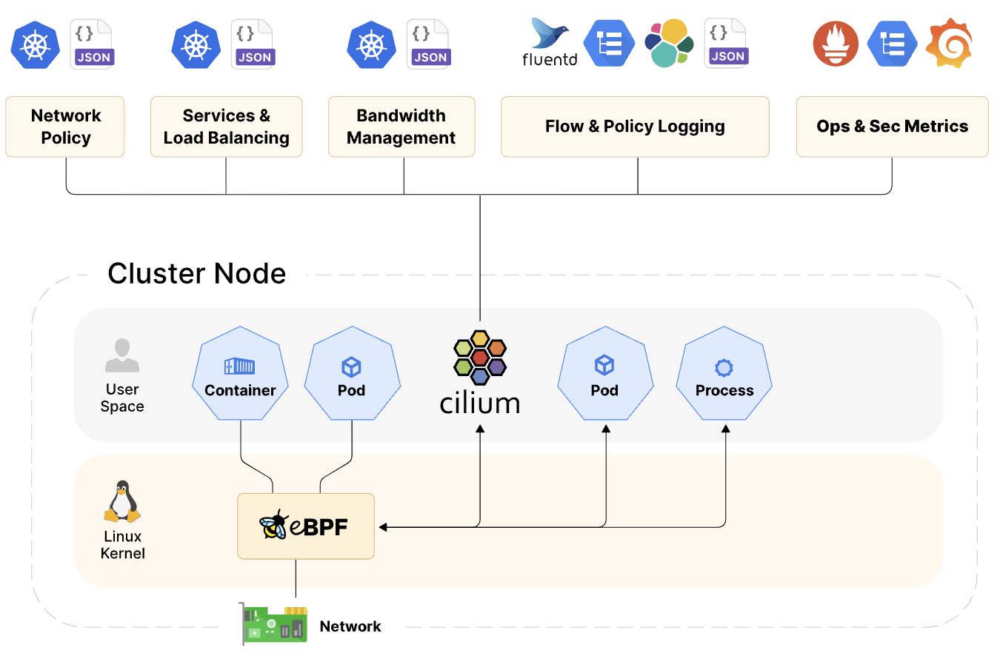
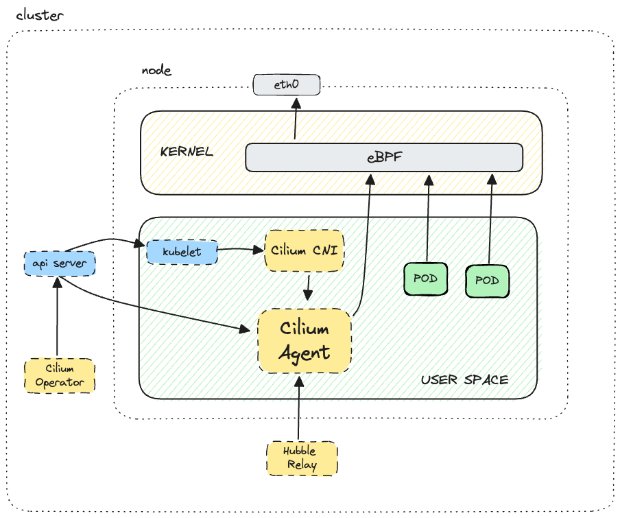
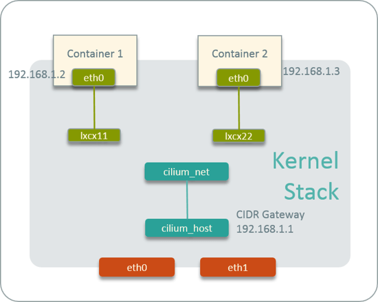
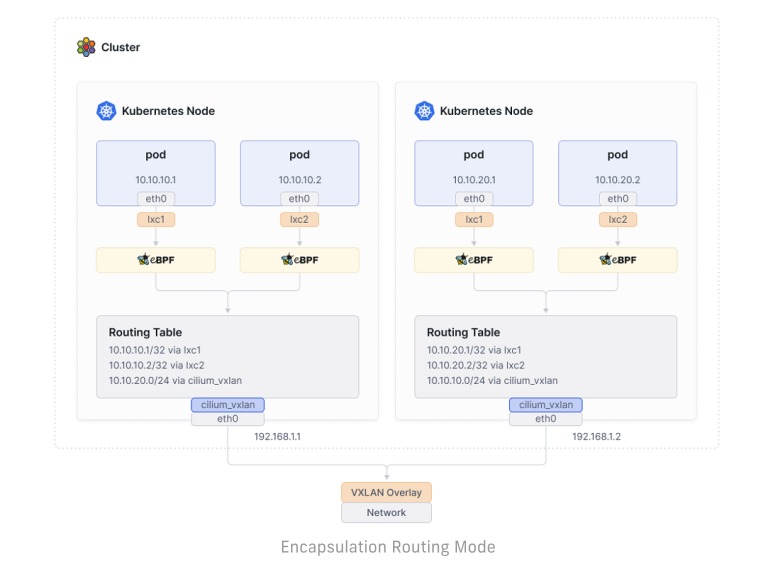
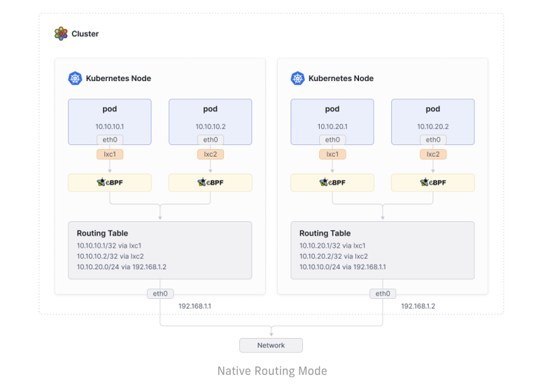
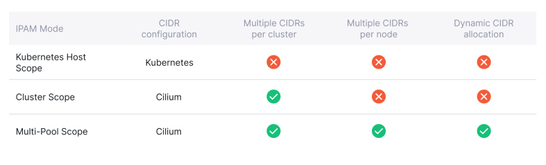
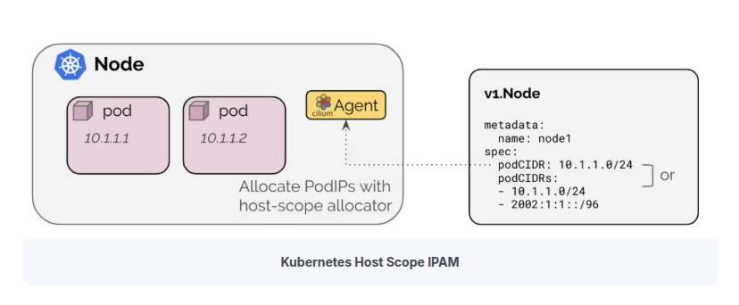
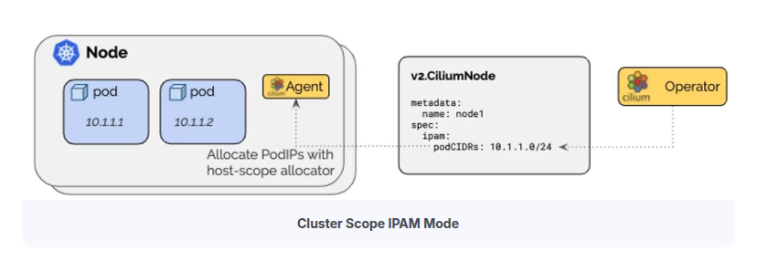
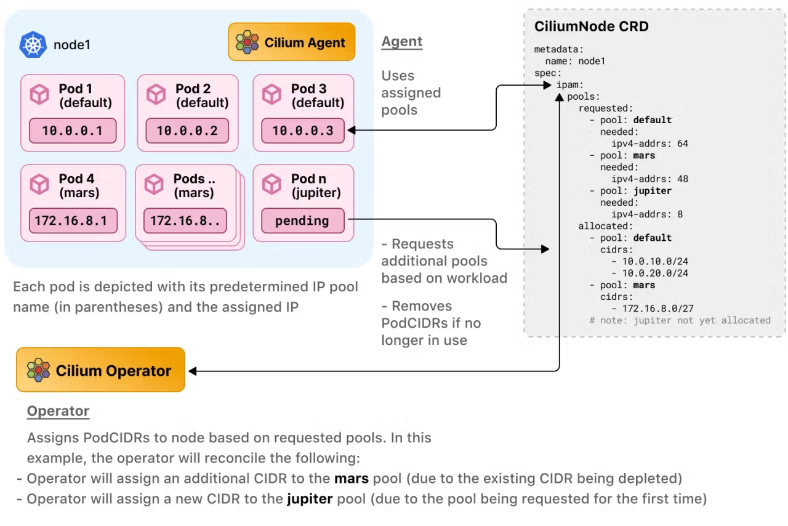
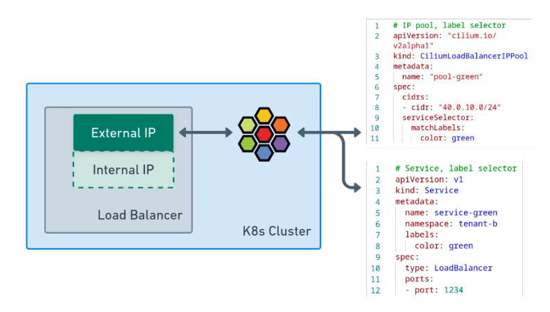

## Cilium

- Cilium은 eBPF 기술을 이용해서 쿠버네티스의 네트워크와 보안 기능을 구현한 쿠버네티스의 CNI Plugin 이다.

- eBPF는 리눅스 커널의 소스코드 변경 없이 커널 내부에서 샌드박스 프로그램을 실행시켜 커널의 기능을 효율적으로 확장시킬 수 있다. [ [BLOG](https://zerotay-blog.vercel.app/4.RESOURCE/KNOWLEDGE/OS/eBPF/) ]

<figure>
  
  <figcaption>Getting started with Cilium for Kubernetes networking and observability</figcaption>
</figure>
<p style="font-size: smaller; color: grey">출처: Getting started with Cilium for Kubernetes networking and observability</p>

### 1. Cilium 구성요소


<span style="font-size: smaller; color: grey;"><p><a href="https://www.spectrocloud.com/blog/getting-started-with-cilium-for-kubernetes-networking-and-observability">출처: https://velog.io/@baeyuna97/Cilium</a></p></span>

#### Cilium Operator

- Deployment로 배포되어 쿠버네티스 클러스터 단위에서 한 번씩 처리해야 하는 작업을 관리한다.

- Operator는 네트워킹 과정에 깊게 관여하지 않아 일시적인 중단에도 클러스터 동작에 영향을 미치지 않는다.

  - 설정에 따라서 IPAM Pool의 고갈 시 신규 IPAM Pool을 노드에 할당한다.

  - Operator의 장애로 신규 IPAM Pool 할당이 안될 경우 신규 Pod 생성이 실패한다.

#### Cilium CNI Plug-in (Node Level 작업)

- 노드에 Pod가 예약되거나 종료될 때 마다 노드에 구성된 kubelet에 의해 호출된다.

  - Operator, Agent, Envoy와 같이 컨테이너로 동작하지 않고 필요할 때만 kubelet의 자식 프로세스로 실행된다.

  - Binary 파일(`/opt/cni/bin/cilium-cni`)로 각 노드에서 관리된다.

- Pod 생성/삭제 시마다 네트워킹(NIC 설정, IP 할당/해제) 설정과 로드 밸런싱, 네트워크 정책 제공에 필요한 라우팅 경로를 업데이트한다.

#### Cilium Agent (Kernel Level 작업, L3-4 계층)

- 데몬셋으로 배포되어 각 노드에서 파드로 실행된다.

- 쿠버네티스 API 서버의 요청을 수신해 L3-4 계층의 네트워킹, 네트워크 정책 설정, 서비스 부하분산, 모니터링 등을 설정한다.

- 커널에서 컨테이너 네트워크 액세스를 제어하도록 eBPF 프로그램을 관리한다.

- eBPF 프로그램을 커널 내부에 로드하고, 파드의 네트워크 트래픽을 처리하며, 네트워크 정책을 시행한다.

  - Kernel에서 수행될 코드를 ByteCode로 Injection하여 패킷 필터링, 라우팅, 트래픽 모니터링 등을 수행한다.

  - 사용자가 네트워크 정책(L3-4 계층)을 통해 파드간의 트래픽을 제어할 수 있는데, 이 정책이 eBPF Program으로 변환하여 실행된다.

#### Envoy Proxy (UserSpace 작업, L7 계층)

- Cilium L7 계층 관련 기능(Ingress, Gateway API, L7 Network Policies, L7 Protocol Visibility)을 사용하는 경우, Envoy Pod를 이용해 L7 트래픽을 관리한다.

- 요청을 라우팅하고, 로드 밸런싱을 수행하며, 모니터링 및 로깅 기능을 제공한다.

> [!TIP] Cilium Agent & Envoy
>
> - L3-4 계층의 패킷은 Agent에서 관리하고, L7 계층의 패킷은 Envoy에서 관리한다.
> - Cilium은 MetalLB의 지원 없이 직접 LB, Ingress의 External IP 할당을 관리할 수 있다.
> - Envoy는 Ingress에 적용된 규칙에 맞춰 라우팅 하는 기능과 L7 계층 Network Policy를 구현하는데 사용된다.

### 2. 네트워크 구성 정보 : _<span style="font-size: smaller; color: Aquamarine;">cilium host, cilium net, cilium health</span>_


<span style="font-size: smaller; color: grey;"><p><a href="https://arthurchiao.art/blog/ctrip-network-arch-evolution/">출처: Ctrip Network Architecture Evolution in the Cloud Computing Era</a></p></span>

```bash
$ ip -c -br addr show
lo                      UNKNOWN        127.0.0.1/8 ::1/128
eth0                    UP             10.0.2.15/24 metric 100 fd17:625c:f037:2:a00:27ff:fe6b:69c9/64 fe80::a00:27ff:fe6b:69c9/64
eth1                    UP             192.168.10.100/24 fe80::a00:27ff:feec:70c4/64
cilium_net@cilium_host  UP             fe80::d00c:4bff:fef0:e4f2/64
cilium_host@cilium_net  UP             172.20.84.1/32 fe80::987a:bff:fe15:6ee5/64
lxc_health@if6          UP             fe80::e445:eeff:fedc:c972/64
```

#### cilium_host

- Cilium이 관리하는 호스트 네트워크 인터페이스

- 클러스터 내의 Pod와 외부 네트워크 간의 연결을 처리 (Pod가 외부 네트워크와 통신할 때 이 인터페이스 사용)

- Pod에서 나가는 트래픽과 외부에서 들어오는 트래픽을 처리하는 데 사용

- 외부에서 들어오는 패킷을 Pod로 전달하는 Reverse NAT 기능을 포함

#### cilium_net

- Cilium에서 관리하는 가상 네트워크 인터페이스

- Cilium의 eBPF 프로그램을 통해 네트워크 트래픽을 처리하고 제어

- Pod 간 통신 관리(보안 정책 적용, 패킷 필터링, 네트워크 성능 측정 등)를 위해 cilium_net 사용

- cilium_net 인터페이스는 각 Pod에 대해 생성되며, Pod의 IP 주소와 연결

- 이 인터페이스는 eBPF 프로그램이 패킷을 검사하고 처리할 수 있도록 해준다.

#### cilium_health (lxc_health)

- 컨테이너의 상태 확인에 사용하는 인터페이스

#### lxcxxxx

- 컨테이너에 할당되는 eth 인터페이스와 호스트의 인터페이스와 맵핑되는 가상 인터페이스

## Cilium Networking

- 기존의 전통적인(Standard) 방식의 CNI 기능은 `kube-proxy(iptables)`를 기반으로 동작한다.

- Cilium에서는 "kube-proxy 대체 모드"를 사용하면 kube-proxy 없이도 클러스터 네트워킹을 구현할 수 있다.

- eBPF 기반의 Cilium CNI는 `kube-proxy(iptables)`를 사용하는 환경보다 더 좋은 성능을 보여준다. [ [link](./_docs/Appendix%201.%20What's%20wrong%20with%20legacy%20iptables.md) ]

### 1. cilium이 서로 다른 노드에 있는 Pod를 연결하는 두 가지 방법: _<span style="font-size: smaller; color: Aquamarine;">Encapsulation(VxLAN, Geneve), Native/Direct</span>_

#### 1.1 Encapsulation Routing Mode (Default)

- UDP 기반 캡슐화 프로토콜인 VXLAN 또는 Geneve를 사용하여 모든 노드 간에 터널 메시가 생성된다. [ [link](./_docs/Appendix%202.%20VxLAN%20and%20Geneve.md) ]

- 노드 간 통신 트래픽은 모두 VXLAN 또는 Geneve을 통해서 캡슐화된다.

- Pod 네트워크는 노드 네트워크의 영향을 받지 않기 때문에 환경에 종속되지 않고 간단하게 구성할 수 있는 장점이 있다.

- 캡슐화를 통해 헤더가 추가되면서 패킷의 효율이 미미하게 떨어지는데, 최적의 네트워크 성능 보장이 필요한 경우 Native/Direct 모드가 적합하다.

  
  <span style="font-size: smaller; color: grey;"><p>출처: Kubernetes Networking & Cilium for Network Engineers - An Instruction Manual (ISOVALENT_eBOOK)</p></span>

#### 1.2 Native Routing Mode

- 캡슐화 기능 대신 Cilium의 네트워크 기능을 이용해서 통신한다.

- 각 노드에는 Cilium Agent가 구성되고, Agent는 해당 노드의 Pod들에 대한 네트워크만 관리한다.

- 따라서 다른 노드로 향하는 트래픽은 리눅스 커널의 라우팅 시스템에 위임하여 처리된다.

  
  <span style="font-size: smaller; color: grey;"><p>출처: Kubernetes Networking & Cilium for Network Engineers - An Instruction Manual (ISOVALENT_eBOOK)</p></span>

### 2. 네트워크 엔드포인트(컨테이너/LB) IP 관리를 위한 IPAM (IP Address Management)

- 네트워크 엔드포인트(컨테이너 등)에서 사용할 IP 주소를 할당하고 관리하는 역할을 한다.

- IPAM을 한 번 설정한 상태에서 모드를 변경하는 것은 권장되지 않는다. 새 IPAM 구성으로 새로운 쿠버네티스 클러스터를 생성하는 것이 좋다.

- 배포 환경, 사용자의 요구사항에 따라 다양하게 구성이 가능하도록 7개의 배포 모드를 지원한다. [ [docs](https://docs.cilium.io/en/stable/network/concepts/ipam/) ]

  
  <span style="font-size: smaller; color: grey;"><p>출처: Kubernetes Networking & Cilium for Network Engineers - An Instruction Manual (ISOVALENT_eBOOK)</p></span>

#### 2.1 Kubernetes Host Scope


<span style="font-size: smaller; color: grey;"><p><a href="https://isovalent.com/blog/post/overcoming-kubernetes-ip-address-exhaustion-with-cilium">출처: https://isovalent.com/blog/post/overcoming-kubernetes-ip-address-exhaustion-with-cilium</a></p></span>

- `Kubernetes Controller Manager`가 Node에 할당한 PodCIDR을 사용한다.

- 이 모드는 간단하게 구현이 가능하지만 PodCIDR을 유연하게 관리하는 것은 제약이 많다.

  - 클러스터 전체에 하나의 PodCIDR 구성만 지원한다.

  - 클러스터의 PodCIDR이 고갈되었을 때 클러스터나 개별 노드에 PodCIDR을 추가하는 것이 불가능하다.

  - 초기 클러스터 배포 시 정확하게 노드별 IP 주소 계획을 수립해서 사용해야 한다.

#### 2.2 Cluster Scope IPAM (Default)


<span style="font-size: smaller; color: grey;"><p><a href="https://isovalent.com/blog/post/overcoming-kubernetes-ip-address-exhaustion-with-cilium">출처: https://isovalent.com/blog/post/overcoming-kubernetes-ip-address-exhaustion-with-cilium</a></p></span>

- Kubernetes Host Scope와 동일하게 Node에 할당된 PodCIDR을 활용해 IP를 할당한다.

- Node에 할당된 PodCIDR을 할당하는 주체가 `Kubernetes Controller Manager`가 아닌 `Cilium Operator`가 된다.

- Cluster Scope IPAM의 장점은 여러 CIDR을 할당할 수 있다는 것이다.

- 하지만, 할당된 IP Pool의 주소 고갈 문제를 완전히 해결하지는 못하는 문제는 Kubernetes Host Scope와 동일하다.

#### 2.3 Multi Pool


<span style="font-size: smaller; color: grey;"><p><a href="https://isovalent.com/blog/post/overcoming-kubernetes-ip-address-exhaustion-with-cilium">출처: https://isovalent.com/blog/post/overcoming-kubernetes-ip-address-exhaustion-with-cilium</a></p></span>

- Pod IP Pool을 여러 개 생성한 다음 같은 노드에서 생성되는 Pod에게 서로 다른 IP Pool을 할당할 수 있다.

- `CiliumPodIPPool`을 생성해서 Pod IP Pool을 노드에 동적으로 추가할 수 있다.

#### 2.4 Load Balaner / Egress IPAM


<span style="font-size: smaller; color: grey;"><p><a href="https://isovalent.com/blog/post/migrating-from-metallb-to-cilium/">출처: MetalLB에서 Cilium으로 마이그레이션</a></p></span>

- Cilium은 LoadBalancer/Ingress 유형의 Kubernetes 서비스에 클러스터 외부에 노출 할 External IP 주소를 직접 할당할 수 있다.

- 다른 CNI 같은 경우 Metal LB, AWS Load Balancer Controller와 같은 플러그인이 필요하지만 Cilium은 자체 기능을 통해 제공한다.
