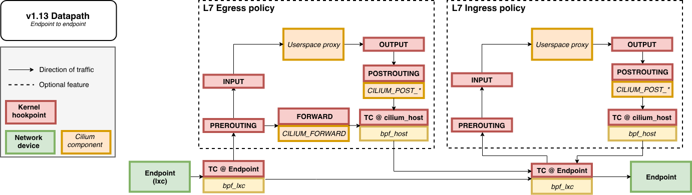
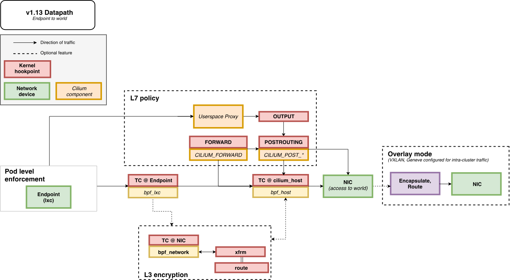
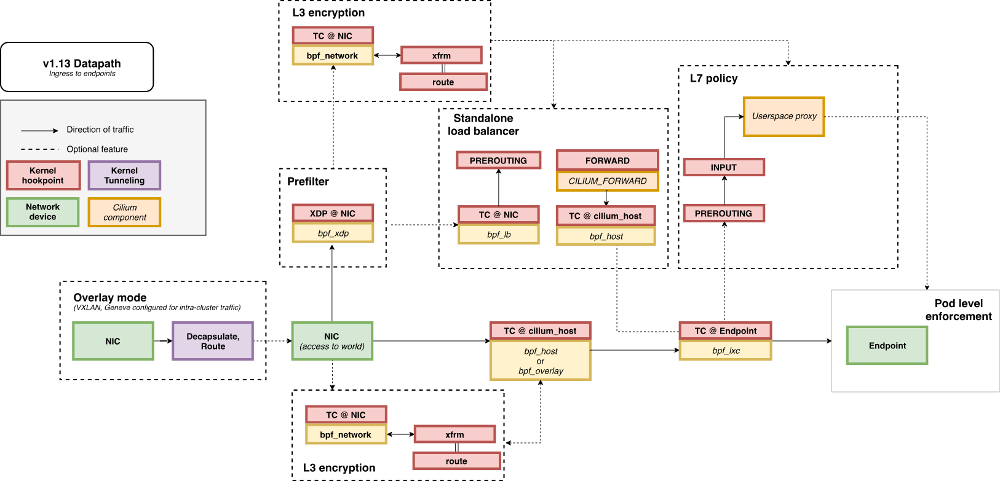
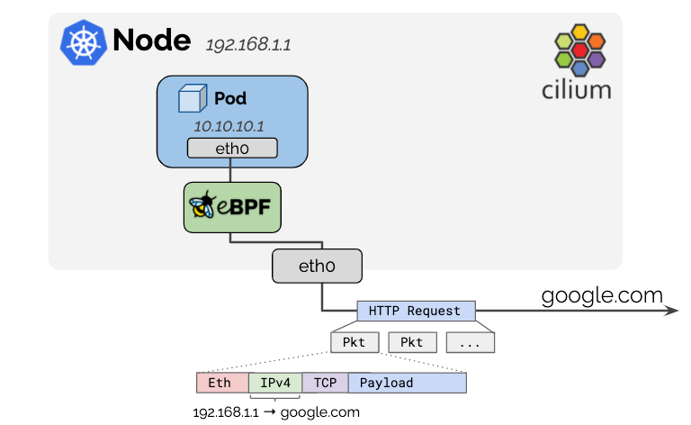

**Table of Contents**
---
- [**Table of Contents**](#table-of-contents)
- [Cilium](#cilium)
  - [1. Cilium 구성요소](#1-cilium-구성요소)
    - [1.1 Cilium 구성요소](#11-cilium-구성요소)
    - [1.2 Cilium 에서 제공하는 다양한 디버깅 툴](#12-cilium-에서-제공하는-다양한-디버깅-툴)
  - [2. 네트워크 구성 정보 : _cilium host, cilium net, cilium health_](#2-네트워크-구성-정보--cilium-host-cilium-net-cilium-health)
    - [2.1 네트워크 인터페이스 구조](#21-네트워크-인터페이스-구조)
    - [2.2 Cilium Network Interface 조회](#22-cilium-network-interface-조회)
  - [3. eBPF를 이용한 Packet Flow (eBPF Datapath)](#3-ebpf를-이용한-packet-flow-ebpf-datapath)
    - [3.1 같은 노드에 배치된 Pod 간의 통신 경로](#31-같은-노드에-배치된-pod-간의-통신-경로)
    - [3.2 Pod에서 외부로 나가는 트래픽 통신 경로](#32-pod에서-외부로-나가는-트래픽-통신-경로)
    - [3.3 Pod 내부로 들어오는 트래픽 통신 경로](#33-pod-내부로-들어오는-트래픽-통신-경로)
    - [3.4 Packet Flow 과정에 사용되는 eBPF Program \& Function 조회 방법](#34-packet-flow-과정에-사용되는-ebpf-program--function-조회-방법)
- [Cilium Networking](#cilium-networking)
  - [1. cilium이 서로 다른 노드에 있는 Pod를 연결하는 두 가지 방법: _Encapsulation(VxLAN, Geneve), Native/Direct_](#1-cilium이-서로-다른-노드에-있는-pod를-연결하는-두-가지-방법-encapsulationvxlan-geneve-nativedirect)
    - [1.1 Encapsulation Routing Mode (Default)](#11-encapsulation-routing-mode-default)
    - [1.2 Native Routing Mode](#12-native-routing-mode)
  - [2. 네트워크 엔드포인트(컨테이너/LB) IP 관리를 위한 IPAM (IP Address Management)](#2-네트워크-엔드포인트컨테이너lb-ip-관리를-위한-ipam-ip-address-management)
    - [2.1 Kubernetes Host Scope](#21-kubernetes-host-scope)
    - [2.2 Cluster Scope IPAM (Default)](#22-cluster-scope-ipam-default)
    - [2.3 Multi Pool](#23-multi-pool)
    - [2.4 Load Balaner / Egress IPAM](#24-load-balaner--egress-ipam)
  - [3. 클러스터 외부로 향하는 패킷 처리를 위한 Maquerading 처리](#3-클러스터-외부로-향하는-패킷-처리를-위한-maquerading-처리)
    - [3.1 Cluster와 같은 네트워크 대역에 있지만 Cluster에 Join 되지 않은 VM 과의 통신 테스트](#31-cluster와-같은-네트워크-대역에-있지만-cluster에-join-되지-않은-vm-과의-통신-테스트)
    - [3.2 Cluster 외부의 다른 네트워크 대역(10.0.0.0/16)에 있는 네트워크와의 통신 테스트](#32-cluster-외부의-다른-네트워크-대역1000016에-있는-네트워크와의-통신-테스트)
    - [3.3 Cluster 외부의 다른 네트워크 대역(10.0.0.0/16)과 Masquerade 없이 통신하도록 설정하는 방법](#33-cluster-외부의-다른-네트워크-대역1000016과-masquerade-없이-통신하도록-설정하는-방법)

## Cilium

<p align=center></p>

- Cilium은 eBPF 기술을 이용해서 쿠버네티스의 네트워크와 보안 기능을 구현한 쿠버네티스의 CNI Plugin 이다.

- eBPF는 리눅스 커널의 소스코드 변경 없이 커널 내부에서 샌드박스 프로그램을 실행시켜 커널의 기능을 효율적으로 확장시킬 수 있다. [ [BLOG](https://zerotay-blog.vercel.app/4.RESOURCE/KNOWLEDGE/OS/eBPF/) ]

<br>

### 1. Cilium 구성요소

#### 1.1 Cilium 구성요소

<p align=center></p>

##### Cilium Operator

- Deployment로 배포되어 쿠버네티스 클러스터 단위에서 한 번씩 처리해야 하는 작업을 관리한다.

- Operator는 네트워킹 과정에 깊게 관여하지 않아 일시적인 중단에도 클러스터 동작에 영향을 미치지 않는다.

  - 설정에 따라서 IPAM Pool의 고갈 시 신규 IPAM Pool을 노드에 할당한다.

  - Operator의 장애로 신규 IPAM Pool 할당이 안될 경우 신규 Pod 생성이 실패한다.

##### Cilium CNI Plug-in (Node Level 작업)

- 노드에 Pod가 예약되거나 종료될 때 마다 노드에 구성된 kubelet에 의해 호출된다.

  - Operator, Agent, Envoy와 같이 컨테이너로 동작하지 않고 필요할 때만 kubelet의 자식 프로세스로 실행된다.

  - Binary 파일(`/opt/cni/bin/cilium-cni`)로 각 노드에서 관리된다.

- Pod 생성/삭제 시마다 네트워킹(NIC 설정, IP 할당/해제) 설정과 로드 밸런싱, 네트워크 정책 제공에 필요한 라우팅 경로를 업데이트한다.

##### Cilium Agent (Kernel Level 작업, L3-4 계층)

- 데몬셋으로 배포되어 각 노드에서 파드로 실행된다.

- 쿠버네티스 API 서버의 요청을 수신해 L3-4 계층의 네트워킹, 네트워크 정책 설정, 서비스 부하분산, 모니터링 등을 설정한다.

- 커널에서 컨테이너 네트워크 액세스를 제어하도록 eBPF 프로그램을 관리한다.

- eBPF 프로그램을 커널 내부에 로드하고, 파드의 네트워크 트래픽을 처리하며, 네트워크 정책을 시행한다.

  - Kernel에서 수행될 코드를 ByteCode로 Injection하여 패킷 필터링, 라우팅, 트래픽 모니터링 등을 수행한다.

  - 사용자가 네트워크 정책(L3-4 계층)을 통해 파드간의 트래픽을 제어할 수 있는데, 이 정책이 eBPF Program으로 변환하여 실행된다.

##### Envoy Proxy (UserSpace 작업, L7 계층)

- Cilium L7 계층 관련 기능(Ingress, Gateway API, L7 Network Policies, L7 Protocol Visibility)을 사용하는 경우, Envoy Pod를 이용해 L7 트래픽을 관리한다.

- 요청을 라우팅하고, 로드 밸런싱을 수행하며, 모니터링 및 로깅 기능을 제공한다.

> [!TIP]
>
> - L3-4 계층의 패킷은 Agent에서 관리하고, L7 계층의 패킷은 Envoy에서 관리한다.
> - Cilium은 MetalLB의 지원 없이 직접 LB, Ingress의 External IP 할당을 관리할 수 있다.
> - Envoy는 Ingress에 적용된 규칙에 맞춰 라우팅 하는 기능과 L7 계층 Network Policy를 구현하는데 사용된다.

<br>

#### 1.2 Cilium 에서 제공하는 다양한 디버깅 툴

- Cilium Agent에는 관리용 CLI 세 가지(`cilium`, `cilium-dbg`, `bpftool`) 디버깅 도구를 제공한다.

  - cilium : Cilium 구성과 관련된 일반 적인 상태 정보, 정책, 서비스 목록 등을 확인하는데 사용한다.

  - cilium-dbg : 네트워킹 디버깅에 사용되는 도구로 패킷 경로를 추적하거나 실시간 이벤트 모니터링에 사용한다.

  - bpftool : eBPF 수준의 디버깅이 필요한 경우 사용되는 도구로 커널에 로드된 eBPF 프로그램 목록, MAP 목록 조회 등에 사용한다.

- Cilium Agent Pod 내에서 실행할 수 있지만 `kubectl` 명령을 사용할 수 있는 노드(Control)에서 각 노드의 Cilium Agent를 통해 툴을 사용하도록 단축키를 지정한다.

  ```bash
  # /ect/profile
  export CILIUMPOD0=$(kubectl get -l k8s-app=cilium pods -n kube-system --field-selector spec.nodeName=cilium-ctr -o jsonpath='{.items[0].metadata.name}')
  export CILIUMPOD1=$(kubectl get -l k8s-app=cilium pods -n kube-system --field-selector spec.nodeName=cilium-w1 -o jsonpath='{.items[0].metadata.name}')
  export CILIUMPOD2=$(kubectl get -l k8s-app=cilium pods -n kube-system --field-selector spec.nodeName=cilium-w2 -o jsonpath='{.items[0].metadata.name}')
  alias c0="kubectl exec -it $CILIUMPOD0 -n kube-system -c cilium-agent -- cilium"
  alias c1="kubectl exec -it $CILIUMPOD1 -n kube-system -c cilium-agent -- cilium"
  alias c2="kubectl exec -it $CILIUMPOD2 -n kube-system -c cilium-agent -- cilium"
  alias c0dbg="kubectl exec -it $CILIUMPOD0 -n kube-system -c cilium-agent -- cilium-dbg"
  alias c1dbg="kubectl exec -it $CILIUMPOD1 -n kube-system -c cilium-agent -- cilium-dbg"
  alias c2dbg="kubectl exec -it $CILIUMPOD2 -n kube-system -c cilium-agent -- cilium-dbg"
  alias c0bpf="kubectl exec -it $CILIUMPOD0 -n kube-system -c cilium-agent -- bpftool"
  alias c1bpf="kubectl exec -it $CILIUMPOD1 -n kube-system -c cilium-agent -- bpftool"
  alias c2bpf="kubectl exec -it $CILIUMPOD2 -n kube-system -c cilium-agent -- bpftool"
  ```

  ```bash
  source /etc/profile
  ```

<br>

### 2. 네트워크 구성 정보 : _<span style="font-size: smaller; color: Aquamarine;">cilium host, cilium net, cilium health</span>_

#### 2.1 네트워크 인터페이스 구조

<p align=center></p>

##### cilium_host

- Cilium이 관리하는 호스트 네트워크 인터페이스

- 클러스터 내의 Pod와 외부 네트워크 간의 연결을 처리 (Pod가 외부 네트워크와 통신할 때 이 인터페이스 사용)

- Pod에서 나가는 트래픽과 외부에서 들어오는 트래픽을 처리하는 데 사용

- 외부에서 들어오는 패킷을 Pod로 전달하는 Reverse NAT 기능을 포함

##### cilium_net

- Cilium에서 관리하는 가상 네트워크 인터페이스

- Cilium의 eBPF 프로그램을 통해 네트워크 트래픽을 처리하고 제어

- Pod 간 통신 관리(보안 정책 적용, 패킷 필터링, 네트워크 성능 측정 등)를 위해 cilium_net 사용

- cilium_net 인터페이스는 각 Pod에 대해 생성되며, Pod의 IP 주소와 연결

- 이 인터페이스는 eBPF 프로그램이 패킷을 검사하고 처리할 수 있도록 해준다.

##### cilium_health (lxc_health)

- 컨테이너의 상태 확인에 사용하는 인터페이스

##### lxcxxxx

- 컨테이너에 할당되는 eth 인터페이스와 호스트의 인터페이스와 맵핑되는 가상 인터페이스

<br>

#### 2.2 Cilium Network Interface 조회

- Control 노드 cilium net과 cilium host 정보 조회

  - control 노드에서 인터페이스의 목록을 확인해보면 cilium net, cilium host, lxc_health 인터페이스를 볼 수 있다.

    ```bash
    $ ip -c -br addr show
    eth0                    UP             10.0.2.15/24 metric 100 fd17:625c:f037:2:a00:27ff:fe6b:69c9/64 fe80::a00:27ff:fe6b:69c9/64 
    eth1                    UP             192.168.10.100/24 fe80::a00:27ff:febd:9813/64 
    cilium_net@cilium_host  UP             fe80::18f2:6aff:fe9d:4953/64 
    cilium_host@cilium_net  UP             172.20.0.6/32 fe80::1cb0:76ff:fe52:2aa/64 
    lxc_health@if6          UP             fe80::7c46:c0ff:fe22:317f/64 
    lxce588bd206718@if8     UP             fe80::ccb:27ff:fe93:8b39/64 
    lxcd4c5e765631e@if10    UP             fe80::2ca3:f9ff:fe4b:520/64 
    ```

- lxc_health Interface 정보 조회

  - lxc_health 인터페이스 같은 경우 Control 노드에서는 IP 정보를 직접 확인할 수 없다.

  - cilium-dbg cli을 통해 control 노드에 할당되어 있는 IP의 정보를 검색하면 `health` 항목에 할당된 IP를 확인할 수 있다.

    ```bash
    $ c0dbg status --verbose | grep -A6 "Allocated"
    Allocated addresses:
      172.20.0.11 (health)
      172.20.0.12 (kube-system/coredns-674b8bbfcf-r4kx2)
      172.20.0.3 (kube-system/coredns-674b8bbfcf-7ltmp)
      172.20.0.6 (router)
    ```

  - cilium에서는 각 endpoint(interface or ip address) 마다 endpoint id를 할당하는데 해당 정보를 cilium cli로 조회한다.

    ```bash
    $ c0 endpoint list
    ENDPOINT   POLICY (ingress)   POLICY (egress)   IDENTITY   LABELS (source:key[=value])                                                  IPv6   IPv4          STATUS   
              ENFORCEMENT        ENFORCEMENT                                                                                                                    
    ...
    1364       Disabled           Disabled          4          reserved:health                                                                     172.20.0.11   ready   
    ...
    ```

  - 172.20.0.11(health) IP에 할당 된 ENDPOINT ID 1364를 이용해서 해당 IP의 세부 정보를 조회하면 Cilium 노드에서 보았던 Interface Name을 확인할 수 있다.

    ```bash
    $ c0 endpoint get 1364 | grep -A11 networking
          "networking": {
            "addressing": [
              {
                "ipv4": "172.20.0.11",        # health interface ip
                "ipv4-pool-name": "default"
              }
            ],
            "host-mac": "7e:46:c0:22:31:7f",  # host mac 정보
            "interface-index": 7, 
            "interface-name": "lxc_health",   # inteface name
            "mac": "3a:c9:b4:f3:4c:9a"
          },
    ```

  - 조금 더 확실하게 비교하기 위해 `host-mac` 정보까지 control node에서 검색해 보면 동일한 정보가 할당되어 있음을 알 수 있다.

    ```bash
    $ ip -c addr show lxc_health
    7: lxc_health@if6: <BROADCAST,MULTICAST,UP,LOWER_UP> mtu 1500 qdisc noqueue state UP group default qlen 1000
        link/ether 7e:46:c0:22:31:7f brd ff:ff:ff:ff:ff:ff link-netnsid 0
        inet6 fe80::7c46:c0ff:fe22:317f/64 scope link 
          valid_lft forever preferred_lft forever
    ```

- lxc_health 외 lxc로 시작하는 기타 인터페이스의 정보 조회

  - cilium 에서는 노드에 Pod가 생성되면 Pod의 인터페이스와 바인딩할 `lxcxxxx` 형태의 인터페이스를 호스트 노드에 생성한다.

  - cilium-dbg cli을 통해 control 노드에 할당되어 있는 IP의 정보를 검색하면 `coredns` Pod에 할당된 IP를 확인할 수 있다.

    ```bash
    $ c0dbg status --verbose | grep -A6 "Allocated"
    Allocated addresses:
      172.20.0.11 (health)
      172.20.0.12 (kube-system/coredns-674b8bbfcf-r4kx2)
      172.20.0.3 (kube-system/coredns-674b8bbfcf-7ltmp)
      172.20.0.6 (router)
    ```

  - coredns의 ENDPOINT ID 값을 조회한 후 해당 ENDPOINT의 상세 내용을 검색하면, 호스트 노드에서 보이는 인터페이스 이름과 일치하는 정보가 확인된다.

    ```bash
    c0 endpoint list
    ENDPOINT   POLICY (ingress)   POLICY (egress)   IDENTITY   LABELS (source:key[=value])                                                  IPv6   IPv4          STATUS   
              ENFORCEMENT        ENFORCEMENT                                                                                                                    
    235        Disabled           Disabled          5118       k8s:io.cilium.k8s.namespace.labels.kubernetes.io/metadata.name=kube-system          172.20.0.3    ready   
                                                              k8s:io.cilium.k8s.policy.cluster=default                                                                  
                                                              k8s:io.cilium.k8s.policy.serviceaccount=coredns                                                           
                                                              k8s:io.kubernetes.pod.namespace=kube-system                                                               
                                                              k8s:k8s-app=kube-dns 
    2089       Disabled           Disabled          5118       k8s:io.cilium.k8s.namespace.labels.kubernetes.io/metadata.name=kube-system          172.20.0.12   ready   
                                                              k8s:io.cilium.k8s.policy.cluster=default                                                                  
                                                              k8s:io.cilium.k8s.policy.serviceaccount=coredns                                                           
                                                              k8s:io.kubernetes.pod.namespace=kube-system                                                               
                                                              k8s:k8s-app=kube-dns 
    ```

    ```bash
    c0 endpoint get 235 | grep -A12 networking
          "networking": {
            "addressing": [
              {
                "ipv4": "172.20.0.3",
                "ipv4-pool-name": "default"
              }
            ],
            "container-interface-name": "eth0",
            "host-mac": "2e:a3:f9:4b:05:20",
            "interface-index": 11,
            "interface-name": "lxcd4c5e765631e",
            "mac": "86:0a:05:59:44:d9"
          },
    ```

<br>

### 3. eBPF를 이용한 Packet Flow (eBPF Datapath)

#### 3.1 같은 노드에 배치된 Pod 간의 통신 경로

<p align=center></p>

- Egress, Ingress L7 정책이 적용된 경우 점선으로 표시된 항목들까지 통신 경로가 추가 된다.

- 별도의 L7 정책이 없다면 Pod간의 통신에는 `lxcxxxx` 인터페이스를 지나는 순간 커널의 TCX(Traffic Control eXpress) ingress/egress Hook 을 통해 eBPF 프로그램이 트리거 된다.

- 이 때 네트워크 트래픽은 커널 내부의 eBPF 프로그램에 의해서 정책이 평가되고, 평가 결과에 따라서 Flow가 결정된다.

<br>

#### 3.2 Pod에서 외부로 나가는 트래픽 통신 경로

<p align=center></p>

<br>

#### 3.3 Pod 내부로 들어오는 트래픽 통신 경로

<p align=center></p>

<br>

#### 3.4 Packet Flow 과정에 사용되는 eBPF Program & Function 조회 방법


- 실행되는 eBPF 프로그램(Component)명은 노란색 박스에 표시되는데, 이 프로그램들은 `cilium-agent` 내부에 C언어 파일로 `/var/lib/cilium/bpf` 폴더에 존재한다.
  
- 이 코드에 대한 내용은 Cilium GitHub 문서에서도 확인할 수 있다. [ [docs](https://github.com/cilium/cilium/blob/main/bpf/bpf_lxc.c) ]

  ```bash
  # /var/lib/cilium/bpf
  $ ls -al
  total 336
  drwxr-xr-x 1 root root  4096 Jul 16 10:05 .
  drwxr-x--- 1 root root  4096 Jul 28 14:05 ..
  -rw-r--r-- 1 root root   420 Jul 16 10:05 COPYING
  -rw-r--r-- 1 root root  1296 Jul 16 10:05 LICENSE.BSD-2-Clause
  -rw-r--r-- 1 root root 18012 Jul 16 10:05 LICENSE.GPL-2.0
  -rw-r--r-- 1 root root 20261 Jul 16 10:05 Makefile
  -rw-r--r-- 1 root root  3533 Jul 16 10:05 Makefile.bpf
  -rw-r--r-- 1 root root  2945 Jul 16 10:05 bpf_alignchecker.c
  -rw-r--r-- 1 root root 58666 Jul 16 10:05 bpf_host.c
  -rw-r--r-- 1 root root 76153 Jul 16 10:05 bpf_lxc.c       # lxcxxx interface를 지날 때 트리거 되는 eBPF 프로그램
  -rw-r--r-- 1 root root  2797 Jul 16 10:05 bpf_network.c
  -rw-r--r-- 1 root root 25289 Jul 16 10:05 bpf_overlay.c
  -rw-r--r-- 1 root root 31334 Jul 16 10:05 bpf_sock.c
  -rw-r--r-- 1 root root  1424 Jul 16 10:05 bpf_wireguard.c
  -rw-r--r-- 1 root root  9064 Jul 16 10:05 bpf_xdp.c
  drwxr-xr-x 6 root root  4096 Jul 16 10:05 complexity-tests
  drwxr-xr-x 2 root root  4096 Jul 16 10:05 custom
  -rw-r--r-- 1 root root  1870 Jul 16 10:05 ep_config.h
  -rw-r--r-- 1 root root   517 Jul 16 10:05 filter_config.h
  drwxr-xr-x 1 root root  4096 Jul 16 10:05 include
  drwxr-xr-x 2 root root  4096 Jul 16 10:05 lib
  -rw-r--r-- 1 root root   404 Jul 16 10:05 netdev_config.h
  -rw-r--r-- 1 root root 10753 Jul 16 10:05 node_config.h
  drwxr-xr-x 4 root root  4096 Jul 16 10:05 tests
  ```

- Pod의 인터페이스 마다 할당되는 eBPF 프로그램의 함수는 `Pod Interface 정보 조회` → `할당된 eBPF Program ID 조회` → `프로그램 내 함수명 조회` 순으로 확인할 수 있다.

  - Pod Interface 정보 조회

    - Pod 조회

      ```bash
      $ kubectl get po -owide
      NAME                      READY   STATUS    RESTARTS        AGE   IP             NODE         NOMINATED NODE   READINESS GATES
      curl-pod                  1/1     Running   1 (4h34m ago)   14h   172.20.2.244   cilium-ctr   <none>           <none>
      webpod-697b545f57-5fmfp   1/1     Running   0               14h   172.20.0.97    cilium-w1    <none>           <none>
      webpod-697b545f57-g9c5f   1/1     Running   0               14h   172.20.1.38    cilium-w2    <none>           <none>
      ```

    - Pod의 ENDPOINT 정보 조회

      ```bash
      $ c0 endpoint list | grep 172.20.2.244
      ENDPOINT   POLICY (ingress)   POLICY (egress)   IDENTITY   LABELS (source:key[=value])        IPv6   IPv4           STATUS   
                ENFORCEMENT        ENFORCEMENT
      4          Disabled           Disabled          47080      k8s:app=curl                              172.20.2.244   ready
      ```

    - Pod의 Interface Name 조회

      ```bash
      $ c0 endpoint get 4 | grep -A11 networking
            "networking": {
              "addressing": [
                {
                  "ipv4": "172.20.2.244",
                  "ipv4-pool-name": "default"
                }
              ],
              "container-interface-name": "eth0",
              "host-mac": "12:73:95:0d:4e:56",
              "interface-index": 9,
              "interface-name": "lxc49adfa975abf",
              "mac": "4e:22:88:88:7d:20"
      ```

  - Pod의 Interface에 적용된 eBPF 프로그램을 조회하면 `cil_from_container`, `cil_to_container` 함수 이름을 확인할 수 있다.

    ```bash
    $ c0bpf net show | grep lxc49adfa975abf
    lxc49adfa975abf(9) tcx/ingress cil_from_container prog_id 1143 link_id 23 
    lxc49adfa975abf(9) tcx/egress cil_to_container prog_id 1149 link_id 24
    ```

- 이 함수는 bpf_lxc.c 파일에 선언되어 있는데 ciliu-agent에 접속 후 해당 함수(`cil_to_container`)를 조회하면 함수의 세부 코드를 확인할 수 있다.

  ```bash
  $ grep -n -A160 "cil_to_container" /var/lib/cilium/bpf/bpf_lxc.c
  2335:int cil_to_container(struct __ctx_buff *ctx)
  2336-{
  2337-   enum trace_point trace = TRACE_FROM_STACK;
  2338-   __u32 magic, identity = 0;
  2339-   __u32 sec_label = SECLABEL;
  2340-   __s8 ext_err = 0;
  2341-   __u16 proto;
  2342-   int ret;
  2343-
  2344-   if (!validate_ethertype(ctx, &proto)) {
  2345-           ret = DROP_UNSUPPORTED_L2;
  2346-           goto out;
  2347-   }
  2348-
  2349-   bpf_clear_meta(ctx);
  2350-
  ...
  2442-
  2443-out:
  2444-   if (IS_ERR(ret))
  2445-           return send_drop_notify_ext(ctx, identity, sec_label, LXC_ID, ret,
  2446-                                       ext_err, CTX_ACT_DROP, METRIC_INGRESS);
  2447-
  2448-   return ret;
  2449-}
  2450-
  2451-BPF_LICENSE("Dual BSD/GPL");
  ```

  - 함수 시작과 동시에 `trace`, `magic`, `identity`, `sec_label` 과 같은 변수를 초기화 한다.
  
  - `validate_ethertype()` 함수를 통해 Ethernet Frame의 Type을 확인하고, 유형이 맞지 않으면 DROP 시키는 코드를 반환한다.
  
  - `bpf_clear_meta()`함수로 전달 받은 패킷 컨텍스트를 초기화 후 새로운 정책 적용을 위한 준비를 한다.
  
  - `EBABLE_L7_LB` 가 정의되어 있는 경우 해당하는 정책으로 점프 시킨다.
  
  - `inherit_identity_from_host()` 함수를 통해 호스트의 정보를 가져와 `MARK_MAGIC_PROXY_INGRESS`, `MARK_MAGIC_PROXY_EGRESS` 인 경우 `send_trace_notify()` 함수를 실행한다.
  
  - 호스트의 방화벽이 활성화되어 있는 경우 `tail_call_policy()` 함수를 통해 호스트 방화벽 정책 적용 후 bpf_lxc로 돌아와 결과에 따라서 패킷을 처리한다.
  
  - Protocol의 종류(ARP, IPv4, IPv6)에 따라서 `tail_call_internal()`함수로 처리하거나 `CTX_ACT_OK` 값을 리턴하도록 구성되어 있다.

<br>

## Cilium Networking

- 기존의 전통적인(Standard) 방식의 CNI 기능은 `kube-proxy(iptables)`를 기반으로 동작한다.

- Cilium에서는 "kube-proxy 대체 모드"를 사용하면 kube-proxy 없이도 클러스터 네트워킹을 구현할 수 있다.

- eBPF 기반의 Cilium CNI는 `kube-proxy(iptables)`를 사용하는 환경보다 더 좋은 성능을 보여준다. [ [link](./_docs/Appendix%201.%20What's%20wrong%20with%20legacy%20iptables.md) ]

<br>

### 1. cilium이 서로 다른 노드에 있는 Pod를 연결하는 두 가지 방법: _<span style="font-size: smaller; color: Aquamarine;">Encapsulation(VxLAN, Geneve), Native/Direct</span>_

#### 1.1 Encapsulation Routing Mode (Default)

<p align=center></p>

- UDP 기반 캡슐화 프로토콜인 VXLAN 또는 Geneve를 사용하여 모든 노드 간에 터널 메시가 생성된다. [ [link](./_docs/Appendix%202.%20VxLAN%20and%20Geneve.md) ]

- 노드 간 통신 트래픽은 모두 VXLAN 또는 Geneve을 통해서 캡슐화된다.

- Pod 네트워크는 노드 네트워크의 영향을 받지 않기 때문에 환경에 종속되지 않고 간단하게 구성할 수 있는 장점이 있다.

- 캡슐화를 통해 헤더가 추가되면서 패킷의 효율이 미미하게 떨어지는데, 최적의 네트워크 성능 보장이 필요한 경우 Native/Direct 모드가 적합하다.

<br>

#### 1.2 Native Routing Mode

<p align=center></p>

- 캡슐화 기능 대신 Cilium의 네트워크 기능과 리눅스 커널의 라우팅 시스템을 이용해서 통신한다.

- 각 노드에는 Cilium Agent가 구성되고, Agent는 해당 노드의 Pod들에 대한 네트워크만 관리한다.

- 따라서 다른 노드로 향하는 트래픽은 리눅스 커널의 라우팅 시스템에 위임하여 처리된다.

  - 각 노드는 서로 다른 노드에 할당된 PodCIDR 정보를 인식하고, 커널 라우팅 테이블에 해당 노드로 향하는 경로가 추가된다.

  - L2 네트워크 프로토콜을 사용하는 경우 `auto-direct-node-routes` 옵션을 활성화하여 구성할 수 있다.

  - 또는, BGP 데몬을 활성화한 다음 서로의 라우팅 경로를 배포하도록 구성해야 한다.

<br>

### 2. 네트워크 엔드포인트(컨테이너/LB) IP 관리를 위한 IPAM (IP Address Management)

<p align=center></p>

- 네트워크 엔드포인트(컨테이너 등)에서 사용할 IP 주소를 할당하고 관리하는 역할을 한다.

- IPAM을 한 번 설정한 상태에서 모드를 변경하는 것은 권장되지 않는다. 새 IPAM 구성으로 새로운 쿠버네티스 클러스터를 생성하는 것이 좋다.

- 배포 환경, 사용자의 요구사항에 따라 다양하게 구성이 가능하도록 7개의 배포 모드를 지원한다. [ [docs](https://docs.cilium.io/en/stable/network/concepts/ipam/) ]

<br>

#### 2.1 Kubernetes Host Scope

<p align=center></p>

- `Kubernetes Controller Manager`가 Node에 할당한 PodCIDR을 사용한다.

- 이 모드는 간단하게 구현이 가능하지만 PodCIDR을 유연하게 관리하는 것은 제약이 많다.

  - 클러스터 전체에 하나의 PodCIDR 구성만 지원한다.

  - 클러스터의 PodCIDR이 고갈되었을 때 클러스터나 개별 노드에 PodCIDR을 추가하는 것이 불가능하다.

  - 초기 클러스터 배포 시 정확하게 노드별 IP 주소 계획을 수립해서 사용해야 한다.

<br>

#### 2.2 Cluster Scope IPAM (Default)

<p align=center></p>

- Kubernetes Host Scope와 동일하게 Node에 할당된 PodCIDR을 활용해 IP를 할당한다.

- Node에 할당된 PodCIDR을 할당하는 주체가 `Kubernetes Controller Manager`가 아닌 `Cilium Operator`가 된다.

- Cluster Scope IPAM의 장점은 여러 CIDR을 할당할 수 있다는 것이다.

- 하지만, 할당된 IP Pool의 주소 고갈 문제를 완전히 해결하지는 못하는 문제는 Kubernetes Host Scope와 동일하다.

<br>

#### 2.3 Multi Pool

<p align=center></p>

- Pod IP Pool을 여러 개 생성한 다음 같은 노드에서 생성되는 Pod에게 서로 다른 IP Pool을 할당할 수 있다.

- `CiliumPodIPPool`을 생성해서 Pod IP Pool을 노드에 동적으로 추가할 수 있다.

<br>

#### 2.4 Load Balaner / Egress IPAM

<p align=center></p>

- Cilium은 LoadBalancer/Ingress 유형의 Kubernetes 서비스에 클러스터 외부에 노출 할 External IP 주소를 직접 할당할 수 있다.

- 다른 CNI 같은 경우 Metal LB, AWS Load Balancer Controller와 같은 플러그인이 필요하지만 Cilium은 자체 기능을 통해 제공한다.

<br>

### 3. 클러스터 외부로 향하는 패킷 처리를 위한 Maquerading 처리

<p align=center></p>

- Cluster 내부의 IP CIDR은 RFC1918 Private Address Block을 사용하기 때문에 그 자체만으로는 Public 통신이 제한된다.

- Node IP 주소를 이용해 Cluster 외부로 나가는 모든 트래픽의 Source IP를 자동으로 Masquerade 한다.

- 노드 간의 통신에는 Encapsulation, Native Routing 방식으로 통신하면서 Cluster를 떠나는 트래픽에 대한 Masquerade 만 지원된다.

- eBPF(default) 방식과 iptablse masquerade 방식을 지원한다.

- Cluster 외부 네트워크 중에 사내망의 특별 IP 대역 처럼 Masquerading 없이 통신하고자 하는 경우 `ip-masq-agent` 설정을 통해 Node IP로의 NAT 없이 통신할 수 있다.

#### 3.1 Cluster와 같은 네트워크 대역에 있지만 Cluster에 Join 되지 않은 VM 과의 통신 테스트

- `route VM`을 추가한 다음 Cluster 구성에 사용된 Node와 같은 IP CIDR 대역을 인터페이스에 할당했다.

- Cluster의 `curl-pod`에서 `route VM`(192.168.10.200) 방향으로 ICMP 패킷을 보내면 `curl-pod`가 배포된 노드의 IP로 변환되어 tcpdump에 기록된다.

  - cluster 노드 ip 정보 조회

    ```bash
    $ kubectl get ciliumnodes 
    NAME         CILIUMINTERNALIP   INTERNALIP       AGE
    cilium-ctr   172.20.2.28        192.168.10.100   24h
    cilium-w1    172.20.0.232       192.168.10.101   24h
    cilium-w2    172.20.1.18        192.168.10.102   24h
    ```

  - `curl-pod` 정보 조회

    ```bash
    $ kubectl get pod -owide
    NAME                      READY   STATUS    RESTARTS        AGE    IP             NODE         NOMINATED NODE   READINESS GATES
    curl-pod                  1/1     Running   1 (7h45m ago)   17h    172.20.2.80    cilium-ctr   <none>           <none>
    webpod-697b545f57-g9c5f   1/1     Running   0               17h    172.20.1.38    cilium-w2    <none>           <none>
    webpod-697b545f57-qgl6m   1/1     Running   0               148m   172.20.1.220   cilium-w2    <none>           <none>
    ```

  - `cilium-ctr`노드와 `route-vm` 노드의 ip, route 설정 정보 조회

    ```bash
    $ for i in ctr r ; do echo ">> node : cilium-$i <<"; sshpass -p 'vagrant' ssh -o StrictHostKeyChecking=no vagrant@cilium-$i ip -c -br addr show | grep eth1; echo; done
    >> node : cilium-ctr <<
    eth1             UP             192.168.10.100/24 fe80::a00:27ff:fe30:52ea/64 

    >> node : cilium-r <<
    eth1             UP             192.168.10.200/24 fe80::a00:27ff:fe7b:379e/64 
    ```

    ```bash
    $ for i in ctr r ; do echo ">> node : cilium-$i <<"; sshpass -p 'vagrant' ssh -o StrictHostKeyChecking=no vagrant@cilium-$i ip -c -br route show; echo; done
    >> node : cilium-ctr <<
    default via 10.0.2.2 dev eth0 proto dhcp src 10.0.2.15 metric 100 
    10.0.2.0/24 dev eth0 proto kernel scope link src 10.0.2.15 metric 100 
    10.0.2.2 dev eth0 proto dhcp scope link src 10.0.2.15 metric 100 
    10.0.2.3 dev eth0 proto dhcp scope link src 10.0.2.15 metric 100 
    172.20.0.0/24 via 192.168.10.101 dev eth1 proto kernel 
    172.20.1.0/24 via 192.168.10.102 dev eth1 proto kernel 
    172.20.2.5 dev lxc_health proto kernel scope link 
    172.20.2.244 dev lxc49adfa975abf proto kernel scope link 
    192.168.10.0/24 dev eth1 proto kernel scope link src 192.168.10.100 

    >> node : cilium-r <<
    default via 10.0.2.2 dev eth0 proto dhcp src 10.0.2.15 metric 100 
    10.0.2.0/24 dev eth0 proto kernel scope link src 10.0.2.15 metric 100 
    10.0.2.2 dev eth0 proto dhcp scope link src 10.0.2.15 metric 100 
    10.0.2.3 dev eth0 proto dhcp scope link src 10.0.2.15 metric 100 
    192.168.10.0/24 dev eth1 proto kernel scope link src 192.168.10.200 
    ```

  - `cilium-ctr`노드와 `route-vm` 통신 테스트

    ```bash
    $ ping 192.168.10.200
    PING 192.168.10.200 (192.168.10.200) 56(84) bytes of data.
    64 bytes from 192.168.10.200: icmp_seq=1 ttl=64 time=0.534 ms
    64 bytes from 192.168.10.200: icmp_seq=2 ttl=64 time=0.302 ms
    ```

    ```bash
    # route-vm tcpdump
    $ tcpdump -i eth1 icmp
    tcpdump: verbose output suppressed, use -v[v]... for full protocol decode
    listening on eth1, link-type EN10MB (Ethernet), snapshot length 262144 bytes
    17:25:16.014947 IP 192.168.10.100 > cilium-r: ICMP echo request, id 38246, seq 1, length 64
    17:25:16.014998 IP cilium-r > 192.168.10.100: ICMP echo reply, id 38246, seq 1, length 64
    17:25:17.050316 IP 192.168.10.100 > cilium-r: ICMP echo request, id 38246, seq 2, length 64
    17:25:17.050343 IP cilium-r > 192.168.10.100: ICMP echo reply, id 38246, seq 2, length 64
    ```

  - `curl-pod`에서 `cilium-ctr` 통신 테스트    

    ```bash
    $ kubectl exec -it curl-pod -- ping 192.168.10.100
    PING 192.168.10.100 (192.168.10.100) 56(84) bytes of data.
    64 bytes from 192.168.10.100: icmp_seq=1 ttl=64 time=0.052 ms
    64 bytes from 192.168.10.100: icmp_seq=2 ttl=64 time=0.052 ms
    ```

    ```bash
    # curl-pod tcpdump
    $ kubectl exec -it curl-pod -- tcpdump -i eth0 icmp
    tcpdump: verbose output suppressed, use -v[v]... for full protocol decode
    listening on eth0, link-type EN10MB (Ethernet), snapshot length 262144 bytes
    08:38:05.178133 IP curl-pod > 192.168.10.100: ICMP echo request, id 25, seq 1, length 64
    08:38:05.178186 IP 192.168.10.100 > curl-pod: ICMP echo reply, id 25, seq 1, length 64
    08:38:06.216058 IP curl-pod > 192.168.10.100: ICMP echo request, id 25, seq 2, length 64
    08:38:06.216096 IP 192.168.10.100 > curl-pod: ICMP echo reply, id 25, seq 2, length 64
    ```

  - `curl-pod`에서 `route-vm` 통신 테스트

    ```bash
    $ kubectl exec -it curl-pod -- ping 192.168.10.200
    PING 192.168.10.200 (192.168.10.200) 56(84) bytes of data.
    64 bytes from 192.168.10.200: icmp_seq=1 ttl=63 time=0.288 ms
    64 bytes from 192.168.10.200: icmp_seq=2 ttl=63 time=0.289 ms
    ```

    ```bash
    # curl-pod tcpdump
    $ kubectl exec -it curl-pod -- tcpdump -i eth0 icmp
    tcpdump: verbose output suppressed, use -v[v]... for full protocol decode
    listening on eth0, link-type EN10MB (Ethernet), snapshot length 262144 bytes
    08:41:05.853488 IP curl-pod > 192.168.10.200: ICMP echo request, id 48, seq 1, length 64
    08:41:05.853771 IP 192.168.10.200 > curl-pod: ICMP echo reply, id 48, seq 1, length 64
    08:41:06.888037 IP curl-pod > 192.168.10.200: ICMP echo request, id 48, seq 2, length 64
    08:41:06.888305 IP 192.168.10.200 > curl-pod: ICMP echo reply, id 48, seq 2, length 64

    # cilium-ctr tcpdump
    $ tcpdump -i eth1 icmp
    tcpdump: verbose output suppressed, use -v[v]... for full protocol decode
    listening on eth1, link-type EN10MB (Ethernet), snapshot length 262144 bytes
    17:41:05.853517 IP cilium-ctr > 192.168.10.200: ICMP echo request, id 42759, seq 1, length 64
    17:41:05.853771 IP 192.168.10.200 > cilium-ctr: ICMP echo reply, id 42759, seq 1, length 64
    17:41:06.888056 IP cilium-ctr > 192.168.10.200: ICMP echo request, id 42759, seq 2, length 64
    17:41:06.888305 IP 192.168.10.200 > cilium-ctr: ICMP echo reply, id 42759, seq 2, length 64
    
    # cilium-r tcpdump
    $ tcpdump -i eth1 icmp
    tcpdump: verbose output suppressed, use -v[v]... for full protocol decode
    listening on eth1, link-type EN10MB (Ethernet), snapshot length 262144 bytes
    17:41:04.073076 IP 192.168.10.100 > cilium-r: ICMP echo request, id 42759, seq 1, length 64   # curl-pod의 172.20.2.80 가 아닌 cilium-ctr의 192.168.10.100 이 찍힌다.
    17:41:04.073113 IP cilium-r > 192.168.10.100: ICMP echo reply, id 42759, seq 1, length 64
    17:41:05.108132 IP 192.168.10.100 > cilium-r: ICMP echo request, id 42759, seq 2, length 64
    17:41:05.108166 IP cilium-r > 192.168.10.100: ICMP echo reply, id 42759, seq 2, length 64
    ```

<br>

#### 3.2 Cluster 외부의 다른 네트워크 대역(10.0.0.0/16)에 있는 네트워크와의 통신 테스트

- router VM에 Dummy Interface(loop1, loop2)를 만들어 두고, 해당 대역과의 통신을 테스트 한다.

  ```bash
  $ ip -c -br addr show
  lo               UNKNOWN        127.0.0.1/8 ::1/128 
  eth0             UP             10.0.2.15/24 metric 100 fd17:625c:f037:2:a00:27ff:fe6b:69c9/64 fe80::a00:27ff:fe6b:69c9/64 
  eth1             UP             192.168.10.200/24 fe80::a00:27ff:fe7b:379e/64 
  loop1            UNKNOWN        10.10.1.200/24 fe80::c837:49ff:fe98:2de4/64 
  loop2            UNKNOWN        10.10.2.200/24 fe80::fc26:82ff:fec4:214/64 
  ```

- Pod 에서는 Masquerading 과정을 거쳐 노드의 129.168.10.0 대역의 IP로 NAT 되어 통신되기 때문에 별도의 라우팅 경로 설정 없이 통신이 가능하다.

  ```bash
  $ ip -c -br route show
  default via 10.0.2.2 dev eth0 proto dhcp src 10.0.2.15 metric 100 
  10.0.2.0/24 dev eth0 proto kernel scope link src 10.0.2.15 metric 100 
  10.0.2.2 dev eth0 proto dhcp scope link src 10.0.2.15 metric 100 
  10.0.2.3 dev eth0 proto dhcp scope link src 10.0.2.15 metric 100 
  10.10.1.0/24 dev loop1 proto kernel scope link src 10.10.1.200 
  10.10.2.0/24 dev loop2 proto kernel scope link src 10.10.2.200 
  192.168.10.0/24 dev eth1 proto kernel scope link src 192.168.10.200
  ```

- `cilium-ctr`에서 `route-vm` Dummy Interface(loop1)와 통신 테스트

  ```bash
  ping 10.10.1.200
  PING 10.10.1.200 (10.10.1.200) 56(84) bytes of data.
  64 bytes from 10.10.1.200: icmp_seq=1 ttl=64 time=0.309 ms
  64 bytes from 10.10.1.200: icmp_seq=2 ttl=64 time=0.294 ms
  ```

- `curl-pod`에서 `route-vm`의 Dummy Interface(loop1)와 통신 테스트

  ```bash
  $ kubectl exec -it curl-pod -- curl -s 10.10.1.200
  <h1>Web Server : router</h1>
  ```

  ```bash
  # curl-pod tcpdump
  $ k exec -it curl-pod -- tcpdump -i eth0 tcp port 80
  tcpdump: verbose output suppressed, use -v[v]... for full protocol decode
  listening on eth0, link-type EN10MB (Ethernet), snapshot length 262144 bytes
  22:08:00.208734 IP curl-pod.52094 > 10.10.1.200.80: Flags [S], seq 237902051, win 64240, options [mss 1460,sackOK,TS val 633285940 ecr 0,nop,wscale 7], length 0
  22:08:00.209027 IP 10.10.1.200.80 > curl-pod.52094: Flags [S.], seq 674184139, ack 237902052, win 65160, options [mss 1460,sackOK,TS val 3608092320 ecr 633285940,nop,wscale 7], length 0
  22:08:00.209062 IP curl-pod.52094 > 10.10.1.200.80: Flags [.], ack 1, win 502, options [nop,nop,TS val 633285941 ecr 3608092320], length 0
  22:08:00.209193 IP curl-pod.52094 > 10.10.1.200.80: Flags [P.], seq 1:76, ack 1, win 502, options [nop,nop,TS val 633285941 ecr 3608092320], length 75: HTTP: GET / HTTP/1.1
  22:08:00.209335 IP 10.10.1.200.80 > curl-pod.52094: Flags [.], ack 76, win 509, options [nop,nop,TS val 3608092320 ecr 633285941], length 0
  22:08:00.209758 IP 10.10.1.200.80 > curl-pod.52094: Flags [P.], seq 1:257, ack 76, win 509, options [nop,nop,TS val 3608092320 ecr 633285941], length 256: HTTP: HTTP/1.1 200 OK
  22:08:00.209782 IP curl-pod.52094 > 10.10.1.200.80: Flags [.], ack 257, win 501, options [nop,nop,TS val 633285941 ecr 3608092320], length 0
  22:08:00.209925 IP curl-pod.52094 > 10.10.1.200.80: Flags [F.], seq 76, ack 257, win 501, options [nop,nop,TS val 633285941 ecr 3608092320], length 0
  22:08:00.210141 IP 10.10.1.200.80 > curl-pod.52094: Flags [F.], seq 257, ack 77, win 509, options [nop,nop,TS val 3608092321 ecr 633285941], length 0
  22:08:00.210162 IP curl-pod.52094 > 10.10.1.200.80: Flags [.], ack 258, win 501, options [nop,nop,TS val 633285942 ecr 3608092321], length 0
  # cilium-ctr tcpdump
  $ tcpdump -i eth1 tcp port 80
  tcpdump: verbose output suppressed, use -v[v]... for full protocol decode
  listening on eth1, link-type EN10MB (Ethernet), snapshot length 262144 bytes
  07:08:00.208767 IP cilium-ctr.52094 > 10.10.1.200.http: Flags [S], seq 237902051, win 64240, options [mss 1460,sackOK,TS val 633285940 ecr 0,nop,wscale 7], length 0
  07:08:00.209027 IP 10.10.1.200.http > cilium-ctr.52094: Flags [S.], seq 674184139, ack 237902052, win 65160, options [mss 1460,sackOK,TS val 3608092320 ecr 633285940,nop,wscale 7], length 0
  07:08:00.209080 IP cilium-ctr.52094 > 10.10.1.200.http: Flags [.], ack 1, win 502, options [nop,nop,TS val 633285941 ecr 3608092320], length 0
  07:08:00.209211 IP cilium-ctr.52094 > 10.10.1.200.http: Flags [P.], seq 1:76, ack 1, win 502, options [nop,nop,TS val 633285941 ecr 3608092320], length 75: HTTP: GET / HTTP/1.1
  07:08:00.209335 IP 10.10.1.200.http > cilium-ctr.52094: Flags [.], ack 76, win 509, options [nop,nop,TS val 3608092320 ecr 633285941], length 0
  07:08:00.209758 IP 10.10.1.200.http > cilium-ctr.52094: Flags [P.], seq 1:257, ack 76, win 509, options [nop,nop,TS val 3608092320 ecr 633285941], length 256: HTTP: HTTP/1.1 200 OK
  07:08:00.209802 IP cilium-ctr.52094 > 10.10.1.200.http: Flags [.], ack 257, win 501, options [nop,nop,TS val 633285941 ecr 3608092320], length 0
  07:08:00.209967 IP cilium-ctr.52094 > 10.10.1.200.http: Flags [F.], seq 76, ack 257, win 501, options [nop,nop,TS val 633285941 ecr 3608092320], length 0
  07:08:00.210141 IP 10.10.1.200.http > cilium-ctr.52094: Flags [F.], seq 257, ack 77, win 509, options [nop,nop,TS val 3608092321 ecr 633285941], length 0
  07:08:00.210184 IP cilium-ctr.52094 > 10.10.1.200.http: Flags [.], ack 258, win 501, options [nop,nop,TS val 633285942 ecr 3608092321], length 0
  # cilium-r tcpdump
  $ tcpdump -i eth1 tcp port 80
  tcpdump: verbose output suppressed, use -v[v]... for full protocol decode
  listening on eth1, link-type EN10MB (Ethernet), snapshot length 262144 bytes
  07:08:00.340767 IP 192.168.10.100.52094 > cilium-r.http: Flags [S], seq 237902051, win 64240, options [mss 1460,sackOK,TS val 633285940 ecr 0,nop,wscale 7], length 0
  07:08:00.340802 IP cilium-r.http > 192.168.10.100.52094: Flags [S.], seq 674184139, ack 237902052, win 65160, options [mss 1460,sackOK,TS val 3608092320 ecr 633285940,nop,wscale 7], length 0
  07:08:00.341009 IP 192.168.10.100.52094 > cilium-r.http: Flags [.], ack 1, win 502, options [nop,nop,TS val 633285941 ecr 3608092320], length 0
  07:08:00.341134 IP 192.168.10.100.52094 > cilium-r.http: Flags [P.], seq 1:76, ack 1, win 502, options [nop,nop,TS val 633285941 ecr 3608092320], length 75: HTTP: GET / HTTP/1.1
  07:08:00.341159 IP cilium-r.http > 192.168.10.100.52094: Flags [.], ack 76, win 509, options [nop,nop,TS val 3608092320 ecr 633285941], length 0
  07:08:00.341565 IP cilium-r.http > 192.168.10.100.52094: Flags [P.], seq 1:257, ack 76, win 509, options [nop,nop,TS val 3608092320 ecr 633285941], length 256: HTTP: HTTP/1.1 200 OK
  07:08:00.341720 IP 192.168.10.100.52094 > cilium-r.http: Flags [.], ack 257, win 501, options [nop,nop,TS val 633285941 ecr 3608092320], length 0
  07:08:00.341894 IP 192.168.10.100.52094 > cilium-r.http: Flags [F.], seq 76, ack 257, win 501, options [nop,nop,TS val 633285941 ecr 3608092320], length 0
  07:08:00.341960 IP cilium-r.http > 192.168.10.100.52094: Flags [F.], seq 257, ack 77, win 509, options [nop,nop,TS val 3608092321 ecr 633285941], length 0
  07:08:00.342107 IP 192.168.10.100.52094 > cilium-r.http: Flags [.], ack 258, win 501, options [nop,nop,TS val 633285942 ecr 3608092321], length 0
  ```

#### 3.3 Cluster 외부의 다른 네트워크 대역(10.0.0.0/16)과 Masquerade 없이 통신하도록 설정하는 방법

- Cluster 외부의 다른 네트워크와 Pod의 IP 대역으로 NAT 없이 통신 하기 위해서는 `ip-masq-agent`를 활성화 해야 한다.

  - helm을 통해 cilium을 생성할 때 `ipMasqAgent.enabled=true` 파라미터를 추가해야 한다.

  - `ipMasqAgent` 파라미터와 연동해서 Masquerade 없이 통신할 Target CIDR 값을 `ipMasqAgent.config.nonMasqueradeCIDRs` 파라미터로 설정할 수 있다.

    ```bash
    helm upgrade cilium cilium/cilium --namespace kube-system --reuse-values \
    --set ipMasqAgent.enabled=true --set ipMasqAgent.config.nonMasqueradeCIDRs='{10.10.1.0/24,10.10.2.0/24}'
    ```

  - 설정 결과 확인 및 추가 설정 정보 수정은 ConfigMap `ip-masq-agent`을 이용한다.

    ```bash
    $ kubectl get cm ip-masq-agent -n kube-system -oyaml
    apiVersion: v1
    data:
      config: '{"nonMasqueradeCIDRs":["10.10.1.0/24","10.10.2.0/24"]}'
    kind: ConfigMap
    metadata:
      annotations:
        meta.helm.sh/release-name: cilium
        meta.helm.sh/release-namespace: kube-system
      creationTimestamp: "2025-07-30T02:26:52Z"
      labels:
        app.kubernetes.io/managed-by: Helm
      name: ip-masq-agent
      namespace: kube-system
      resourceVersion: "311691"
      uid: edcd486d-97a2-493f-b1db-0574bd47315f
      ```

- Cluster 내부 리소스와 통신하려는 사내망의 네트워크에서도 Cluster 내부 리소스와 통신할 경로 값이 설정되어 있어야 한다.

  - `ipMasqAgent` 설정 후 라우팅 정보를 추가 하지 않은 상태에서 동일하게 `curl-pod`에서 HTTP 트래픽을 사용하면 응답이 오지 않는다.

    ```bash
    $ kubectl exec -it curl-pod -- curl -s 10.10.1.200
    ```

    ```bash
    # cilium-ctr tcpdump
    $ tcpdump -i eth1 tcp port 80
    tcpdump: verbose output suppressed, use -v[v]... for full protocol decode
    listening on eth1, link-type EN10MB (Ethernet), snapshot length 262144 bytes
    11:40:46.764927 IP 172.20.2.80.40900 > 10.10.1.200.http: Flags [S], seq 53382965, win 64240, options [mss 1460,sackOK,TS val 649652496 ecr 0,nop,wscale 7], length 0
    11:40:47.816066 IP 172.20.2.80.40900 > 10.10.1.200.http: Flags [S], seq 53382965, win 64240, options [mss 1460,sackOK,TS val 649653548 ecr 0,nop,wscale 7], length 0
    11:40:48.840032 IP 172.20.2.80.40900 > 10.10.1.200.http: Flags [S], seq 53382965, win 64240, options [mss 1460,sackOK,TS val 649654572 ecr 0,nop,wscale 7], length 0
    11:40:49.864038 IP 172.20.2.80.40900 > 10.10.1.200.http: Flags [S], seq 53382965, win 64240, options [mss 1460,sackOK,TS val 649655596 ecr 0,nop,wscale 7], length 0
    11:40:50.888112 IP 172.20.2.80.40900 > 10.10.1.200.http: Flags [S], seq 53382965, win 64240, options [mss 1460,sackOK,TS val 649656620 ecr 0,nop,wscale 7], length 0
    11:40:51.912075 IP 172.20.2.80.40900 > 10.10.1.200.http: Flags [S], seq 53382965, win 64240, options [mss 1460,sackOK,TS val 649657644 ecr 0,nop,wscale 7], length 0
    11:40:53.960031 IP 172.20.2.80.40900 > 10.10.1.200.http: Flags [S], seq 53382965, win 64240, options [mss 1460,sackOK,TS val 649659692 ecr 0,nop,wscale 7], length 0
    11:40:57.992070 IP 172.20.2.80.40900 > 10.10.1.200.http: Flags [S], seq 53382965, win 64240, options [mss 1460,sackOK,TS val 649663724 ecr 0,nop,wscale 7], length 0
    11:41:06.056072 IP 172.20.2.80.40900 > 10.10.1.200.http: Flags [S], seq 53382965, win 64240, options [mss 1460,sackOK,TS val 649671788 ecr 0,nop,wscale 7], length 0
    11:41:22.440062 IP 172.20.2.80.40900 > 10.10.1.200.http: Flags [S], seq 53382965, win 64240, options [mss 1460,sackOK,TS val 649688172 ecr 0,nop,wscale 7], length 0
    # cilium-r tcpdump
    $ tcpdump -i eth1 tcp port 80
    tcpdump: verbose output suppressed, use -v[v]... for full protocol decode
    listening on eth1, link-type EN10MB (Ethernet), snapshot length 262144 bytes
    11:40:46.770814 IP 172.20.2.80.40900 > cilium-r.http: Flags [S], seq 53382965, win 64240, options [mss 1460,sackOK,TS val 649652496 ecr 0,nop,wscale 7], length 0
    11:40:47.821961 IP 172.20.2.80.40900 > cilium-r.http: Flags [S], seq 53382965, win 64240, options [mss 1460,sackOK,TS val 649653548 ecr 0,nop,wscale 7], length 0
    11:40:48.845932 IP 172.20.2.80.40900 > cilium-r.http: Flags [S], seq 53382965, win 64240, options [mss 1460,sackOK,TS val 649654572 ecr 0,nop,wscale 7], length 0
    11:40:49.869943 IP 172.20.2.80.40900 > cilium-r.http: Flags [S], seq 53382965, win 64240, options [mss 1460,sackOK,TS val 649655596 ecr 0,nop,wscale 7], length 0
    11:40:50.893936 IP 172.20.2.80.40900 > cilium-r.http: Flags [S], seq 53382965, win 64240, options [mss 1460,sackOK,TS val 649656620 ecr 0,nop,wscale 7], length 0
    11:40:51.917980 IP 172.20.2.80.40900 > cilium-r.http: Flags [S], seq 53382965, win 64240, options [mss 1460,sackOK,TS val 649657644 ecr 0,nop,wscale 7], length 0
    11:40:53.965934 IP 172.20.2.80.40900 > cilium-r.http: Flags [S], seq 53382965, win 64240, options [mss 1460,sackOK,TS val 649659692 ecr 0,nop,wscale 7], length 0
    11:40:57.997976 IP 172.20.2.80.40900 > cilium-r.http: Flags [S], seq 53382965, win 64240, options [mss 1460,sackOK,TS val 649663724 ecr 0,nop,wscale 7], length 0
    11:41:06.062041 IP 172.20.2.80.40900 > cilium-r.http: Flags [S], seq 53382965, win 64240, options [mss 1460,sackOK,TS val 649671788 ecr 0,nop,wscale 7], length 0
    11:41:22.445981 IP 172.20.2.80.40900 > cilium-r.http: Flags [S], seq 53382965, win 64240, options [mss 1460,sackOK,TS val 649688172 ecr 0,nop,wscale 7], length 0
    11:41:54.702038 IP 172.20.2.80.40900 > cilium-r.http: Flags [S], seq 53382965, win 64240, options [mss 1460,sackOK,TS val 649720428 ecr 0,nop,wscale 7], length 0
    ```

  - `route-vm`의 tcpdump 결과 172.20.2.80(curl-pod) IP 값이 조회되는데, route-vm의 라우팅 경로에는 172.20.0.0/24 CIDR 대역에 대한 경로 정보가 없다.

    ```bash
    $ ip -c -br route show
    default via 10.0.2.2 dev eth0 proto dhcp src 10.0.2.15 metric 100 
    10.0.2.0/24 dev eth0 proto kernel scope link src 10.0.2.15 metric 100 
    10.0.2.2 dev eth0 proto dhcp scope link src 10.0.2.15 metric 100 
    10.0.2.3 dev eth0 proto dhcp scope link src 10.0.2.15 metric 100 
    10.10.1.0/24 dev loop1 proto kernel scope link src 10.10.1.200 
    10.10.2.0/24 dev loop2 proto kernel scope link src 10.10.2.200 
    192.168.10.0/24 dev eth1 proto kernel scope link src 192.168.10.200
    ```

  - 각 노드에는 Pod에 할당할 PodCIDR이 정해져 있다. 각 PodCIDR을 해당 노드의 인터페이스로 향하는 경로를 설정해야 한다.

    ```bash
    $ kubectl get ciliumnode -o jsonpath='{range .items[*]}{.metadata.name}{" "}{.spec.ipam.podCIDRs[*]}{"\n"}{end}' | column -t
    cilium-ctr  172.20.2.0/24
    cilium-w1   172.20.0.0/24
    cilium-w2   172.20.1.0/24
    ```

    ```bash
    kubectl get ciliumnode
    NAME         CILIUMINTERNALIP   INTERNALIP       AGE
    cilium-ctr   172.20.2.28        192.168.10.100   43h
    cilium-w1    172.20.0.232       192.168.10.101   43h
    cilium-w2    172.20.1.18        192.168.10.102   43h
    ```

    ```bash
    # cilium-r 노드에서 진행
    ip route add 172.20.2.0/24 via 192.168.10.100
    ip route add 172.20.0.0/24 via 192.168.10.101
    ip route add 172.20.1.0/24 via 192.168.10.102
    ```

  - `route-vm` 라우팅 경로 추가 정보 확인 

    ```bash
    ip -c -br route show
    default via 10.0.2.2 dev eth0 proto dhcp src 10.0.2.15 metric 100 
    10.0.2.0/24 dev eth0 proto kernel scope link src 10.0.2.15 metric 100 
    10.0.2.2 dev eth0 proto dhcp scope link src 10.0.2.15 metric 100 
    10.0.2.3 dev eth0 proto dhcp scope link src 10.0.2.15 metric 100 
    10.10.1.0/24 dev loop1 proto kernel scope link src 10.10.1.200 
    10.10.2.0/24 dev loop2 proto kernel scope link src 10.10.2.200 
    172.20.0.0/24 via 192.168.10.101 dev eth1 
    172.20.1.0/24 via 192.168.10.102 dev eth1 
    172.20.2.0/24 via 192.168.10.100 dev eth1 
    192.168.10.0/24 dev eth1 proto kernel scope link src 192.168.10.200
    ```

  - 라우팅 경로 추가 후 다시 통신 테스트 결과 이번에는 응답이 오는 것을 확인할 수 있다.
  
    ```bash
    $ kubectl exec -it curl-pod -- curl -s 10.10.1.200
    <h1>Web Server : router</h1>
    ```

    ```bash
    # cilium-ctr tcpdump 
    $ tcpdump -i eth1 tcp port 80
    tcpdump: verbose output suppressed, use -v[v]... for full protocol decode
    listening on eth1, link-type EN10MB (Ethernet), snapshot length 262144 bytes
    11:52:53.344844 IP 172.20.2.80.34686 > 10.10.1.200.http: Flags [S], seq 509259083, win 64240, options [mss 1460,sackOK,TS val 650379076 ecr 0,nop,wscale 7], length 0
    11:52:53.345103 IP 10.10.1.200.http > 172.20.2.80.34686: Flags [S.], seq 4247483222, ack 509259084, win 65160, options [mss 1460,sackOK,TS val 4031452192 ecr 650379076,nop,wscale 7], length 0
    11:52:53.345177 IP 172.20.2.80.34686 > 10.10.1.200.http: Flags [.], ack 1, win 502, options [nop,nop,TS val 650379077 ecr 4031452192], length 0
    11:52:53.345341 IP 172.20.2.80.34686 > 10.10.1.200.http: Flags [P.], seq 1:76, ack 1, win 502, options [nop,nop,TS val 650379077 ecr 4031452192], length 75: HTTP: GET / HTTP/1.1
    11:52:53.345454 IP 10.10.1.200.http > 172.20.2.80.34686: Flags [.], ack 76, win 509, options [nop,nop,TS val 4031452192 ecr 650379077], length 0
    11:52:53.345757 IP 10.10.1.200.http > 172.20.2.80.34686: Flags [P.], seq 1:257, ack 76, win 509, options [nop,nop,TS val 4031452192 ecr 650379077], length 256: HTTP: HTTP/1.1 200 OK
    11:52:53.345793 IP 172.20.2.80.34686 > 10.10.1.200.http: Flags [.], ack 257, win 501, options [nop,nop,TS val 650379077 ecr 4031452192], length 0
    11:52:53.346009 IP 172.20.2.80.34686 > 10.10.1.200.http: Flags [F.], seq 76, ack 257, win 501, options [nop,nop,TS val 650379078 ecr 4031452192], length 0
    11:52:53.346181 IP 10.10.1.200.http > 172.20.2.80.34686: Flags [F.], seq 257, ack 77, win 509, options [nop,nop,TS val 4031452193 ecr 650379078], length 0
    11:52:53.346227 IP 172.20.2.80.34686 > 10.10.1.200.http: Flags [.], ack 258, win 501, options [nop,nop,TS val 650379078 ecr 4031452193], length 0
    # cilium-r tcpdump
    $ tcpdump -i eth1 tcp port 80
    tcpdump: verbose output suppressed, use -v[v]... for full protocol decode
    listening on eth1, link-type EN10MB (Ethernet), snapshot length 262144 bytes
    11:52:53.350732 IP 172.20.2.80.34686 > cilium-r.http: Flags [S], seq 509259083, win 64240, options [mss 1460,sackOK,TS val 650379076 ecr 0,nop,wscale 7], length 0
    11:52:53.350774 IP cilium-r.http > 172.20.2.80.34686: Flags [S.], seq 4247483222, ack 509259084, win 65160, options [mss 1460,sackOK,TS val 4031452192 ecr 650379076,nop,wscale 7], length 0
    11:52:53.350964 IP 172.20.2.80.34686 > cilium-r.http: Flags [.], ack 1, win 502, options [nop,nop,TS val 650379077 ecr 4031452192], length 0
    11:52:53.351125 IP 172.20.2.80.34686 > cilium-r.http: Flags [P.], seq 1:76, ack 1, win 502, options [nop,nop,TS val 650379077 ecr 4031452192], length 75: HTTP: GET / HTTP/1.1
    11:52:53.351146 IP cilium-r.http > 172.20.2.80.34686: Flags [.], ack 76, win 509, options [nop,nop,TS val 4031452192 ecr 650379077], length 0
    11:52:53.351427 IP cilium-r.http > 172.20.2.80.34686: Flags [P.], seq 1:257, ack 76, win 509, options [nop,nop,TS val 4031452192 ecr 650379077], length 256: HTTP: HTTP/1.1 200 OK
    11:52:53.351586 IP 172.20.2.80.34686 > cilium-r.http: Flags [.], ack 257, win 501, options [nop,nop,TS val 650379077 ecr 4031452192], length 0
    11:52:53.351797 IP 172.20.2.80.34686 > cilium-r.http: Flags [F.], seq 76, ack 257, win 501, options [nop,nop,TS val 650379078 ecr 4031452192], length 0
    11:52:53.351856 IP cilium-r.http > 172.20.2.80.34686: Flags [F.], seq 257, ack 77, win 509, options [nop,nop,TS val 4031452193 ecr 650379078], length 0
    11:52:53.352005 IP 172.20.2.80.34686 > cilium-r.http: Flags [.], ack 258, win 501, options [nop,nop,TS val 650379078 ecr 4031452193], length 0
    ```

  - 소규모 작업 환경에서는 관리자가 수동으로 라우팅 설정하는 것이 가능하지만 대규모 환경에서는 BGP를 이용해 동적으로 라우팅 정보를 전파하는 것이 좋다.