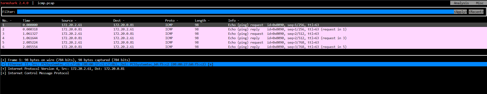

**Table of Contents**
---
- [**Table of Contents**](#table-of-contents)
- [Cilium 환경 분석 사전 준비](#cilium-환경-분석-사전-준비)
- [Cilium Network Interface 구조](#cilium-network-interface-구조)
  - [테스트 환경 Control 노드의 Interface 구성](#테스트-환경-control-노드의-interface-구성)
  - [Control 노드 cilium net과 cilium host 정보 조회](#control-노드-cilium-net과-cilium-host-정보-조회)
  - [lxc\_health Interface 정보 조회](#lxc_health-interface-정보-조회)
  - [lxc\_health 외 lxc로 시작하는 기타 인터페이스의 정보 조회](#lxc_health-외-lxc로-시작하는-기타-인터페이스의-정보-조회)
- [Routing : Encapsulation, Native/Direct](#routing--encapsulation-nativedirect)
  - [Encapsulation](#encapsulation)
  - [Native / Direct](#native--direct)
- [IPAM : Cluster Scope / Multi Pool Mode](#ipam--cluster-scope--multi-pool-mode)
  - [1. Cluster Scope IPAM Mode](#1-cluster-scope-ipam-mode)
    - [1.1 Cluster Scope IPAM 모드에서 CIDR 추가 테스트](#11-cluster-scope-ipam-모드에서-cidr-추가-테스트)
    - [1.2 IP Pool이 고갈된 상황 테스트](#12-ip-pool이-고갈된-상황-테스트)
  - [2 Multi IPAM IPAM Mode](#2-multi-ipam-ipam-mode)
    - [2.1 Pod CIDR 선택 배포 테스트](#21-pod-cidr-선택-배포-테스트)
    - [2.2 CIDR 풀 자동 확장 테스트](#22-cidr-풀-자동-확장-테스트)
  - [3. Load Balancer and Eggress IPAM](#3-load-balancer-and-eggress-ipam)
    - [Load Balaner IP Pool 생성](#load-balaner-ip-pool-생성)


## Cilium 환경 분석 사전 준비 

- Cilium Agent에는 관리용 CLI 세 가지(`cilium`, `cilium-dbg`, `bpftool`)를 제공한다.

  - cilium : Cilium 구성과 관련된 일반 적인 상태 정보, 정책, 서비스 목록 등을 확인하는데 사용한다.

  - cilium-dbg : 네트워킹 디버깅에 사용되는 도구로 패킷 경로를 추적하거나 실시간 이벤트 모니터링에 사용한다.

  - bpftool : eBPF 수준의 디버깅이 필요한 경우 사용되는 도구로 커널에 로드된 eBPF 프로그램 목록, MAP 목록 조회 등에 사용한다.

- Cilium Agent Pod 내에서 실행할 수 있지만 `kubectl exec` 명령을 통해 Control 노드에서 각 노드의 Cilium Agent를 사용하도록 단축키를 지정한다.

```bash
# /ect/profile
export CILIUMPOD0=$(kubectl get -l k8s-app=cilium pods -n kube-system --field-selector spec.nodeName=cilium-ctr -o jsonpath='{.items[0].metadata.name}')
export CILIUMPOD1=$(kubectl get -l k8s-app=cilium pods -n kube-system --field-selector spec.nodeName=cilium-w1 -o jsonpath='{.items[0].metadata.name}')
export CILIUMPOD2=$(kubectl get -l k8s-app=cilium pods -n kube-system --field-selector spec.nodeName=cilium-w2 -o jsonpath='{.items[0].metadata.name}')
alias c0="kubectl exec -it $CILIUMPOD0 -n kube-system -c cilium-agent -- cilium"
alias c1="kubectl exec -it $CILIUMPOD1 -n kube-system -c cilium-agent -- cilium"
alias c2="kubectl exec -it $CILIUMPOD2 -n kube-system -c cilium-agent -- cilium"
alias c0dbg="kubectl exec -it $CILIUMPOD0 -n kube-system -c cilium-agent -- cilium-dbg"
alias c1dbg="kubectl exec -it $CILIUMPOD1 -n kube-system -c cilium-agent -- cilium-dbg"
alias c2dbg="kubectl exec -it $CILIUMPOD2 -n kube-system -c cilium-agent -- cilium-dbg"
alias c0bpf="kubectl exec -it $CILIUMPOD0 -n kube-system -c cilium-agent -- bpftool"
alias c1bpf="kubectl exec -it $CILIUMPOD1 -n kube-system -c cilium-agent -- bpftool"
alias c2bpf="kubectl exec -it $CILIUMPOD2 -n kube-system -c cilium-agent -- bpftool"
```

```bash
source /etc/profile
```

## Cilium Network Interface 구조

### 테스트 환경 Control 노드의 Interface 구성

<p align=center></p>

### Control 노드 cilium net과 cilium host 정보 조회

- control 노드에서 인터페이스의 목록을 확인해보면 cilium net, cilium host, lxc_health 인터페이스를 볼 수 있다.

```bash
$ ip -c -br addr show
eth0                    UP             10.0.2.15/24 metric 100 fd17:625c:f037:2:a00:27ff:fe6b:69c9/64 fe80::a00:27ff:fe6b:69c9/64 
eth1                    UP             192.168.10.100/24 fe80::a00:27ff:febd:9813/64 
cilium_net@cilium_host  UP             fe80::18f2:6aff:fe9d:4953/64 
cilium_host@cilium_net  UP             172.20.0.6/32 fe80::1cb0:76ff:fe52:2aa/64 
lxc_health@if6          UP             fe80::7c46:c0ff:fe22:317f/64 
lxce588bd206718@if8     UP             fe80::ccb:27ff:fe93:8b39/64 
lxcd4c5e765631e@if10    UP             fe80::2ca3:f9ff:fe4b:520/64 
```

### lxc_health Interface 정보 조회

- lxc_health 인터페이스 같은 경우 Control 노드에서는 IP 정보를 직접 확인할 수 없다.

- cilium-dbg cli을 통해 control 노드에 할당되어 있는 IP의 정보를 검색하면 `health` 항목에 할당된 IP를 확인할 수 있다.

```bash
$ c0dbg status --verbose | grep -A6 "Allocated"
Allocated addresses:
  172.20.0.11 (health)
  172.20.0.12 (kube-system/coredns-674b8bbfcf-r4kx2)
  172.20.0.3 (kube-system/coredns-674b8bbfcf-7ltmp)
  172.20.0.6 (router)
```

- cilium에서는 각 endpoint(interface or ip address) 마다 endpoint id를 할당하는데 해당 정보를 cilium cli로 조회한다.

```bash
$ c0 endpoint list
ENDPOINT   POLICY (ingress)   POLICY (egress)   IDENTITY   LABELS (source:key[=value])                                                  IPv6   IPv4          STATUS   
           ENFORCEMENT        ENFORCEMENT                                                                                                                    
...
1364       Disabled           Disabled          4          reserved:health                                                                     172.20.0.11   ready   
...
```

- 172.20.0.11(health) IP에 할당 된 ENDPOINT ID 1364를 이용해서 해당 IP의 세부 정보를 조회하면 Cilium 노드에서 보았던 Interface Name을 확인할 수 있다.

```bash
$ c0 endpoint get 1364 | grep -A11 networking
      "networking": {
        "addressing": [
          {
            "ipv4": "172.20.0.11",        # health interface ip
            "ipv4-pool-name": "default"
          }
        ],
        "host-mac": "7e:46:c0:22:31:7f",  # host mac 정보
        "interface-index": 7, 
        "interface-name": "lxc_health",   # inteface name
        "mac": "3a:c9:b4:f3:4c:9a"
      },
```

- 조금 더 확실하게 비교하기 위해 `host-mac` 정보까지 control node에서 검색해 보면 동일한 정보가 할당되어 있음을 알 수 있다.

```bash
$ ip -c addr show lxc_health
7: lxc_health@if6: <BROADCAST,MULTICAST,UP,LOWER_UP> mtu 1500 qdisc noqueue state UP group default qlen 1000
    link/ether 7e:46:c0:22:31:7f brd ff:ff:ff:ff:ff:ff link-netnsid 0
    inet6 fe80::7c46:c0ff:fe22:317f/64 scope link 
       valid_lft forever preferred_lft forever
```

### lxc_health 외 lxc로 시작하는 기타 인터페이스의 정보 조회

- cilium 에서는 노드에 Pod가 생성되면 Pod의 인터페이스와 바인딩할 `lxcxxxx` 형태의 인터페이스를 호스트 노드에 생성한다.

- cilium-dbg cli을 통해 control 노드에 할당되어 있는 IP의 정보를 검색하면 `coredns` Pod에 할당된 IP를 확인할 수 있다.

```bash
$ c0dbg status --verbose | grep -A6 "Allocated"
Allocated addresses:
  172.20.0.11 (health)
  172.20.0.12 (kube-system/coredns-674b8bbfcf-r4kx2)
  172.20.0.3 (kube-system/coredns-674b8bbfcf-7ltmp)
  172.20.0.6 (router)
```

- coredns의 ENDPOINT ID 값을 조회한 후 해당 ENDPOINT의 상세 내용을 검색하면, 호스트 노드에서 보이는 인터페이스 이름과 일치하는 정보가 확인된다.

```bash
c0 endpoint list
ENDPOINT   POLICY (ingress)   POLICY (egress)   IDENTITY   LABELS (source:key[=value])                                                  IPv6   IPv4          STATUS   
           ENFORCEMENT        ENFORCEMENT                                                                                                                    
235        Disabled           Disabled          5118       k8s:io.cilium.k8s.namespace.labels.kubernetes.io/metadata.name=kube-system          172.20.0.3    ready   
                                                           k8s:io.cilium.k8s.policy.cluster=default                                                                  
                                                           k8s:io.cilium.k8s.policy.serviceaccount=coredns                                                           
                                                           k8s:io.kubernetes.pod.namespace=kube-system                                                               
                                                           k8s:k8s-app=kube-dns 
2089       Disabled           Disabled          5118       k8s:io.cilium.k8s.namespace.labels.kubernetes.io/metadata.name=kube-system          172.20.0.12   ready   
                                                           k8s:io.cilium.k8s.policy.cluster=default                                                                  
                                                           k8s:io.cilium.k8s.policy.serviceaccount=coredns                                                           
                                                           k8s:io.kubernetes.pod.namespace=kube-system                                                               
                                                           k8s:k8s-app=kube-dns 
```

```bash
c0 endpoint get 235 | grep -A12 networking
      "networking": {
        "addressing": [
          {
            "ipv4": "172.20.0.3",
            "ipv4-pool-name": "default"
          }
        ],
        "container-interface-name": "eth0",
        "host-mac": "2e:a3:f9:4b:05:20",
        "interface-index": 11,
        "interface-name": "lxcd4c5e765631e",
        "mac": "86:0a:05:59:44:d9"
      },
```

## Routing : Encapsulation, Native/Direct

### Encapsulation

### Native / Direct

- 통신 테스트를 위해 샘플 파드(curl / netshoot)를 생성한다.

```bash
$ kubectl get po -owide
NAME                      READY   STATUS    RESTARTS   AGE     IP             NODE         NOMINATED NODE   READINESS GATES
curl-pod                  1/1     Running   0          2d23h   172.20.2.61    cilium-ctr   <none>           <none>
netshoot-pod-w1           1/1     Running   0          55s     172.20.0.81    cilium-w1    <none>           <none>
netshoot-pod-w2           1/1     Running   0          36s     172.20.1.174   cilium-w2    <none>           <none>
```

- WEB-POD의 IP를 변수에 저장 후 활용한다.

```bash
export NETPODIP1=$(kubectl get -l app=curl pods --field-selector spec.nodeName=cilium-w1 -o jsonpath='{.items[0].status.podIP}')
export NETPODIP2=$(kubectl get -l app=curl pods --field-selector spec.nodeName=cilium-w2 -o jsonpath='{.items[0].status.podIP}')
```

```bash
$ echo $NETPODIP1
172.20.0.81
$ echo $NETPODIP2
172.20.1.174
```

- `curl-pod`에서 `webpod`로 ICMP 패킷을 전달하고 Pod, Node에서 tcpdumpe를 확인하면 Pod IP로 통신하고 있는 것을 확인할 수 있다.

```bash
kubectl exec -it curl-pod -- ping $NETPODIP1
```

```bash
# cilium-ctr 노드에서 실행 한 tcpdump 결과 값
$ tcpdump -i eth1 icmp
11:47:48.295596 IP 172.20.2.61 > 172.20.0.81: ICMP echo request, id 96, seq 1, length 64
11:47:48.295921 IP 172.20.0.81 > 172.20.2.61: ICMP echo reply, id 96, seq 1, length 64
...
# cilium-w1 노드에서 실행 한 tcpdump 결과 값
$ tcpdump -i eth1 icmp
11:48:33.992812 IP 172.20.2.61 > 172.20.0.81: ICMP echo request, id 102, seq 1, length 64
11:48:33.992915 IP 172.20.0.81 > 172.20.2.61: ICMP echo reply, id 102, seq 1, length 64
...
# curl-pod에서 실행 한 tcpdump 결과 값
$ kubectl exec -it curl-pod -- tcpdump -i eth0 icmp
02:49:06.529171 IP curl-pod > 172.20.0.81: ICMP echo request, id 114, seq 1, length 64
02:49:06.529437 IP 172.20.0.81 > curl-pod: ICMP echo reply, id 114, seq 1, length 64
...
# netshoot-pod-w1에서 실행 한 tcpdump 결과 값
$ kubectl exec -it netshoot-pod-w1 -- tcpdump -i eth0 icmp
02:49:38.379248 IP 172.20.2.61 > netshoot-pod-w1: ICMP echo request, id 120, seq 1, length 64
02:49:38.379321 IP netshoot-pod-w1 > 172.20.2.61: ICMP echo reply, id 120, seq 1, length 64
```

- 통신 경로를 살펴 보면 각 Pod에서는 자신의 노드의 `cilium_host` ip가 default routing 경로로 설정되어 있다.

```bash
# curl-pod routing table
$ kubectl exec -it curl-pod -- ip -c route
default via 172.20.2.225 dev eth0 mtu 1500 
172.20.2.225 dev eth0 scope link
# netshoot-pod-w1 routing table
$ kubectl exec -it netshoot-pod-w1 -- ip -c route
default via 172.20.0.51 dev eth0 mtu 1500 
172.20.0.51 dev eth0 scope link 
```

```bash
$ for i in ctr w1 ; do echo ">> node : cilium-$i <<"; sshpass -p 'vagrant' ssh -o StrictHostKeyChecking=no vagrant@cilium-$i ip -c addr  | grep -A5 cilium_host@cilium_net ; echo; done
>> node : cilium-ctr <<
5: cilium_host@cilium_net: <BROADCAST,MULTICAST,NOARP,UP,LOWER_UP> mtu 1500 qdisc noqueue state UP group default qlen 1000
    link/ether 56:e4:89:84:db:22 brd ff:ff:ff:ff:ff:ff
    inet 172.20.2.225/32 scope global cilium_host
       valid_lft forever preferred_lft forever
    inet6 fe80::54e4:89ff:fe84:db22/64 scope link 
       valid_lft forever preferred_lft forever

>> node : cilium-w1 <<
5: cilium_host@cilium_net: <BROADCAST,MULTICAST,NOARP,UP,LOWER_UP> mtu 1500 qdisc noqueue state UP group default qlen 1000
    link/ether 2a:36:dc:ae:dd:c3 brd ff:ff:ff:ff:ff:ff
    inet 172.20.0.51/32 scope global cilium_host
       valid_lft forever preferred_lft forever
    inet6 fe80::2836:dcff:feae:ddc3/64 scope link 
       valid_lft forever preferred_lft forever
```

- `cilium-ctr`과 `cilium-w1` 노드에서 각 파드로 향하는 패킷은 리눅스 커널 라우팅 정보를 기반으로 동작한다.

- 각 노드에 할당된 IP와 노드마다 할당된 PodCIDR, Routing 정보를 확인하면 다음과 같고, `cilium_host` 인터페이스로 전달된 Pod의 패킷이 이 정보를 기반으로 Direct로 전달되는 것을 알 수 있다.

```bash
# cilium node ip information
$ kubectl get ciliumnodes
NAME         CILIUMINTERNALIP   INTERNALIP       AGE
cilium-ctr   172.20.2.225       192.168.10.100   5d14h
cilium-w1    172.20.0.51        192.168.10.101   5d14h
cilium-w2    172.20.1.221       192.168.10.102   5d14h
# cilium-ctr, cilium-w1 PodCIDR information
$ kubectl get ciliumnode -o jsonpath='{range .items[*]}{.metadata.name}{" "}{.spec.ipam.podCIDRs[*]}{"\n"}{end}' | column -t
cilium-ctr  172.20.2.0/24
cilium-w1   172.20.0.0/24
cilium-w2   172.20.1.0/24
# cilium-ctr, ciliu,-w1 routeing table 
$ for i in ctr w1 ; do echo ">> node : cilium-$i <<"; sshpass -p 'vagrant' ssh -o StrictHostKeyChecking=no vagrant@cilium-$i ip -c route show ; echo; done
ne
>> node : cilium-ctr <<
default via 10.0.2.2 dev eth0 proto dhcp src 10.0.2.15 metric 100 
10.0.2.0/24 dev eth0 proto kernel scope link src 10.0.2.15 metric 100 
10.0.2.2 dev eth0 proto dhcp scope link src 10.0.2.15 metric 100 
10.0.2.3 dev eth0 proto dhcp scope link src 10.0.2.15 metric 100 
172.20.0.0/24 via 192.168.10.101 dev eth1 proto kernel 
172.20.1.0/24 via 192.168.10.102 dev eth1 proto kernel 
172.20.2.27 dev lxcf18fa3ec10e8 proto kernel scope link 
172.20.2.61 dev lxceef064c53fb6 proto kernel scope link 
172.20.2.106 dev lxc811fcf88a445 proto kernel scope link 
192.168.10.0/24 dev eth1 proto kernel scope link src 192.168.10.100 

>> node : cilium-w1 <<
default via 10.0.2.2 dev eth0 proto dhcp src 10.0.2.15 metric 100 
10.0.2.0/24 dev eth0 proto kernel scope link src 10.0.2.15 metric 100 
10.0.2.2 dev eth0 proto dhcp scope link src 10.0.2.15 metric 100 
10.0.2.3 dev eth0 proto dhcp scope link src 10.0.2.15 metric 100 
172.20.0.65 dev lxcc4ed30f5773e proto kernel scope link 
172.20.0.81 dev lxc50169b2b208e proto kernel scope link 
172.20.0.106 dev lxc773f942306ed proto kernel scope link 
172.20.0.218 dev lxc6bc61689249b proto kernel scope link 
172.20.1.0/24 via 192.168.10.102 dev eth1 proto kernel 
172.20.2.0/24 via 192.168.10.100 dev eth1 proto kernel 
192.168.10.0/24 dev eth1 proto kernel scope link src 192.168.10.101
```

- `cilium-ctr` 노드에서 tcpdump 내용을 pcap 파일로 저장 후 정보를 확인하면 자신의 인터페이스와 `cilium-w1` 노드의 인터페이스의 MAC Address를 Source와 Destination 주소로 사용한다.

- `cilium-ctr`, `cilium-w1` 노드에서 각각 interface, arp cache table 정보를 조회해보면 서로 통신에 사용하는 같은 네트워크 `192.168.10.0/24`대역에 할당된 IP, MAC 주소임이 확인된다.



```bash
# cilium-ctr, cilium-w1 node macc address information
$ for i in ctr w1 ; do echo ">> node : cilium-$i <<"; sshpass -p 'vagrant' ssh -o StrictHostKeyChecking=no vagrant@cilium-$i ip -c addr | grep -A3 eth1 ; echo; done
>> node : cilium-ctr <<
3: eth1: <BROADCAST,MULTICAST,UP,LOWER_UP> mtu 1500 qdisc fq_codel state UP group default qlen 1000
    link/ether 08:00:27:c1:c7:6b brd ff:ff:ff:ff:ff:ff
    altname enp0s8
    inet 192.168.10.100/24 brd 192.168.10.255 scope global eth1
       valid_lft forever preferred_lft forever
    inet6 fe80::a00:27ff:fec1:c76b/64 scope link 
       valid_lft forever preferred_lft forever

>> node : cilium-w1 <<
3: eth1: <BROADCAST,MULTICAST,UP,LOWER_UP> mtu 1500 qdisc fq_codel state UP group default qlen 1000
    link/ether 08:00:27:b0:f5:c2 brd ff:ff:ff:ff:ff:ff
    altname enp0s8
    inet 192.168.10.101/24 brd 192.168.10.255 scope global eth1
       valid_lft forever preferred_lft forever
    inet6 fe80::a00:27ff:feb0:f5c2/64 scope link 
       valid_lft forever preferred_lft forever
```

```bash
# cilium-ctr, cilum-w1 arp table information
$ for i in ctr w1 ; do echo ">> node : cilium-$i <<"; sshpass -p 'vagrant' ssh -o StrictHostKeyChecking=no vagrant@cilium-$i arp -a ; echo; done
>> node : cilium-ctr <<
cilium-w1 (192.168.10.101) at 08:00:27:b0:f5:c2 [ether] on eth1
? (10.0.2.3) at 52:55:0a:00:02:03 [ether] on eth0
Workspace (192.168.10.1) at 0a:00:27:00:00:00 [ether] on eth1
? (172.20.2.27) at 56:dc:67:22:28:5f [ether] on lxcf18fa3ec10e8
cilium-w2 (192.168.10.102) at 08:00:27:74:3f:da [ether] on eth1
_gateway (10.0.2.2) at 52:55:0a:00:02:02 [ether] on eth0
? (172.20.2.106) at 2e:41:42:6f:af:8b [ether] on lxc811fcf88a445

>> node : cilium-w1 <<
Workspace (192.168.10.1) at 0a:00:27:00:00:00 [ether] on eth1
? (192.168.10.100) at 08:00:27:c1:c7:6b [ether] on eth1       
? (192.168.10.102) at 08:00:27:74:3f:da [ether] on eth1
? (172.20.0.218) at f6:95:fa:fc:81:2b [ether] on lxc6bc61689249b
? (172.20.0.65) at ce:d6:39:bf:db:a1 [ether] on lxcc4ed30f5773e
_gateway (10.0.2.2) at 52:55:0a:00:02:02 [ether] on eth0
? (10.0.2.3) at 52:55:0a:00:02:03 [ether] on eth0
```

- 동작과정 분석 결과 네트워크 처리 과정을 살펴보면 같은 노드에 배치된 파드간의 통신에는 eBPF를 사용해 Cilium이 처리하고, 노드간의 파드 통신에는 리눅스의 라우팅 시스템을 통해 통신한다는 것을 알 수 있다.


## IPAM : Cluster Scope / Multi Pool Mode

### 1. Cluster Scope IPAM Mode

#### 1.1 Cluster Scope IPAM 모드에서 CIDR 추가 테스트

- cluster scope ipam cidr 설정 파일을 생성한다.

```yaml
# cilium-values.yaml
---
ipam:
  mode: cluster-pool
  operator:
    clusterPoolIPv4MaskSize: 29
    clusterPoolIPv4PodCIDRList:
      - "172.20.42.0/28"
      - "172.20.84.0/28"
```

- Helm 도구를 이용해서 1.17.5 Cilium을 설치하면서 설정파일을 `-f` 옵션으로 할당한다.

```bash
helm repo add cilium https://helm.cilium.io/
helm repo update
helm install cilium cilium/cilium -n kube-system --version 1.17.5 -f cilium-values.yaml
```

- Cilium CLI를 이용해 배포 결과를 확인한다. (CLI는 별도 설치 필요)

```bash
$ cilium config view | grep cluster-pool
cluster-pool-ipv4-cidr                            172.20.42.0/28 172.20.84.0/28
cluster-pool-ipv4-mask-size                       29
ipam                                              cluster-pool
```

- `172.20.42.0/28`, `172.20.84.0/28` CIDR 이 외에 추가 CIDR을 파일에 반영 후 Helm을 업데이트한다.

```yaml
# cilium-values.yaml
---
ipam:
  mode: cluster-pool
  operator:
    clusterPoolIPv4MaskSize: 29
    clusterPoolIPv4PodCIDRList:
      - "172.20.42.0/28"
      - "172.20.84.0/28"
      - "10.0.0.0/28"
```

```bash
helm upgrade cilium cilium/cilium -n kube-system --version 1.17.5 -f cilium-values.yaml
```

- Cilium CLI를 이용해 배포 결과를 확인한다.

```bash
$ cilium config view | grep cluster-pool
cluster-pool-ipv4-cidr                            172.20.42.0/28 172.20.84.0/28 10.0.0.0/28
cluster-pool-ipv4-mask-size                       29
ipam                                              cluster-pool
```

- node에 할당된 cidr 정보를 확인한다.

```bash
$ kubectl get ciliumnode -o jsonpath='{range .items[*]}{.metadata.name}{" "}{.spec.ipam.podCIDRs[*]}{"\n"}{end}' | column -t
cilium-ctr  172.20.84.0/29
cilium-w1   172.20.42.0/29
cilium-w2   172.20.42.8/29
```

#### 1.2 IP Pool이 고갈된 상황 테스트

- `cilium-w1`, `cilium-w2` 노드에 할당된 CIDR Pool 정보와 남은 IP의 개수를 확인한다.

```bash
$ c1dbg status | grep IPAM
IPAM:                    IPv4: 3/6 allocated from 172.20.42.0/29,
$ c2dbg status | grep IPAM
IPAM:                    IPv4: 3/6 allocated from 172.20.42.8/29,
```

- 노드에 할당된 IP의 정보를 세부적으로 확인하기 위해서 `--verbose` 옵션을 추가하면 router, health, coredns 정보를 확인할 수 있다.

```bash
$ c1dbg status --verbose | grep -A6 "Allocated"
Allocated addresses:
  172.20.42.2 (router)
  172.20.42.3 (health)
  172.20.42.5 (kube-system/coredns-674b8bbfcf-xcvrr)
```

- 호스트 노드에 할당된 인터페이스의 정보를 조회하면 router에 할당된 IP와 같은 것을 확인할 수 있다.

```bash
$ sshpass -p 'vagrant' ssh -o StrictHostKeyChecking=no vagrant@cilium-w1 ip -c -br addr show
...
cilium_host@cilium_net  UP             172.20.42.2/32 fe80::4cb3:63ff:fe9a:4b8b/64
lxc_health@if6          UP             fe80::c07d:afff:fe65:d624/64
lxc31994ffe5fef@if8     UP             fe80::5c67:79ff:fec9:4eb3/64
```

- coredns에 할당된 IP 정보를 `kubectl` 명령으로 확인하면 해당 정보도 cilium agent에서 확인한 정보와 같은 것을 볼 수 있다.

  ```bash
  $ k get po -A -owide | grep coredns | grep cilium-w1
  kube-system   coredns-674b8bbfcf-xcvrr             1/1     Running   1 (22m ago)   34h    172.20.42.5      cilium-w1    <none>           <none>
  ```

- 각 노드에 3개의 IP 가용량만 남은 상태에서 IP를 고갈 시 동작 결과를 확인하기 위해 10개의 Pod를 생성한다.

```bash
$ kubectl create deployment netshoot --image nginx --replicas 10
deployment.apps/netshoot created
```

- 생성 후 결과를 조회하면 4개의 Pod가 `ContainerCreating` 단계에서 넘어가지 못하고 홀딩 상태 유지하는 것을 볼 수 있는데,

```bash
$ kubectl get po -o wide
NAME                        READY   STATUS              RESTARTS   AGE     IP             NODE        NOMINATED NODE   READINESS GATES
netshoot-5fbc6f4997-99djz   1/1     Running             0          2m34s   172.20.42.9    cilium-w2   <none>           <none>
netshoot-5fbc6f4997-9h945   1/1     Running             0          2m34s   172.20.42.10   cilium-w2   <none>           <none>
netshoot-5fbc6f4997-9h9vw   0/1     ContainerCreating   0          2m34s   <none>         cilium-w2   <none>           <none>
netshoot-5fbc6f4997-b9mdk   0/1     ContainerCreating   0          2m34s   <none>         cilium-w2   <none>           <none>
netshoot-5fbc6f4997-rdbg8   1/1     Running             0          2m34s   172.20.42.4    cilium-w1   <none>           <none>
netshoot-5fbc6f4997-t84kf   0/1     ContainerCreating   0          2m34s   <none>         cilium-w1   <none>           <none>
netshoot-5fbc6f4997-tq5tt   0/1     ContainerCreating   0          2m34s   <none>         cilium-w1   <none>           <none>
netshoot-5fbc6f4997-wpf8j   1/1     Running             0          2m34s   172.20.42.1    cilium-w1   <none>           <none>
netshoot-5fbc6f4997-xjft8   1/1     Running             0          2m34s   172.20.42.11   cilium-w2   <none>           <none>
netshoot-5fbc6f4997-zxzfs   1/1     Running             0          2m34s   172.20.42.6    cilium-w1   <none>           <none>
```

- 배포 완료되지 못한 특정 파드의 이벤트 정보를 확인하면, kubelet이 Cilium Plugin에서 IP주소를 가져오지 못하고 "range is full" 메세지를 보여준다.

```bash
$ kubectl describe po netshoot-5fbc6f4997-tq5tt  | grep -A10 Events
Events:
  Type     Reason                  Age                  From               Message
  ----     ------                  ----                 ----               -------
  Normal   Scheduled               5m31s                default-scheduler  Successfully assigned default/netshoot-5fbc6f4997-tq5tt to cilium-w1
  Warning  FailedCreatePodSandBox  5m30s                kubelet            Failed to create pod sandbox: rpc error: code = Unknown desc = failed to setup network for sandbox "d0146b59d6be4c9e7fdd3e2d1fbba7b999d4c8bddf99f9248168bea00062d0d8": plugin type="cilium-cni" failed (add): unable to allocate IP via local cilium agent: [POST /ipam][502] postIpamFailure "range is full"
  ...
```

- 실제로 cilium agent의 디버깅 CLI로 남은 IP 수량을 확인하면 `6/6`으로 모든 IP가 소진되었고, 용 가능한 IP 주소가 없는 것을 확인할 수 있다.

```bash
$ c1dbg status | grep IPAM
IPAM:                    IPv4: 6/6 allocated from 172.20.42.0/29
$ c2dbg status | grep IPAM
IPAM:                    IPv4: 6/6 allocated from 172.20.42.8/29,
```

### 2 Multi IPAM IPAM Mode

#### 2.1 Pod CIDR 선택 배포 테스트

- multi-pool ipam cidr 설정 파일을 생성한다.

```yaml
# cilium-values.yaml
---
ipam:
  mode: multi-pool
  operator:
    autoCreateCiliumPodIPPools:
      default:
        ipv4:
          cidrs: 172.20.0.0/16
          maskSize: 28
```

```bash
helm install cilium cilium/cilium -n kube-system --version 1.17.5 -f cilium-values.yaml
```

- Cilium CLI를 이용해 multi pool ipam 배포 결과를 확인한다.

```bash
$ cilium config view | grep multi-pool
ipam                                              multi-pool
$ cilium config view | grep auto-create
auto-create-cilium-pod-ip-pools                   default=ipv4-cidrs:172.20.0.0/16;ipv4-mask-size:28
```

- 각 노드에 할당된 cidr 정보를 확인한다.

```bash
$ for i in ctr w1 w2 ; do echo ">> node : cilium-$i <<"; kubectl get ciliumnodes cilium-$i -o yaml | yq .spec.ipam.pools.allocated ; echo; done
>> node : cilium-ctr <<
[
  {
    "cidrs": [
      "172.20.0.0/28",
      "172.20.0.16/28"
    ],
    "pool": "default"
  }
]

>> node : cilium-w1 <<
[
  {
    "cidrs": [
      "172.20.0.48/28",
      "172.20.0.80/28"
    ],
    "pool": "default"
  }
]

>> node : cilium-w2 <<
[
  {
    "cidrs": [
      "172.20.0.32/28",
      "172.20.0.64/28"
    ],
    "pool": "default"
  }
]
```

- 기존에 cilium cni를 설치하는 과정에 설정된 cidr 이후에도 ip 대역을 추가할 때는 `CiliumPodIPPool`을 사용할 수 있다.

- `CiliumPodIPPool`를 이용해 vac, no-engine에서 사용할 IP Pool을 추가한다.

```yaml
# cilium_ip_pool_vac.yaml
apiVersion: cilium.io/v2alpha1
kind: CiliumPodIPPool
metadata:
  name: vac
spec:
  ipv4:
    cidrs:
      - 10.100.0.0/16
    maskSize: 29
# cilium_ip_pool_no.yaml
apiVersion: cilium.io/v2alpha1
kind: CiliumPodIPPool
metadata:
  name: no-engine
spec:
  ipv4:
    cidrs:
      - 10.200.0.0/16
    maskSize: 29
```

```bash
kubectl apply -f cilium_ip_pool_vac.yaml
kubectl apply -f cilium_ip_pool_no.yaml
```

- `CiliumPodIPPool`를 생성할 때 `metadata.name` 필드를 이용해서 vac, no-engine를 만들었는데,

- Pod의 매니페스트 파일에서 annotation을 지정하지 않으면 default ip pool을 사용하게 된다.

- default ip pool 할당 여부를 확인하기 위해 기본 설정으로 deployment를 생성해보고 할당되는 IP 주소가 `172.20.0.0/16`인지 확인한다.

```bash
$ kubectl create deployment netshoot --image nginx --replicas 2
$ kubectl get po -owide
NAME                        READY   STATUS    RESTARTS   AGE   IP            NODE        NOMINATED NODE   READINESS GATES
netshoot-5fbc6f4997-2dd4z   1/1     Running   0          92s   172.20.0.77   cilium-w2   <none>           <none>
netshoot-5fbc6f4997-4tmch   1/1     Running   0          92s   172.20.0.89   cilium-w1   <none>           <none>
```

- 특정 ip pool을 사용하고자 할 때는 `spec.template.metadata.annotation` 필드에 사용하고자 하는 ip pool의 name을 지정한다.

```yaml
# deploy_vac.yaml
apiVersion: apps/v1
kind: Deployment
metadata:
  name: nginx-vac
spec:
  selector:
    matchLabels:
      app: nginx-vac
  replicas: 2
  template:
    metadata:
      labels:
        app: nginx-vac
      annotations:
        ipam.cilium.io/ip-pool: vac # ip pool name 지정
    spec:
      containers:
        - name: nginx
          image: nginx
          ports:
            - containerPort: 80
---
# deploy_no.yaml
apiVersion: apps/v1
kind: Deployment
metadata:
  name: nginx-no
spec:
  selector:
    matchLabels:
      app: nginx-no
  replicas: 2
  template:
    metadata:
      labels:
        app: nginx-no
      annotations:
        ipam.cilium.io/ip-pool: no-engine # ip pool name 지정
    spec:
      containers:
        - name: nginx
          image: nginx
          ports:
            - containerPort: 80
```

- 배포 후 vac Pod는 `10.100.0.0/16`, no Pod는 `10.200.0.0/16` 대역의 주소가 의도한 대로 할당되었는지 확인한다.

```bash
$ kubectl get pods -o wide
NAME                         READY   STATUS    RESTARTS   AGE     IP            NODE        NOMINATED NODE   READINESS GATES
netshoot-5fbc6f4997-2dd4z    1/1     Running   0          6m19s   172.20.0.77   cilium-w2   <none>           <none>
netshoot-5fbc6f4997-4tmch    1/1     Running   0          6m19s   172.20.0.89   cilium-w1   <none>           <none>
nginx-no-76df566dfb-4kfpx    1/1     Running   0          20s     10.200.0.11   cilium-w1   <none>           <none>
nginx-no-76df566dfb-d6v2j    1/1     Running   0          20s     10.200.0.3    cilium-w2   <none>           <none>
nginx-vac-65889dbdc9-75rr6   1/1     Running   0          82s     10.100.0.14   cilium-w2   <none>           <none>
nginx-vac-65889dbdc9-dsp56   1/1     Running   0          82s     10.100.0.6    cilium-w1   <none>           <none>
```

#### 2.2 CIDR 풀 자동 확장 테스트

- CIDR IP Pool이 확장 되기 전에 현재 노드 마다 할당된 CIDR IP Pool 정보를 확인한다.

```bash
$ for i in ctr w1 w2 ; do echo ">> node : cilium-$i <<"; kubectl get ciliumnodes cilium-$i -o yaml | yq .spec.ipam.pools.allocated ; echo; done
>> node : cilium-ctr <<
[
  {
    "cidrs": [
      "172.20.0.0/28",
      "172.20.0.16/28"
    ],
    "pool": "default"
  }
]

>> node : cilium-w1 <<
[
  {
    "cidrs": [
      "172.20.0.48/28",
      "172.20.0.80/28"
    ],
    "pool": "default"
  },
  {
    "cidrs": [
      "10.200.0.8/29"
    ],
    "pool": "no-engine"
  },
  {
    "cidrs": [
      "10.100.0.0/29"
    ],
    "pool": "vac"
  }
]

>> node : cilium-w2 <<
[
  {
    "cidrs": [
      "172.20.0.32/28",
      "172.20.0.64/28"
    ],
    "pool": "default"
  },
  {
    "cidrs": [
      "10.200.0.0/29"
    ],
    "pool": "no-engine"
  },
  {
    "cidrs": [
      "10.100.0.8/29"
    ],
    "pool": "vac"
  }
]
```

- 추가된 ip pool은 `/29`로 8개씩 IP를 할당할 수 있는데 고갈된 경우 동적으로 확장되는지 테스트 하기 위해 `nginx-vac` deployment의 replicas 개수를 20개로 수정한다.

```bash
$ kubectl scale deployment nginx-vac --replicas=20
```

- Pod의 배포 결과를 확인해 보면 기존 할당된 ip pool 대비 더 많은 Pod가 정상적으로 배포 된 것을 볼 수 있다.

```bash
$ kubectl get po -owide
NAME                         READY   STATUS    RESTARTS   AGE     IP            NODE        NOMINATED NODE   READINESS GATES
netshoot-5fbc6f4997-2dd4z    1/1     Running   0          14m     172.20.0.77   cilium-w2   <none>           <none>
netshoot-5fbc6f4997-4tmch    1/1     Running   0          14m     172.20.0.89   cilium-w1   <none>           <none>
nginx-no-76df566dfb-4kfpx    1/1     Running   0          8m30s   10.200.0.11   cilium-w1   <none>           <none>
nginx-no-76df566dfb-d6v2j    1/1     Running   0          8m30s   10.200.0.3    cilium-w2   <none>           <none>
nginx-vac-65889dbdc9-2fz58   1/1     Running   0          39s     10.100.0.28   cilium-w2   <none>           <none>
nginx-vac-65889dbdc9-4h48r   1/1     Running   0          6m51s   10.100.0.1    cilium-w1   <none>           <none>
nginx-vac-65889dbdc9-75rr6   1/1     Running   0          9m32s   10.100.0.14   cilium-w2   <none>           <none>
nginx-vac-65889dbdc9-7q2zr   1/1     Running   0          39s     10.100.0.30   cilium-w2   <none>           <none>
nginx-vac-65889dbdc9-96bcx   1/1     Running   0          6m51s   10.100.0.13   cilium-w2   <none>           <none>
nginx-vac-65889dbdc9-9jfcp   1/1     Running   0          6m51s   10.100.0.11   cilium-w2   <none>           <none>
nginx-vac-65889dbdc9-bdj98   1/1     Running   0          39s     10.100.0.22   cilium-w1   <none>           <none>
nginx-vac-65889dbdc9-bttzt   1/1     Running   0          39s     10.100.0.20   cilium-w1   <none>           <none>
nginx-vac-65889dbdc9-chbhz   1/1     Running   0          6m51s   10.100.0.10   cilium-w2   <none>           <none>
nginx-vac-65889dbdc9-ck4q8   1/1     Running   0          39s     10.100.0.27   cilium-w2   <none>           <none>
nginx-vac-65889dbdc9-cqgmd   1/1     Running   0          6m51s   10.100.0.2    cilium-w1   <none>           <none>
nginx-vac-65889dbdc9-dsp56   1/1     Running   0          9m32s   10.100.0.6    cilium-w1   <none>           <none>
nginx-vac-65889dbdc9-jlchn   1/1     Running   0          39s     10.100.0.9    cilium-w2   <none>           <none>
nginx-vac-65889dbdc9-l2nz5   1/1     Running   0          39s     10.100.0.29   cilium-w2   <none>           <none>
nginx-vac-65889dbdc9-ncsmb   1/1     Running   0          39s     10.100.0.21   cilium-w1   <none>           <none>
nginx-vac-65889dbdc9-nr7zv   1/1     Running   0          6m51s   10.100.0.3    cilium-w1   <none>           <none>
nginx-vac-65889dbdc9-rggpj   1/1     Running   0          6m51s   10.100.0.12   cilium-w2   <none>           <none>
nginx-vac-65889dbdc9-s9s6w   1/1     Running   0          39s     10.100.0.4    cilium-w1   <none>           <none>
nginx-vac-65889dbdc9-vn4bv   1/1     Running   0          39s     10.100.0.17   cilium-w1   <none>           <none>
nginx-vac-65889dbdc9-xsz9h   1/1     Running   0          6m51s   10.100.0.5    cilium-w1   <none>           <none>
```

- 필요한 IP 수가 늘어나게 되면 CIDR IP Pool이 자동으로 확장 된다.

```bash
$ for i in ctr w1 w2 ; do echo ">> node : cilium-$i <<"; kubectl get ciliumnodes cilium-$i -o yaml | yq .spec.ipam.pools.allocated ; echo; done
>> node : cilium-ctr <<
[
  {
    "cidrs": [
      "172.20.0.0/28",
      "172.20.0.16/28"
    ],
    "pool": "default"
  }
]

>> node : cilium-w1 <<
[
  {
    "cidrs": [
      "172.20.0.48/28",
      "172.20.0.80/28"
    ],
    "pool": "default"
  },
  {
    "cidrs": [
      "10.200.0.8/29"
    ],
    "pool": "no-engine"
  },
  {
    "cidrs": [
      "10.100.0.0/29",
      "10.100.0.16/29"  # 추가된 cidr
    ],
    "pool": "vac"
  }
]

>> node : cilium-w2 <<
[
  {
    "cidrs": [
      "172.20.0.32/28",
      "172.20.0.64/28"
    ],
    "pool": "default"
  },
  {
    "cidrs": [
      "10.200.0.0/29"
    ],
    "pool": "no-engine"
  },
  {
    "cidrs": [
      "10.100.0.24/29",   # 추가된 cidr
      "10.100.0.8/29"
    ],
    "pool": "vac"
  }
]
```

### 3. Load Balancer and Eggress IPAM

#### Load Balaner IP Pool 생성

- 쿠버네티스의 LoadBalancer, Ingress 리소스를 생성할 때 External IP에 할당할 IP Pool을 생성해야 한다.

```yaml
# lb-ip-pool.yaml
apiVersion: "cilium.io/v2alpha1"
kind: CiliumLoadBalancerIPPool
metadata:
  name: lb-ip-pool
spec:
  cidrs:
    - cidr: "10.0.250.0/24"
```

- IP Pool 생성 후 Ingress Nginx 또는 ArgoCD와 같은 Ingress Controller, LoadBalancer Type의 리소스를 생성하면 자동으로 External IP가 할당된다.

```bash
$ kubectl get svc -n ingress-nginx
NAME                                 TYPE           CLUSTER-IP       EXTERNAL-IP   PORT(S)                      AGE
ingress-nginx-controller             LoadBalancer   10.96.201.226    10.0.250.1    80:31181/TCP,443:32179/TCP   16d
```

- IP 주소가 할당되고 난 다음에는 외부 클라이언트가 해당 IP 주소로 접속할 수 있도록 네트워크 설정이 추가되어야 한다.

- BGP를 이용하는 방식(ToR 네트워크 장치 필요)과 ARP를 이용하는 L2 방식이 있다.

- ARP 를 통한 L2 방식을 사용하기 위해서는 Cilium CNI의 옵션을 추가해야 한다.

```yaml

---
# cilium-values.yaml
kubeProxyReplacement: true
autoDirectNodeRoutes: true
l2announcements:
  enabled: true
externalIPs:
  enabled: true
```

```bash
helm upgrade cilium cilium/cilium -n kube-system --version 1.17.5 -f cilium-values.yaml
```

- helm으로 Cilium을 재배포한 후 설정이 반영되었는지 확인한다.

```bash
$ cilium config view | grep enable-l2
enable-l2-announcements                           true
enable-l2-neigh-discovery                         true
```

- 그 다음 LoadBalancer/Ingress에 할당되는 External IP에 대한 ARP 요청에 응답할 수 있도록 `CiliumL2AnnouncementPolicy`를 생성한다.

```yaml
# cilium-l2-announcement-policy.yaml
apiVersion: "cilium.io/v2alpha1"
kind: CiliumL2AnnouncementPolicy
metadata:
  name: cilium-l2-announcement-policy
spec:
  externalIPs: true
  loadBalancerIPs: true
```

```bash
kubectl apply -f cilium-l2-announcement-policy.yaml
```

- 배포 후 LoadBalancer/Ingress Type 서비스에 할당된 External IP로 요청을 보내면 응답을 받을 수 있다.
