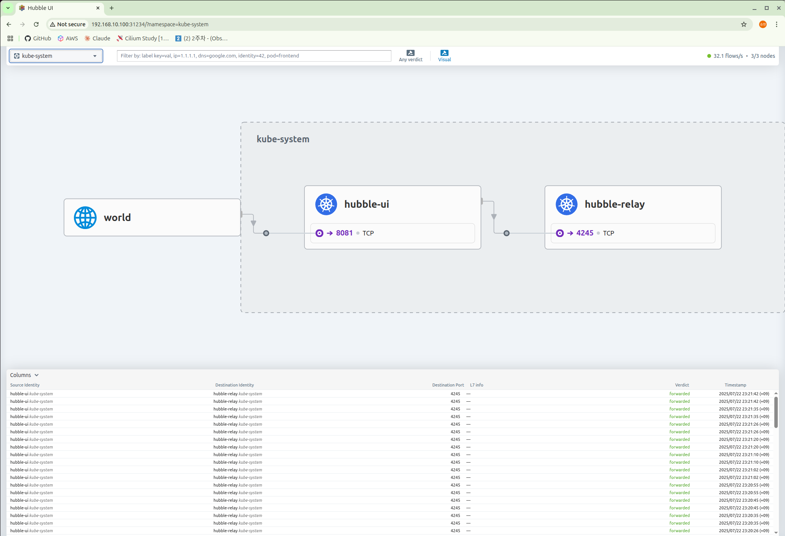

## Network Observability with Hubble

### 개요

- Hubble은 Cilium과 eBPF를 기반으로 observability를 제공하는 도구다.

- 서비스의 통신 및 동작과 네트워킹 인프라를 깊이 있게 관찰할 수 있는 가시성을 제공한다.

- 노드, 클러스터, 멀티 클러스터 전반에 걸친 가시성을 제공할 수 있다.

### Hubble 주요 구성요소

### Hubble API

- Hubble API는 Cilium Agent가 실행되는 개별 노드의 범위 내에서 작동한다.

- Cilium Agent Pod에 설치되는 Hubbel CLI를 이용하면 Hubbel API 쿼리가 가능하다.

- 이러한 특성 때문에 Hubbel API는 관찰 가능한 범위가 Cilium Agent가 동작하는 개별 노드 범위 내로 한정된다.

### Hubble Relay

- 개별 노드의 범위로 제한된 관찰 가능성을 갖는 Hubbel API의 동작 방식을 보완하기 위해 Hubble Relay를 사용한다.

- Hubble Relay를 배포하면 클러스터 메시 시나리오에서 전체 클러스터 또는 여러 클러스터에 대한 네트워크 가시성이 제공된다.

- Hubbel Relay로 Hubble CLi를 연결하거나 Hubble UI를 통해 각 노드의 Hubble 데이터에 액세스할 수 있다.

### Hubble UI

- L3/L4/L7 계층 네트워크 트래픽 데이터에 대한 검색/시각화를 지원하는 웹 인터페이스다.

### Hubble Exporter

- Hubble flows 로그를 파일에 저장할 수 있는 cilium-agent의 기능이다.

## Setting up Hubble Observability

### Hubble 설치 옵션

- helm으로 cilium 설치한 환경에서 hubble 을 추가 활성화하려는 경우 `--reuse-values` 옵션을 이용해서 추가 옵션을 활성화할 수 있다.

```bash
helm upgrade cilium cilium/cilium --namespace kube-system --reuse-values \
--set hubble.enabled=true \         # hubble 활성화
--set hubble.relay.enabled=true \   # hubble-relay 활성화 (데이터 중앙 수집용)
--set hubble.ui.enabled=true \      # hubble-ui 활성화 (웹 UI 접속용)
--set hubble.ui.service.type=NodePort \   # ui 서비스 타입 설정
--set hubble.ui.service.nodePort=31234 \  # ui 서비스 포트 설정
--set hubble.export.static.enabled=true \   # hubble-export 활성화
--set hubble.export.static.filePath=/var/run/cilium/hubble/events.log \   # hubble-export 경로 설정
--set prometheus.enabled=true \                 # cilium-agent 메트릭 수집 활성화
--set operator.prometheus.enabled=true \        # cilium-operator 메트릭 수집 활성화
--set hubble.metrics.enableOpenMetrics=true \   # hubble 메트릭 수집 활성화
--set hubble.metrics.enabled="{dns,drop,tcp,flow,port-distribution,icmp,httpV2:exemplars=true;labelsContext=source_ip\,source_namespace\,source_workload\,destination_ip\,destination_namespace\,destination_workload\,traffic_direction}"
```

### Hubble UI 접속

설치 옵션에 `NodePort` 타입의 `31234` 포트로 지정되어 있기 때문에 특정 노드의 IP와 `31234` 포트로 접속하면 Hubble Web UI로 접속할 수 있다.



## Hubble 구성

### Hubble Relay가 Peer를 이용하는 메커니즘

Hubble Relay는 Peer 리소스를 통해 클러스터 전체의 Hubble 데이터를 수집하는 분산 아키텍처를 구현한다. 각 노드에서 실행되는 Cilium Agent의 Hubble API에 연결하여 네트워크 관측 데이터를 중앙화한다. (각 Kubernetes 노드에서 실행되는 Cilium Agent는 독립적인 Hubble API 서버를 포함하고 있다. 이 Agent는 해당 노드를 통과하는 네트워크 트래픽만 관측 가능하다.)

### Peer 서비스의 구성

Hubble Relay의 구성 정보는 `hubble-relay-config` ConfigMap에서 확인할 수 있다.

```bash
$ kubectl describe cm -n kube-system hubble-relay-config | grep peer
peer-service: "hubble-peer.kube-system.svc.cluster.local.:443"
```

hubble-peer 서비스의 `엔드포인트`를 조회하면 각 노드의 Hubble API 연결 구성을 확인할 수 있다. 여기에서 각 노드에서 실행되고 있는 `4244` 포트는 Hubble API 서버의 포트다.

```bash
$ kubectl get svc,ep -n kube-system hubble-peer
Warning: v1 Endpoints is deprecated in v1.33+; use discovery.k8s.io/v1 EndpointSlice
NAME                  TYPE        CLUSTER-IP     EXTERNAL-IP   PORT(S)   AGE
service/hubble-peer   ClusterIP   10.96.31.125   <none>        443/TCP   32m

NAME                    ENDPOINTS                                                     AGE
endpoints/hubble-peer   192.168.10.100:4244,192.168.10.101:4244,192.168.10.102:4244   32m
```

## Hubble CLI

### Hubble CLI 설치

```bash
HUBBLE_VERSION=$(curl -s https://raw.githubusercontent.com/cilium/hubble/master/stable.txt)
HUBBLE_ARCH=amd64
if [ "$(uname -m)" = "aarch64" ]; then HUBBLE_ARCH=arm64; fi
curl -L --fail --remote-name-all https://github.com/cilium/hubble/releases/download/$HUBBLE_VERSION/hubble-linux-${HUBBLE_ARCH}.tar.gz{,.sha256sum}
sudo tar xzvfC hubble-linux-${HUBBLE_ARCH}.tar.gz /usr/local/bin
which hubble
hubble status
```

### Hubble CLI 명령어

```bash
hubble observe -f                               # 전체 트래픽 플로우 출력 (유지)
hubble observe -f --from-identity <IDENTITY>    # ID 값 기준으로 필터
hubble observe -f --protocol udp                # 프로토콜 기준으로 필터
hubble observe -f --type drop                   # 드랍 패킷 출력
hubble observe -f --pod deathstar               # 파드 이름으로 필터
```

### observe 명령어 출력 결과

```bash
# 3 way hand-shake
Jul 23 13:09:19.678: default/xwing:37762 (ID:4619) -> default/deathstar-8c4c77fb7-pktmt:80 (ID:14866) to-endpoint FORWARDED (TCP Flags: SYN)
Jul 23 13:09:19.679: default/xwing:37762 (ID:4619) -> default/deathstar-8c4c77fb7-pktmt:80 (ID:14866) to-endpoint FORWARDED (TCP Flags: ACK)
Jul 23 13:09:19.679: default/xwing:37762 (ID:4619) -> default/deathstar-8c4c77fb7-pktmt:80 (ID:14866) to-endpoint FORWARDED (TCP Flags: ACK, PSH)
Jul 23 13:09:19.679: default/xwing:37762 (ID:4619) <> default/deathstar-8c4c77fb7-pktmt (ID:14866) pre-xlate-rev TRACED (TCP)
Jul 23 13:09:19.679: default/xwing:37762 (ID:4619) <> default/deathstar-8c4c77fb7-pktmt (ID:14866) pre-xlate-rev TRACED (TCP)
Jul 23 13:09:19.679: default/xwing:37762 (ID:4619) <> default/deathstar-8c4c77fb7-pktmt (ID:14866) pre-xlate-rev TRACED (TCP)
Jul 23 13:09:19.679: default/xwing:37762 (ID:4619) <> default/deathstar-8c4c77fb7-pktmt (ID:14866) pre-xlate-rev TRACED (TCP)
Jul 23 13:09:19.679: default/xwing:37762 (ID:4619) <> default/deathstar-8c4c77fb7-pktmt (ID:14866) pre-xlate-rev TRACED (TCP)
Jul 23 13:09:19.679: default/xwing:37762 (ID:4619) -> default/deathstar-8c4c77fb7-pktmt:80 (ID:14866) to-endpoint FORWARDED (TCP Flags: ACK, FIN)
Jul 23 13:09:19.692: default/xwing (ID:4619) <> 10.96.189.73:80 (world) pre-xlate-fwd TRACED (TCP)
Jul 23 13:09:19.692: default/xwing (ID:4619) <> default/deathstar-8c4c77fb7-pktmt:80 (ID:14866) post-xlate-fwd TRANSLATED (TCP)
Jul 23 13:09:19.692: default/xwing:37762 (ID:4619) -> default/deathstar-8c4c77fb7-pktmt:80 (ID:14866) to-network FORWARDED (TCP Flags: SYN)
Jul 23 13:09:19.692: default/xwing:37762 (ID:4619) -> default/deathstar-8c4c77fb7-pktmt:80 (ID:14866) to-network FORWARDED (TCP Flags: ACK)
Jul 23 13:09:19.692: default/xwing:37762 (ID:4619) -> default/deathstar-8c4c77fb7-pktmt:80 (ID:14866) to-network FORWARDED (TCP Flags: ACK, PSH)
Jul 23 13:09:19.693: default/xwing:37762 (ID:4619) -> default/deathstar-8c4c77fb7-pktmt:80 (ID:14866) to-network FORWARDED (TCP Flags: ACK, FIN)
Jul 23 13:09:19.679: default/xwing:37762 (ID:4619) -> default/deathstar-8c4c77fb7-pktmt:80 (ID:14866) to-endpoint FORWARDED (TCP Flags: ACK)
Jul 23 13:09:19.693: default/xwing:37762 (ID:4619) -> default/deathstar-8c4c77fb7-pktmt:80 (ID:14866) to-network FORWARDED (TCP Flags: ACK)
# Drop 패킷
Jul 23 13:13:00.129: default/xwing:36558 (ID:4619) <> default/deathstar-8c4c77fb7-q7zq6:80 (ID:14866) Policy denied DROPPED (TCP Flags: SYN)
Jul 23 13:13:01.140: default/xwing:36558 (ID:4619) <> default/deathstar-8c4c77fb7-q7zq6:80 (ID:14866) Policy denied DROPPED (TCP Flags: SYN)
```

## Prometheus & Grafana

### Monitoring, Observavility 개념

Monitoring은 사전에 정의된 기준을 기반으로 시스템의 상태를 감시하는 것에 중점을 둔다. 그래서 주로 시스템(하드웨어/소프트웨어)의 메트릭을 수집해서 정상적으로 작동하는지 확인하고 문제가 발생하면 탐지하는 용으로 데이터들을 사용한다. Observability(관찰가능성)은 수집된 데이터를 기반으로 시스템 내부 상태를 분석하고 상태를 이해하는데 중점을 둔다.

주요 차이점을 정리한다면, 모니터링은 단순한 시스템에 적합하고 단순하게 문제가 발생해 감지하는 부분까지 처리한다. 반면, 관찰 가능성은 문제가 발생한 원인을 분석하고 그 과정에 일어나는 일련의 시스템 동작을 이해하는 것을 중점으로 한다. 관찰 가능성은 마이크로 서비스 아키텍처, 컨테이너 환경에서 필수적인 요소다. Application Perfomance Monitoring이라는 용어 대신 추적(tracing), 계측(instrumentation), 텔레메트리(telemetry) 라는 용어를 사용한다.

|  비교항목   |           메트릭           |                로그                |                     추적                     |
| :---------: | :------------------------: | :--------------------------------: | :------------------------------------------: |
|    정의     | 수치로 표현된 성능 데이터  |         시스템 이벤트 기록         |       요청이 시스템을 거치는 과정 추적       |
|    형태     |        숫자(정량적)        |           텍스트(비정형)           |                트랜잭션 흐름                 |
| 예시 데이터 |  CPU 사용률, 응답 시간 등  | 오류 메세지, 로그인 시도, API 호출 | A → B → C 시스템 순으로 이동하는 트래픽 흐름 |
|  주요 목적  | 시스템 성능 모니터링, 알림 |        이벤트 분석, 디버깅         |     서비스간 호출 경로 및 병목 현상 분석     |
|  저장방식   |       시계열 데이터        |    로그 파일, 로그 관리 시스템     |             분산 트레이신 시스템             |
|  활용 도구  |    Prometheus, Grafana     |           ELS Tack, Loki           |                Jaeger, Zipkin                |

### Sample Application 배포

- 배포 리소스 확인인

```bash
NAME                      READY   STATUS              RESTARTS   AGE
curl-pod                  1/1     Running             0          63s
webpod-697b545f57-9x2g4   1/1     Running             0          116s
webpod-697b545f57-g4txg   1/1     Running             0          116s
```

- 엔드포인트 정보 확인

```bash
NAME                      SECURITY IDENTITY   ENDPOINT STATE   IPV4           IPV6
curl-pod                  19727               ready            172.20.2.61
webpod-697b545f57-9x2g4   49161               ready            172.20.1.242
webpod-697b545f57-g4txg   49161               ready            172.20.0.132
```

- 통신 확인

```bash
$ kubectl exec -it curl-pod -- sh -c 'while true; do curl -s webpod | grep Hostname; sleep 1; done'
Hostname: webpod-697b545f57-9x2g4
Hostname: webpod-697b545f57-9x2g4
Hostname: webpod-697b545f57-g4txg
Hostname: webpod-697b545f57-g4txg
Hostname: webpod-697b545f57-9x2g4
Hostname: webpod-697b545f57-9x2g4
Hostname: webpod-697b545f57-g4txg
Hostname: webpod-697b545f57-9x2g4
Hostname: webpod-697b545f57-9x2g4
Hostname: webpod-697b545f57-g4txg
```

### Prometheus & Grafana 설치

- 배포 명령

```bash
kubectl apply -f https://raw.githubusercontent.com/cilium/cilium/1.17.6/examples/kubernetes/addons/prometheus/monitoring-example.yaml
```

- 설치 리소스 조회

```bash
kubectl get deploy,pod,svc,ep -n cilium-monitoring
kubectl get cm -n cilium-monitoring     # 서버, 대시보드 관련 설정
```

- 접속을 위한 NodePort 설정

```bash
kubectl patch svc -n cilium-monitoring prometheus -p '{"spec": {"type": "NodePort", "ports": [{"port": 9090, "targetPort": 9090, "nodePort": 30001}]}}'
kubectl patch svc -n cilium-monitoring grafana -p '{"spec": {"type": "NodePort", "ports": [{"port": 3000, "targetPort": 3000, "nodePort": 30002}]}}'
```

### 메트릭 수집 정보 설정

Cilium, Hubble은 기본적으로 메트릭을 외부에 노출하지 않는다. 추가 설정을 통해 클러스터의 각 노드의 9962, 9965, 9963 포트를 통해 메트릭 수집이 가능하도록 구성할 수 있다. cilium-agent, cilium-operator, hubble에서 메트릭 수집을 활성화 하기 위해 helm install 과정에 다음 옵션이 필요하다.

```bash
# 위 설치 과정에 이미 포함되어 있는 옵션
--set prometheus.enabled=true \                 # cilium-agent 메트릭 수집 활성화
--set operator.prometheus.enabled=true \        # cilium-operator 메트릭 수집 활성화
--set hubble.metrics.enableOpenMetrics=true \   # hubble 메트릭 수집 활성화
```

각 노드에서 포트가 오픈하고 있는 정보를 조회하는 for문을 실행해서 정보를 확인할 수 있다.

```bash
$ for i in ctr w1 w2 ; do echo ">> node : cilium-$i <<"; sshpass -p 'vagrant' ssh vagrant@cilium-$i sudo ss -tnlp | grep -E '9962|9963|9965' ; echo; done
```

### Prometheus 명령어

```bash
# 최근 5분 간의 데이터로 증가율 계산
rate(cilium_bpf_map_ops_total{k8s_app="cilium"}[5m]) # Graph 확인

# 여러 시계열(metric series)의 값의 평균
avg(rate(cilium_bpf_map_ops_total{k8s_app="cilium"}[5m]))

# 집계 함수(예: sum, avg, max, rate)와 함께 사용하여 어떤 레이블(label)을 기준으로 그룹화할지를 지정하는 그룹핑(grouping) 
avg(rate(cilium_bpf_map_ops_total{k8s_app="cilium"}[5m])) by (pod)
avg(rate(cilium_bpf_map_ops_total{k8s_app="cilium"}[5m])) by (pod, map_name)
avg(rate(cilium_bpf_map_ops_total{k8s_app="cilium"}[5m])) by (pod, map_name, operation) # Graph 확인

# 시계열 중에서 가장 큰 k개를 선택
topk(5, avg(rate(cilium_bpf_map_ops_total{k8s_app="cilium"}[5m]))) by (pod, map_name, operation)
topk(5, avg(rate(cilium_bpf_map_ops_total{k8s_app="cilium", pod="cilium-4hghz"}[5m]))) by (pod, map_name, operation)
```
