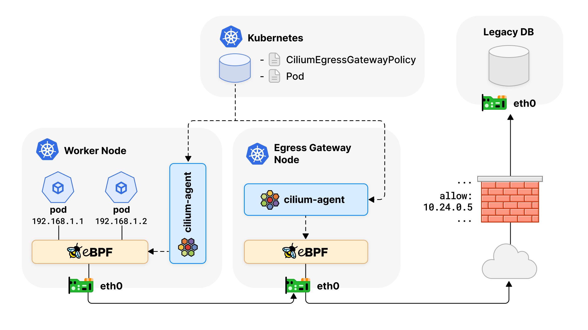
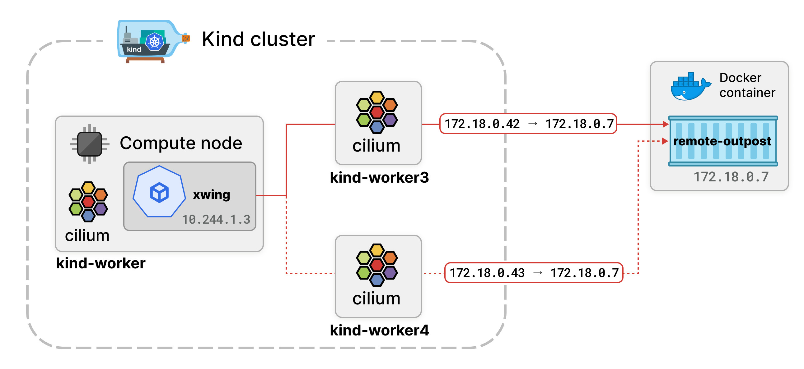
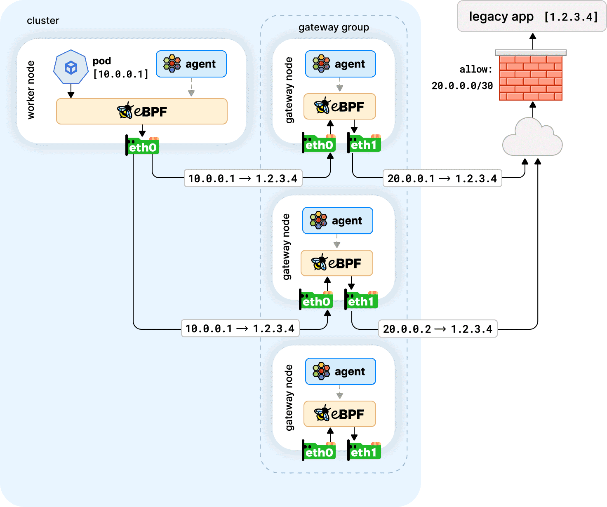
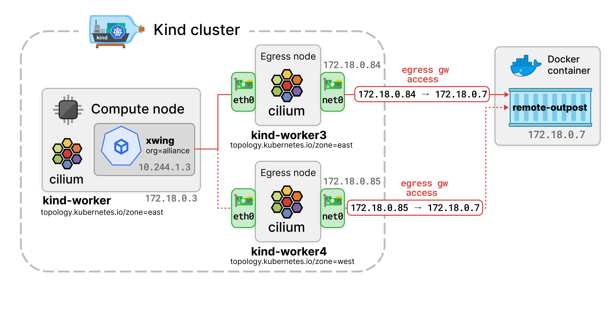

**Table of Contents**
---
- [**Table of Contents**](#table-of-contents)
- [BGP 이용 네트워크 구성](#bgp-이용-네트워크-구성)
  - [개요](#개요)
  - [주요 구성요소](#주요-구성요소)
  - [BGP Network 구성 실습](#bgp-network-구성-실습)
  - [참고](#참고)
- [LB IP BGP 광고](#lb-ip-bgp-광고)
- [Cilium ingress Support](#cilium-ingress-support)
  - [Cilium Ingress Controller, Gateway API와 기존의 Ingress Controller의 차이](#cilium-ingress-controller-gateway-api와-기존의-ingress-controller의-차이)
  - [설정](#설정)
  - [ingress network policy 설정](#ingress-network-policy-설정)
  - [Dedicated Mode 생성](#dedicated-mode-생성)
- [Cilium Egress Gateway](#cilium-egress-gateway)
  - [실습환경 구성](#실습환경-구성)
  - [통신 테스트](#통신-테스트)
  - [egress gateway policy 설정](#egress-gateway-policy-설정)
  - [egress gateway traffic 경로 확인](#egress-gateway-traffic-경로-확인)
  - [egress gateway의 고가용성](#egress-gateway의-고가용성)
  - [egress gateway ip 할당](#egress-gateway-ip-할당)
  - [AWARE Egress Routing](#aware-egress-routing)

## BGP 이용 네트워크 구성

### 개요

- Cilium이 BGP( Border Gateway Protocol ) 를 사용하여 연결된 라우터에 경로를 광고할 수 있는 방법을 제공
- BGP 피어, 정책 및 광고를 구성하는 유연한 방법을 제공하는 사용자 정의 리소스 세트로 관리


### 주요 구성요소


- CiliumBGPClusterConfig: 여러 노드에 적용되는 BGP 인스턴스와 피어 구성을 정의
- CiliumBGPPeerConfig: 공통적인 BGP 피어링 설정입니다. 여러 피어에서 사용
- CiliumBGPAdvertisement: BGP 라우팅 테이블에 삽입되는 접두사를 정의
- CiliumBGPNodeConfigOverride: 노드별 BGP 구성을 정의하여 더욱 세부적인 제어를 제공


### BGP Network 구성 실습

- 상단의 ToR Switch 역할을 해줄 VM(router)를 하나 추가 후 기본 라우팅 설정을 진행한다.
- 초기 설정한 클러스터와 다른 네트워크 대역을 만들고 워커 노드를 추가한다.
- Router VM에 frr 툴 설치 및 설정

  ```
  router bgp 65000
  bgp router-id 192.168.60.200
  bgp graceful-restart
  no bgp ebgp-requires-policy
  bgp bestpath as-path multipath-relax
  maximum-paths 4
  network 10.10.1.0/24
  neighbor CILIUM peer-group
  neighbor CILIUM remote-as external
  neighbor 192.168.60.100 peer-group CILIUM
  neighbor 192.168.60.101 peer-group CILIUM
  neighbor 192.168.160.100 peer-group CILIUM 
  ```

  ```bash
  systemctl daemon-reexec && systemctl restart frr
  systemctl status frr --no-pager --full
  ```

- BGP Node Label 설정

  ```bash
  kubectl label nodes cilium-control cilium-worker01 cilium-worker02 enable-bgp=true
  kubectl get node -l enable-bgp=true
  ```

- Cilium BPG 설정 (router 정보를 입력 후 어떤 IP 정보를 교환할 것인지 설정)

  ```yaml
  apiVersion: cilium.io/v2
  kind: CiliumBGPAdvertisement
  metadata:
    name: bgp-advertisements
    labels:
      advertise: bgp
  spec:
    advertisements:
      - advertisementType: "PodCIDR"
  ---
  apiVersion: cilium.io/v2
  kind: CiliumBGPPeerConfig
  metadata:
    name: cilium-peer
  spec:
    timers:
      holdTimeSeconds: 9
      keepAliveTimeSeconds: 3
    ebgpMultihop: 2
    gracefulRestart:
      enabled: true
      restartTimeSeconds: 15
    families:
      - afi: ipv4
        safi: unicast
        advertisements:
          matchLabels:
            advertise: "bgp"
  ---
  apiVersion: cilium.io/v2
  kind: CiliumBGPClusterConfig
  metadata:
    name: cilium-bgp
  spec:
    nodeSelector:
      matchLabels:
        "enable-bgp": "true"
    bgpInstances:
    - name: "instance-65001"
      localASN: 65001
      peers:
      - name: "tor-switch"
        peerASN: 65000
        peerAddress: 192.168.60.200  # router ip address
        peerConfigRef:
          name: "cilium-peer"
  ```

- Control Node에서 연결상태 확인

  ```bash
  ss -tnp | grep 179
  cilium bgp peers
  cilium bgp routes available ipv4 unicast
  kubectl get ciliumbgpadvertisements,ciliumbgppeerconfigs,ciliumbgpclusterconfigs
  kubectl get ciliumbgpnodeconfigs -o yaml | grep -A6 peeringState
  ```

- Router Node에서 연결 상태 확인

  ```bash
  ip -c route | grep bgp
  vtysh -c 'show ip bgp summary'
  vtysh -c 'show ip bgp'
  ```

- BGP로 학습한 라우팅 정보 확인

  ```bash
  # router node
  ip -c route | grep bgp
  172.20.0.0/24 nhid 96 via 192.168.60.100 dev eth1 proto bgp metric 20 
  172.20.1.0/24 nhid 94 via 192.168.60.101 dev eth1 proto bgp metric 20 
  172.20.2.0/24 nhid 92 via 192.168.160.100 dev eth2 proto bgp metric 20 
  ```

- TCPDUMP 정보 확인

  ```bash
  # control node
  tcpdump -i eth1 tcp port 179 -w /tmp/bgp.pcap
  # router node
  systemctl restart frr && journalctl -u frr -f
  # bgp.type == 2
  termshark -r bgp.pcap
  ```

- control node, worker01~02 node routing table 정보 추가

  ```bash
  # control node
  ip route add 172.20.0.0/16 via 192.168.60.200
  sshpass -p 'vagrant' ssh vagrant@cilium-worker01 sudo ip route add 172.20.0.0/16 via 192.168.60.200
  sshpass -p 'vagrant' ssh vagrant@cilium-worker02 sudo ip route add 172.20.0.0/16 via 192.168.160.200
  ```

  - 각 노드에서는 bgp update 정보를 받았지만 bgp가 직접 커널의 라우팅 정보를 수정하지 않기 때문에 수동으로 설정 필요

  - ToR Switch를 default gateway로 설정되어 있는 환경인 경우 이 과정은 불필요 (이미 router에서는 BGP로 경로 값이 학습되어 있기 때문)

  - 또는 default gateway가 tor 스위치로 향하지 않는 환경인 경우 수동으로 경로 설정이 필요함

- 정상 통신 확인

  ```bash
  kubectl exec -it curl-pod -- sh -c 'while true; do curl -s --connect-timeout 1 webpod | grep Hostname; echo "---" ; sleep 1; done'
  ```

### 참고

- 노드가 많은 대규모 클러스터의 경우, api 서버에 부하 유발할 수 있으니, bgp status reporting off 권장

  ```bash
  # CiliumBGPNodeConfig Status 정보 확인
  kubectl get ciliumbgpnodeconfigs -o yaml | yq
  # bgpControlPlane.statusReport.enabled=false 설정
  helm upgrade cilium cilium/cilium --version 1.18.0 --namespace kube-system --reuse-values \
  --set bgpControlPlane.statusReport.enabled=false
  kubectl -n kube-system rollout restart ds/cilium
  # CiliumBGPNodeConfig Status 정보 확인
  kubectl get ciliumbgpnodeconfigs -o yaml | yq
  ```

## LB IP BGP 광고

- LB IPAM 설정

  ```yaml
  apiVersion: "cilium.io/v2"
  kind: CiliumLoadBalancerIPPool
  metadata:
    name: "cilium-pool"
  spec:
    allowFirstLastIPs: "No"
    blocks:
    - cidr: "172.16.1.0/24"
  ```

  ```bash
  kubectl get ippool
  ```

- Cluster Type 서비스 LB Type 변경

  ```bash
  kubectl patch svc webpod -p '{"spec": {"type": "LoadBalancer"}}'
  kubectl get svc webpod 
  ```

  ```bash
  kubectl -n kube-system exec ds/cilium -c cilium-agent -- cilium-dbg service list | grep -A2 LoadBalancer
  16   172.16.1.1:80/TCP      LoadBalancer   1 => 172.20.1.20:80/TCP (active)        
                                            2 => 172.20.2.107:80/TCP (active)      
  ```

- BGP Announce 설정

 ```yaml
 apiVersion: cilium.io/v2
  kind: CiliumBGPAdvertisement
  metadata:
    name: bgp-advertisements-lb-exip-webpod
    labels:
      advertise: bgp
  spec:
    advertisements:
      - advertisementType: "Service"
        service:
          addresses:
            - LoadBalancerIP
        selector:             
          matchExpressions:
            - { key: app, operator: In, values: [ webpod ] }
  ```

  ```bash
  kubectl get CiliumBGPAdvertisement
  ```

  ```bash
  kubectl exec -it -n kube-system ds/cilium -- cilium-dbg bgp route-policies
  cilium bgp routes available ipv4 unicast
  ```

- router 에 추가된 라우팅 경로 확인

  ```bash
  sshpass -p 'vagrant' ssh vagrant@cilium-router ip -c route
  ...
  172.16.1.1 nhid 133 proto bgp metric 20 
        nexthop via 192.168.60.101 dev eth1 weight 1 
        nexthop via 192.168.60.100 dev eth1 weight 1 
        nexthop via 192.168.160.100 dev eth2 weight 1 
  ...
  ```

  ```bash
  sshpass -p 'vagrant' ssh vagrant@cilium-router "sudo vtysh -c 'show ip route bgp'"
  sshpass -p 'vagrant' ssh vagrant@cilium-router "sudo vtysh -c 'show ip bgp summary'"
  sshpass -p 'vagrant' ssh vagrant@cilium-router "sudo vtysh -c 'show ip bgp'"
  sshpass -p 'vagrant' ssh vagrant@cilium-router "sudo vtysh -c 'show ip bgp 172.16.1.1/32'"
  ```

- 통신 테스트 (control node)

  ```bash
  root@cilium-control:~# LBIP=$(kubectl get svc webpod -o jsonpath='{.status.loadBalancer.ingress[0].ip}')
  root@cilium-control:~# curl -s $LBIP
  Hostname: webpod-697b545f57-7cnln
  IP: 127.0.0.1
  IP: ::1
  IP: 172.20.1.20
  IP: fe80::883d:f5ff:fe10:373e
  RemoteAddr: 192.168.60.100:35352
  GET / HTTP/1.1
  Host: 172.16.1.1
  User-Agent: curl/8.5.0
  Accept: */*

  root@cilium-control:~# curl -s $LBIP
  Hostname: webpod-697b545f57-9glcn
  IP: 127.0.0.1
  IP: ::1
  IP: 172.20.2.107
  IP: fe80::3455:45ff:fe8d:83bc
  RemoteAddr: 192.168.60.100:47042
  GET / HTTP/1.1
  Host: 172.16.1.1
  User-Agent: curl/8.5.0
  Accept: */*
  ```

- 통신 테스트 (router node)

  ```bash
  root@cilium-router:~# LBIP=172.16.1.1
  root@cilium-router:~# curl -s $LBIP
  Hostname: webpod-697b545f57-9glcn
  IP: 127.0.0.1
  IP: ::1
  IP: 172.20.2.107
  IP: fe80::3455:45ff:fe8d:83bc
  RemoteAddr: 192.168.60.100:45870
  GET / HTTP/1.1
  Host: 172.16.1.1
  User-Agent: curl/8.5.0
  Accept: */*

  root@cilium-router:~# curl -s $LBIP
  Hostname: webpod-697b545f57-7cnln
  IP: 127.0.0.1
  IP: ::1
  IP: 172.20.1.20
  IP: fe80::883d:f5ff:fe10:373e
  RemoteAddr: 192.168.60.100:45882  # control 노드에는 라우팅 대상이 없지만 계속 이곳으로 라우팅 되는 상태 
  GET / HTTP/1.1
  Host: 172.16.1.1
  User-Agent: curl/8.5.0
  Accept: */*
  ```

## Cilium ingress Support

- Cilium에서는 `ingressClassName`으로 `Cilium`을 사용하는 Ingress Controller를 제공한다.
- dedicated 모드는 ingress에 대한 전용 로드 밸런서를 생성한다.
- shared 모드는 모든 ingress가 공유할 로드 밸런서를 생성한다.
- Cilium에서 Ingress Controller를 사용하기 위해서는 `nodePort.enabled=true` 또는 `kubeProxyReplacement=true`를 사용해 kube-proxy를 대체 활성화 해야 한다.
- Cilium에서는 L7 Proxy(Envoy)를 통해서 구성된다.

### Cilium Ingress Controller, Gateway API와 기존의 Ingress Controller의 차이
- Cilium의 Ingress Controller, Gateway API는 다른 Ingress Controller와 다르게 CNI에서 제공하는 기술 스택의 일부로 구성되어 이전 Ingress Controller와는 다르게 동작한다.
- 다른 Ingress 또는 Gateway API 컨트롤러는 일반적으로 클러스터에 Deployment 또는 데몬셋으로 설치된다.
- Cilium Ingress 및 Gateway API 구성은 Loadbalancer 또는 NodePort 서비스를 통해 노출된다.
- 선택적으로 Host network에서도 노출될 수 있다.
- 트래픽이 서비스의 포트에 도착하면 eBPF 코드가 트래픽을 가로채어 Envoy에게 전달한다.
- 또한 Cilium의 네트워크 정책 엔진이 Ingress에서 들어오는 트래픽 경계와 트래픽에 CiliumNetworkPolicy를 적용할 수 있다.
- cilium ingress와 ingress nginx와 같은 별도의 controller를 병행 사용할 수 있다.

### 설정 

- lb 활성화

  ```bash
  helm upgrade cilium cilium/cilium --version 1.18.0 --namespace kube-system --reuse-values \
    --set ingressController.enabled=true \
    --set ingressController.loadbalancerMode=shared \
    --set loadBalancer.l7.backend=envoy
  ```

  ```bash
  kubectl -n kube-system rollout restart ds/cilium
  ```

  ```bash
  cilium config view | grep -E '^loadbalancer|l7'
  enable-l7-proxy                                   true
  loadbalancer-l7                                   envoy
  loadbalancer-l7-algorithm                         round_robin
  loadbalancer-l7-ports 
  ```

- lb ipam 설정

 ```bash
 cat << EOF | kubectl apply -f -
  apiVersion: "cilium.io/v2" 
  kind: CiliumLoadBalancerIPPool
  metadata:
    name: "cilium-lb-ippool"
  spec:
    blocks:
    - start: "192.168.10.211"
      stop:  "192.168.10.215"
  EOF
  ```

- L2 Accouncement 설정

  ```bash
  cat << EOF | kubectl apply -f -
  apiVersion: "cilium.io/v2alpha1"
  kind: CiliumL2AnnouncementPolicy
  metadata:
    name: policy1
  spec:
    interfaces:
    - eth1
    externalIPs: true
    loadBalancerIPs: true
  EOF
  ```

- 리더 인스턴스 조회

  ```bash
  $ kubectl -n kube-system get lease | grep "cilium-l2announce"
  cilium-l2announce-kube-system-cilium-ingress   cilium-w2
  ```

- LoadBalancer로 띄워진 cilium-ingress 정보 조회

  ```bash
  root@cilium-ctr:~# kubectl get svc -n kube-system cilium-ingress
  NAME             TYPE           CLUSTER-IP     EXTERNAL-IP      PORT(S)                      AGE
  cilium-ingress   LoadBalancer   10.96.149.41   192.168.10.211   80:32573/TCP,443:30748/TCP   3d13h
  root@cilium-ctr:~# kubectl get ingressclasses
  NAME     CONTROLLER                     PARAMETERS   AGE
  cilium   cilium.io/ingress-controller   <none>       3d13h
  ```

- ingress 생성 및 정보 조회

  ```bash
  # sample application
  root@cilium-ctr:~# kubectl apply -f https://raw.githubusercontent.com/istio/istio/release-1.26/samples/bookinfo/platform/kube/bookinfo.yaml
  # sample ingress 
  root@cilium-ctr:~# cat << EOF | kubectl apply -f -
  apiVersion: networking.k8s.io/v1
  kind: Ingress
  metadata:
    name: basic-ingress
    namespace: default
  spec:
    ingressClassName: cilium
    rules:
    - http:
        paths:
        - backend:
            service:
              name: details
              port:
                number: 9080
          path: /details
          pathType: Prefix
        - backend:
            service:
              name: productpage
              port:
                number: 9080
          path: /
          pathType: Prefix
  EOF
  # ingress 정보 조회
  root@cilium-ctr:~# k get ing
  NAME            CLASS    HOSTS   ADDRESS          PORTS   AGE
  basic-ingress   cilium   *       192.168.10.211   80      4s
  ```

- ingress 통신 테스트

  ```bash
  LBIP=$(kubectl get svc -n kube-system cilium-ingress -o jsonpath='{.status.loadBalancer.ingress[0].ip}')
  ```

  ```bash
  curl -so /dev/null -w "%{http_code}\n" http://$LBIP/
  curl -so /dev/null -w "%{http_code}\n" http://$LBIP/details/1
  ```

### ingress network policy 설정

- ingress와 관련된 모든 트래픽 차단

  ```bash
  cat << EOF | kubectl apply -f -
  apiVersion: "cilium.io/v2"
  kind: CiliumClusterwideNetworkPolicy
  metadata:
    name: "external-lockdown"
  spec:
    description: "Block all the traffic originating from outside of the cluster"
    endpointSelector: {}
    ingress:
    - fromEntities:
      - cluster
  EOF
  ```

  ```bash
  root@cilium-ctr:~# kubectl get ciliumclusterwidenetworkpolicy
  NAME                VALID
  external-lockdown   True
  ```

  ```bash
  root@cilium-ctr:~# curl --fail -v http://"$LBIP"/details/1
  *   Trying 192.168.10.211:80...
  * Connected to 192.168.10.211 (192.168.10.211) port 80
  > GET /details/1 HTTP/1.1
  > Host: 192.168.10.211
  > User-Agent: curl/8.5.0
  > Accept: */*
  > 
  < HTTP/1.1 403 Forbidden
  < content-length: 15
  < content-type: text/plain
  < date: Fri, 22 Aug 2025 05:44:03 GMT
  < server: envoy
  * The requested URL returned error: 403
  * Closing connection
  curl: (22) The requested URL returned error: 403
  ```

- hubble 관측 결과 확인

  ```bash
  root@cilium-ctr:~# cilium hubble port-forward&
  root@cilium-ctr:~# hubble observe -f --identity ingress
  ```

  ```bash
  root@cilium-ctr:~# curl --fail -v http://"$LBIP"/details/1
  Aug 22 05:46:14.512: 127.0.0.1:47282 (ingress) -> 127.0.0.1:13618 (world) http-request DROPPED (HTTP/1.1 GET http://192.168.10.211/details/1)
  Aug 22 05:46:14.512: 127.0.0.1:47282 (ingress) <- 127.0.0.1:13618 (world) http-response FORWARDED (HTTP/1.1 403 0ms (GET http://192.168.10.211/details/1))
  ```

  ```bash
  root@cilium-ctr:~# sshpass -p 'vagrant' ssh vagrant@cilium-r curl -s http://$LBIP/details/1 -v
  Aug 22 05:46:43.680: 192.168.10.200:35288 (ingress) -> 192.168.10.211:80 (world) http-request DROPPED (HTTP/1.1 GET http://192.168.10.211/details/1)
  Aug 22 05:46:43.680: 192.168.10.200:35288 (ingress) <- 192.168.10.211:80 (world) http-response FORWARDED (HTTP/1.1 403 0ms (GET http://192.168.10.211/details/1))
  ```

- 허용 정책 추가

  ```bash
  cat << EOF | kubectl apply -f -
  apiVersion: "cilium.io/v2"
  kind: CiliumClusterwideNetworkPolicy
  metadata:
    name: "allow-cidr"
  spec:
    description: "Allow all the traffic originating from a specific CIDR"
    endpointSelector:
      matchExpressions:
      - key: reserved:ingress
        operator: Exists
    ingress:
    - fromCIDRSet:
      # Please update the CIDR to match your environment
      - cidr: 192.168.10.200/32
      - cidr: 127.0.0.1/32
  EOF
  ```

  ```bash
  root@cilium-ctr:~# kubectl get ciliumclusterwidenetworkpolicy
  NAME                VALID
  allow-cidr          True
  external-lockdown   True
  ```

- 통신 테스트 추가

  ```bash
  root@cilium-ctr:~# curl --fail -v http://"$LBIP"/details/1
  Aug 22 05:48:31.222: 172.20.0.214:46089 (ingress) -> default/details-v1-766844796b-vldmp:9080 (ID:22766) policy-verdict:L3-Only INGRESS ALLOWED (TCP Flags: SYN)
  Aug 22 05:48:31.222: 172.20.0.214:46089 (ingress) -> default/details-v1-766844796b-vldmp:9080 (ID:22766) to-endpoint FORWARDED (TCP Flags: SYN)
  Aug 22 05:48:31.222: 172.20.0.214:46089 (ingress) <- default/details-v1-766844796b-vldmp:9080 (ID:22766) to-network FORWARDED (TCP Flags: SYN, ACK)
  Aug 22 05:48:31.222: 172.20.0.214:46089 (ingress) -> default/details-v1-766844796b-vldmp:9080 (ID:22766) to-endpoint FORWARDED (TCP Flags: ACK)
  Aug 22 05:48:31.222: 172.20.0.214:46089 (ingress) -> default/details-v1-766844796b-vldmp:9080 (ID:22766) to-endpoint FORWARDED (TCP Flags: ACK, PSH)
  Aug 22 05:48:31.222: 172.20.0.214:46089 (ingress) <> default/details-v1-766844796b-vldmp (ID:22766) pre-xlate-rev TRACED (TCP)
  Aug 22 05:48:31.223: 172.20.0.214:46089 (ingress) <> default/details-v1-766844796b-vldmp (ID:22766) pre-xlate-rev TRACED (TCP)
  Aug 22 05:48:31.223: 172.20.0.214:46089 (ingress) <> default/details-v1-766844796b-vldmp (ID:22766) pre-xlate-rev TRACED (TCP)
  Aug 22 05:48:31.223: 172.20.0.214:46089 (ingress) <> default/details-v1-766844796b-vldmp (ID:22766) pre-xlate-rev TRACED (TCP)
  Aug 22 05:48:31.223: 172.20.0.214:46089 (ingress) <> default/details-v1-766844796b-vldmp (ID:22766) pre-xlate-rev TRACED (TCP)
  Aug 22 05:48:31.223: 172.20.0.214:46089 (ingress) <> default/details-v1-766844796b-vldmp (ID:22766) pre-xlate-rev TRACED (TCP)
  Aug 22 05:48:31.223: 172.20.0.214:46089 (ingress) <> default/details-v1-766844796b-vldmp (ID:22766) pre-xlate-rev TRACED (TCP)
  Aug 22 05:48:31.223: 172.20.0.214:46089 (ingress) <- default/details-v1-766844796b-vldmp:9080 (ID:22766) to-network FORWARDED (TCP Flags: ACK, PSH)
  Aug 22 05:48:31.279: 127.0.0.1:49514 (ingress) -> default/details-v1-766844796b-vldmp:9080 (ID:22766) http-request FORWARDED (HTTP/1.1 GET http://192.168.10.211/details/1)
  Aug 22 05:48:31.280: 127.0.0.1:49514 (ingress) <- default/details-v1-766844796b-vldmp:9080 (ID:22766) http-response FORWARDED (HTTP/1.1 200 1ms (GET http://192.168.10.211/details/1))
  ```

  ```bash
  root@cilium-ctr:~# sshpass -p 'vagrant' ssh vagrant@cilium-r curl -s http://$LBIP/details/1 -v
  Aug 22 05:49:01.258: 172.20.0.214:46089 (ingress) <- default/details-v1-766844796b-vldmp:9080 (ID:22766) to-network FORWARDED (TCP Flags: ACK, FIN)
  Aug 22 05:49:01.259: 172.20.0.214:46089 (ingress) -> default/details-v1-766844796b-vldmp:9080 (ID:22766) to-endpoint FORWARDED (TCP Flags: ACK, FIN)
  Aug 22 05:49:02.890: 172.20.2.187:33589 (ingress) -> default/details-v1-766844796b-vldmp:9080 (ID:22766) policy-verdict:L3-Only INGRESS ALLOWED (TCP Flags: SYN)
  Aug 22 05:49:02.890: 172.20.2.187:33589 (ingress) -> default/details-v1-766844796b-vldmp:9080 (ID:22766) to-endpoint FORWARDED (TCP Flags: SYN)
  Aug 22 05:49:02.890: 172.20.2.187:33589 (ingress) <- default/details-v1-766844796b-vldmp:9080 (ID:22766) to-network FORWARDED (TCP Flags: SYN, ACK)
  Aug 22 05:49:02.891: 172.20.2.187:33589 (ingress) -> default/details-v1-766844796b-vldmp:9080 (ID:22766) to-endpoint FORWARDED (TCP Flags: ACK)
  Aug 22 05:49:02.891: 172.20.2.187:33589 (ingress) -> default/details-v1-766844796b-vldmp:9080 (ID:22766) to-endpoint FORWARDED (TCP Flags: ACK, PSH)
  Aug 22 05:49:02.891: 172.20.2.187:33589 (ingress) <> default/details-v1-766844796b-vldmp (ID:22766) pre-xlate-rev TRACED (TCP)
  Aug 22 05:49:02.891: 172.20.2.187:33589 (ingress) <> default/details-v1-766844796b-vldmp (ID:22766) pre-xlate-rev TRACED (TCP)
  Aug 22 05:49:02.891: 172.20.2.187:33589 (ingress) <> default/details-v1-766844796b-vldmp (ID:22766) pre-xlate-rev TRACED (TCP)
  Aug 22 05:49:02.891: 172.20.2.187:33589 (ingress) <> default/details-v1-766844796b-vldmp (ID:22766) pre-xlate-rev TRACED (TCP)
  Aug 22 05:49:02.891: 172.20.2.187:33589 (ingress) <> default/details-v1-766844796b-vldmp (ID:22766) pre-xlate-rev TRACED (TCP)
  Aug 22 05:49:02.892: 172.20.2.187:33589 (ingress) <> default/details-v1-766844796b-vldmp (ID:22766) pre-xlate-rev TRACED (TCP)
  Aug 22 05:49:02.892: 172.20.2.187:33589 (ingress) <> default/details-v1-766844796b-vldmp (ID:22766) pre-xlate-rev TRACED (TCP)
  Aug 22 05:49:02.892: 172.20.2.187:33589 (ingress) <- default/details-v1-766844796b-vldmp:9080 (ID:22766) to-network FORWARDED (TCP Flags: ACK, PSH)
  Aug 22 05:49:02.948: 192.168.10.200:46248 (ingress) -> default/details-v1-766844796b-vldmp:9080 (ID:22766) http-request FORWARDED (HTTP/1.1 GET http://192.168.10.211/details/1)
  Aug 22 05:49:02.950: 192.168.10.200:46248 (ingress) <- default/details-v1-766844796b-vldmp:9080 (ID:22766) http-response FORWARDED (HTTP/1.1 200 2ms (GET http://192.168.10.211/details/1))
  ```

- 정책 삭제

  ```bash
  root@cilium-ctr:~# kubectl delete CiliumClusterwideNetworkPolicy --all
  root@cilium-ctr:~# kubectl get ciliumclusterwidenetworkpolicy
  No resources found
  ```

### Dedicated Mode 생성

  ```bash
  cat << EOF | kubectl apply -f -
  apiVersion: networking.k8s.io/v1
  kind: Ingress
  metadata:
    name: webpod-ingress
    namespace: default
    annotations:
      ingress.cilium.io/loadbalancer-mode: dedicated
  spec:
    ingressClassName: cilium
    rules:
    - http:
        paths:
        - backend:
            service:
              name: webpod
              port:
                number: 80
          path: /
          pathType: Prefix
  EOF
  ```

- 생성 결과 확인 (shared ingress와 external ip가 다름)

  ```bash
  root@cilium-ctr:~# k get ing
  NAME             CLASS    HOSTS   ADDRESS          PORTS   AGE
  basic-ingress    cilium   *       192.168.10.211   80      68m
  webpod-ingress   cilium   *       192.168.10.212   80      3s
  ```

  ```bash
  root@cilium-ctr:~# k get svc -A | grep cilium-ingress
  default             cilium-ingress-webpod-ingress   LoadBalancer   10.96.255.186   192.168.10.212   80:32121/TCP,443:32296/TCP   3m14s
  kube-system         cilium-ingress                  LoadBalancer   10.96.149.41    192.168.10.211   80:32573/TCP,443:30748/TCP   3d14h- 통신 테스트
  root@cilium-ctr:~# k get ep -A | grep cilium-ingress
  Warning: v1 Endpoints is deprecated in v1.33+; use discovery.k8s.io/v1 EndpointSlice
  default             cilium-ingress-webpod-ingress   192.192.192.192:9999                                                      3m48s
  kube-system         cilium-ingress                  192.192.192.192:9999                                                      3d14h
  ```

- dedicated ingress의 리더 노드 확인

  ```bash
  root@cilium-ctr:~# kubectl get lease -n kube-system | grep ingress
  cilium-l2announce-default-cilium-ingress-webpod-ingress   cilium-w1                                                                   4m11s
  cilium-l2announce-kube-system-cilium-ingress              cilium-w2                                                                   103m
  ```

- 통신 테스트

  ```bash
  root@cilium-ctr:~# sshpass -p 'vagrant' ssh vagrant@cilium-r curl -s http://$LB2IP
  Hostname: webpod-697b545f57-zc48g
  IP: 127.0.0.1
  IP: ::1
  IP: 172.20.1.172
  IP: fe80::aa:49ff:fefb:1f50
  RemoteAddr: 10.0.2.15:38034
  GET / HTTP/1.1
  Host: 192.168.10.212
  User-Agent: curl/8.5.0
  Accept: */*
  X-Envoy-Internal: true
  X-Forwarded-For: 192.168.10.200
  X-Forwarded-Proto: http
  X-Request-Id: aef276be-a1eb-48a6-8971-ca85510b15dc
  ```

  ```bash
  Aug 22 05:56:35.146: 10.0.2.15:38034 (ingress) -> default/webpod-697b545f57-zc48g:80 (ID:46081) to-endpoint FORWARDED (TCP Flags: SYN)
  Aug 22 05:56:35.146: 10.0.2.15:38034 (ingress) -> default/webpod-697b545f57-zc48g:80 (ID:46081) to-endpoint FORWARDED (TCP Flags: ACK)
  Aug 22 05:56:35.146: 192.168.10.200:48684 (ingress) -> default/webpod-697b545f57-zc48g:80 (ID:46081) http-request FORWARDED (HTTP/1.1 GET http://192.168.10.212/)
  Aug 22 05:56:35.146: 10.0.2.15:38034 (ingress) -> default/webpod-697b545f57-zc48g:80 (ID:46081) to-endpoint FORWARDED (TCP Flags: ACK, PSH)
  Aug 22 05:56:35.146: 192.168.10.200:48684 (ingress) <- default/webpod-697b545f57-zc48g:80 (ID:46081) http-response FORWARDED (HTTP/1.1 200 1ms (GET http://192.168.10.212/))
  Aug 22 05:56:38.607: 10.0.2.15:35482 (ingress) -> default/webpod-697b545f57-g2gpc:80 (ID:46081) to-endpoint FORWARDED (TCP Flags: ACK)
  ```

## Cilium Egress Gateway



- 클러스터 내부 리소스가 외부 워크로드와 통신해야 할 때 고정적인 IP 주소를 할당받지 못하는 제약으로 인해 기존 방화벽의 고정 IP 관리 방식으로 인해 네트워킹 제약이 발생할 수 있다.
- 동적으로 변하는 클러스터 환경에 따라서 제약을 해결하기 위해서 Egress Gateway는 외부 세계에 접속할 때 어떤 노드를 사용해야 하는지 지정할 수 있게 해준다.
- Pod에서 발생하는 트래픽은 노드의 IP 주소로 SNAT 처리되어 외부로 전달되도록 구성할 수 있게 된다.
- 이를 기반으로 방화벽에 적절한 IP 정책을 적용할 수 있도록 지원한다.

### 실습환경 구성



- kind 클러스터로 구성되어 있다.
- kind-worker3, 4를 egress gateway를 통해 외부로 트래픽이 나가는 `egress nodes`로 사용한다.

```bash
root@server:~# kubectl get nodes
NAME                 STATUS     ROLES           AGE     VERSION
kind-control-plane   NotReady   control-plane   6m1s    v1.31.0
kind-worker          NotReady   <none>          5m50s   v1.31.0
kind-worker2         NotReady   <none>          5m50s   v1.31.0
kind-worker3         NotReady   <none>          5m50s   v1.31.0
kind-worker4         NotReady   <none>          5m50s   v1.31.0
```

- Pod가 egress node에 배치되지 않도록 하려면 taint, node label 설정을 해두어야 한다.

```bash
root@server:~# kubectl taint node kind-worker3 egress-gw:NoSchedule
root@server:~# kubectl taint node kind-worker4 egress-gw:NoSchedule
node/kind-worker3 tainted
node/kind-worker4 tainted
root@server:~# kubectl label nodes kind-worker3 egress-gw=true
root@server:~# kubectl label nodes kind-worker4 egress-gw=true
node/kind-worker3 labeled
node/kind-worker4 labeled
```

- egress IP로 사용될 Dummy Interface를 kind-worker3, 4 노드에 설정한다.

```bash
root@server:~# docker exec kind-worker3 ip link add net0 type dummy
root@server:~# docker exec kind-worker3 ip a add 172.18.0.42/16 dev net0
root@server:~# docker exec kind-worker3 ip link set net0 up
root@server:~# docker exec kind-worker4 ip link add net0 type dummy
root@server:~# docker exec kind-worker4 ip a add 172.18.0.43/16 dev net0
root@server:~# docker exec kind-worker4 ip link set net0 up
```

- kind cluster가 사용하고 있는 CIDR은 `172.18.0.0/16`이다.

```bash
root@server:~# docker network inspect -f '{{range.IPAM.Config}}{{.Subnet}}, {{end}}' kind
fc00:f853:ccd:e793::/64, 172.18.0.0/16, 
```

- cilium 설치

```bash
cilium install \
  --version 1.17.4 \
  --set kubeProxyReplacement=true \
  --set egressGateway.enabled=true \
  --set bpf.masquerade=true \
  --set l7Proxy=false \
  --set devices="{eth+,net+}"
```

  - `bpf.masquerade`, `kubeProxyReplacement` 설정은 egress gateway 를 위해 필수로 필요하다.
  - 노드에서 사용할 장치를 eth, net 두개를 모두 사용하도록 설정한다.
  - 각 노드의 Internal IP를 확인하면 다음과 같다.
    ```bash
    root@server:~# k get ciliumnodes
    NAME                 CILIUMINTERNALIP   INTERNALIP   AGE
    kind-control-plane   10.244.0.110       172.18.0.5   3m36s
    kind-worker          10.244.3.106       172.18.0.3   3m37s
    kind-worker2         10.244.2.200       172.18.0.2   3m38s
    kind-worker3         10.244.1.100       172.18.0.4   3m37s
    kind-worker4         10.244.4.212       172.18.0.6   3m37s
    ```
  - kind-worker와 kind-worker3번을 비교하면 사용되고 있는 인터페이스 정보가 다른 것을 확인할 수 있다. (kind-worker4에서도 동일한 구조를 확인할 수 있다.)
    ```bash
    root@server:~# CILIUM_POD=$(kubectl -n kube-system get po -l k8s-app=cilium --field-selector spec.nodeName=kind-worker -o name)
    root@server:~# kubectl -n kube-system exec -ti $CILIUM_POD -- cilium status | grep KubeProxyReplacement:
    Defaulted container "cilium-agent" out of: cilium-agent, config (init), mount-cgroup (init), apply-sysctl-overwrites (init), mount-bpf-fs (init), clean-cilium-state (init), install-cni-binaries (init)
    KubeProxyReplacement:    True   [eth0    172.18.0.3 fc00:f853:ccd:e793::3 fe80::78e3:a6ff:fee7:9688 (Direct Routing)]
    ---
    root@server:~# CILIUM3_POD=$(kubectl -n kube-system get po -l k8s-app=cilium --field-selector spec.nodeName=kind-worker3 -o name)
    root@server:~# kubectl -n kube-system exec -ti $CILIUM3_POD -- cilium status | grep KubeProxyReplacement:
    Defaulted container "cilium-agent" out of: cilium-agent, config (init), mount-cgroup (init), apply-sysctl-overwrites (init), mount-bpf-fs (init), clean-cilium-state (init), install-cni-binaries (init)
    KubeProxyReplacement:    True   [eth0    172.18.0.4 fc00:f853:ccd:e793::4 fe80::c0df:abff:fec1:9388 (Direct Routing), net0   172.18.0.42 fe80::9c0b:67ff:fe93:be68]
    ```

### 통신 테스트


- `172.18.0.42`, `172.18.0.43`에서 출발하는 트래픽만 허용하는 환경으로 클러스터에서 통신을 시도하려고 한다고 가정한다.
- 테스트를 위한 smaple docker container를 생성한다.

  ```bash
  root@server:~# docker run -d \
  --name remote-outpost \
  --network kind \
  -e ALLOWED_IP=172.18.0.42,172.18.0.43 \
  quay.io/isovalent-dev/egressgw-whatismyip:latest
  ```
- 생성된 docker container의 ip를 확인한다.

  ```bash
  root@server:~# OUTPOST=$(docker inspect -f '{{range.NetworkSettings.Networks}}{{.IPAddress}}{{end}}' remote-outpost)
  echo $OUTPOST
  172.18.0.7
  ```

- 통신 테스트할 경우 다음과 같은 결과 값을 받는다.

  ```bash
  root@server:~# curl http://$OUTPOST:8000
  Access denied. Your source IP (172.18.0.1) doesn't match the allowed IPs (172.18.0.42,172.18.0.43)
  ```

- 샘플 Pod를 생성한 다음 통신 테스트를 진행하면 동일하게 오류가 발생한다.

  ```bash
  root@server:~# kubectl run netperf-pod \
  --labels "org=sds,class=netweorkengineer" \
  --image docker.io/tgraf/netperf
  ---
  root@server:~# kubectl exec -ti netperf-pod -- curl --max-time 2 http://$OUTPOST:8000
  Access denied. Your source IP (172.18.0.3) doesn't match the allowed IPs (172.18.0.42,172.18.0.43)
  ```
  - 여기에서 source ip 는 요청을 보낸 pod가 속한 호스트 노드의 ip다.
    ```bash
    root@server:~# k get po -owide
    NAME          READY   STATUS    RESTARTS   AGE   IP            NODE          NOMINATED NODE   READINESS GATES
    netperf-pod   1/1     Running   0          81s   10.244.3.71   kind-worker   <none>           <none>
    root@server:~# k get ciliumnodes
    NAME                 CILIUMINTERNALIP   INTERNALIP   AGE
    kind-control-plane   10.244.0.110       172.18.0.5   17m
    kind-worker          10.244.3.106       172.18.0.3   17m
    ...
    ```
  
### egress gateway policy 설정


- CiliumEgressGatewayPolicy를 통해 cilium이 트래픽에 대해서 어떤 egress gateway를 사용해야 하는지 알 수 있도록 구성할 수 있다.
- `podSelector` 설정을 통해 `org=sds` 로 표시된 Pod에서 출발하는 트래픽은 kind-worker3, 4 노드의 IP로 SNAT 되어 나가기 때문에 통신이 가능해진다.
- 정책에서는 `nodeSelector`를 이용해서 특정 label이 할당된 node만 대상으로 선택해서 해당 정책이 설정되도록 구성할 수 있다.

  ```yaml
  apiVersion: cilium.io/v2
  kind: CiliumEgressGatewayPolicy
  metadata:
    name: outpost
  spec:
    destinationCIDRs:
    - "172.18.0.0/16"
    selectors:
    - podSelector:
        matchLabels:
          org: sds
    egressGateway:
      nodeSelector:
        matchLabels:
          egress-gw: 'true'
      interface: net0
  ```
  ```bash
  root@server:~# kubectl get nodes --show-labels | grep egress-gw
  kind-worker3         Ready    <none>          40m   v1.31.0   beta.kubernetes.io/arch=amd64,beta.kubernetes.io/os=linux,egress-gw=true,kubernetes.io/arch=amd64,kubernetes.io/hostname=kind-worker3,kubernetes.io/os=linux
  kind-worker4         Ready    <none>          40m   v1.31.0   beta.kubernetes.io/arch=amd64,beta.kubernetes.io/os=linux,egress-gw=true,kubernetes.io/arch=amd64,kubernetes.io/hostname=kind-worker4,kubernetes.io/os=linux
  ```

- 정책 배포 후 다시 테스트하면 정상 통신이 되는 것을 확인할 수 있다.

  ```bash
  root@server:~# OUTPOST=$(docker inspect -f '{{range.NetworkSettings.Networks}}{{.IPAddress}}{{end}}' remote-outpost)
  root@server:~# kubectl exec -ti netperf-pod -- curl --max-time 2 http://$OUTPOST:8000
  Access granted. Your source IP (172.18.0.42) matches an allowed IP.
  ```

- 만약 `podSelector` 에 설정된 labels 정보가 없는 Pod에서 트래픽을 보낼 경우에는 통신에 실패한다.

  ```bash
  root@server:~# kubectl run anonymous \
  --labels "org=hacker,class=ddos" \
  --image docker.io/tgraf/netperf
  ---
  root@server:~# kubectl exec -ti anonymous -- curl --max-time 2 http://$OUTPOST:8000
  Access denied. Your source IP (172.18.0.3) doesn't match the allowed IPs (172.18.0.42,172.18.0.43)
  ---
  root@server:~# k get po -owide | grep anonymous
  anonymous     1/1     Running   0          64s   10.244.3.159   kind-worker   <none>           <none>
  ---
  -root@server:~# k get ciliumnodes | grep 172.18.0.3
  kind-worker          10.244.3.106       172.18.0.3   36m
  ```

### egress gateway traffic 경로 확인

- 통신에 성공한 Pod가 배치된 노드의 정보를 가져와 해당 노드의  ciliu-agent로 egress list를 확인한다.

```bash
root@server:~# kubectl get po netperf-pod -owide
NAME          READY   STATUS    RESTARTS   AGE   IP            NODE          NOMINATED NODE   READINESS GATES
netperf-pod   1/1     Running   0          22m   10.244.3.71   kind-worker   <none>           <none>
---
root@server:~# kubectl -n kube-system get po -l k8s-app=cilium \
  --field-selector spec.nodeName=kind-worker
NAME           READY   STATUS    RESTARTS   AGE
cilium-48tc8   1/1     Running   0          39m
---
root@server:~# kubectl -n kube-system exec -ti pod/cilium-48tc8 -c cilium-agent -- \
  cilium bpf egress list
Source IP     Destination CIDR   Egress IP   Gateway IP
10.244.3.71   172.18.0.0/16      0.0.0.0     172.18.0.4
```

  - 소스 IP 필드는 소스 Pod의 IP이며, netperf-pod의 IP가 된다.
  - 목적지 CIDR은 `Egress Gateway Policy`에 지정된 CIDR이 된다.
  - egress ip는 gateway로 설정되지 않은 노드에서 조회할 경우 `0.0.0.0`으로 표시된다.
  - 게이트웨이 IP는 소스 및 목적지와 일치하는 패킷의 다음 홉의 IP이며, 이는 출구 노드 중 하나의 IP가 된다.
  
- ciliu-agent를 이용해서 gateway ip를 가진 노드의 정보를 출력해볼 수 있다.

```bash
root@server:~# GATEWAY_IP=$(kubectl -n kube-system exec -ti pod/cilium-48tc8 -c cilium-agent -- cilium bpf egress list -o json | jq -r '.[0].GatewayIP')
root@server:~# echo $GATEWAY_IP
172.18.0.4
```

- 이 ip를 가진 노드의 name은 kubectl 을 이용해서 확인할 수 있다.

```bash
root@server:~# EGRESS_NODE=$(kubectl get no  -o json | jq -r ".items[] | select(.status.addresses[].address==\"$GATEWAY_IP\").metadata.name")
root@server:~# echo $EGRESS_NODE
kind-worker3
```

- `kind-worker3` 노드를 통해서 트래픽이 외부로 나갔고, `kind-worker3` 노드에 떠 있는 cilium-agent를 이용해서 egress-policy를 다시 조회해보면 위에서 egress ip에 `0.0.0.0`으로 보였던 정보가 외부로 나갈 때 사용될 net 인터페이스의 `172.18.0.42/16`의 값이 보인다.

```bash
root@server:~# CILIUM_POD=$(kubectl -n kube-system get po -l k8s-app=cilium --field-selector spec.nodeName=$EGRESS_NODE -o name)
kubectl -n kube-system exec -ti $CILIUM_POD -c cilium-agent -- \
  cilium bpf egress list
Source IP     Destination CIDR   Egress IP     Gateway IP
10.244.3.71   172.18.0.0/16      172.18.0.42   172.18.0.4
```

- for문을 통해서 10번 트래픽을 보내보면 항상 같은 gateway 를 타고 외부로 나가는 것을 확인할 수 있다.

```bash
root@server:~# for i in $(seq 1 10); do
  kubectl exec -ti netperf-pod -- \
    curl --max-time 2 http://172.18.0.7:8000
done
Access granted. Your source IP (172.18.0.42) matches an allowed IP.
Access granted. Your source IP (172.18.0.42) matches an allowed IP.
Access granted. Your source IP (172.18.0.42) matches an allowed IP.
Access granted. Your source IP (172.18.0.42) matches an allowed IP.
Access granted. Your source IP (172.18.0.42) matches an allowed IP.
Access granted. Your source IP (172.18.0.42) matches an allowed IP.
Access granted. Your source IP (172.18.0.42) matches an allowed IP.
Access granted. Your source IP (172.18.0.42) matches an allowed IP.
Access granted. Your source IP (172.18.0.42) matches an allowed IP.
Access granted. Your source IP (172.18.0.42) matches an allowed IP.
```

### egress gateway의 고가용성



- 항상 같은 egress gateway를 사용하도록 설정된다면 해당 노드에 장애가 발생했을 경우 통신 장애로 이어지게 된다.
- 고가용성을 제공하기 위해서 egress gateway에서는 ha 기능을 제공한다.
- 우선 기존 정책을 제거한다.

```bash
root@server:~# kubectl delete ciliumegressgatewaypolicies outpost
ciliumegressgatewaypolicy.cilium.io "outpost" deleted
```

- 새로 배포하는 egress gateway policy는 isovalent에서 HA 기능을 제공하기 위해서 만든 CRD를 이용한다.
- 가장 큰 차이점은 `egressGateway` 항목이 `egressGroups`으로 바뀌어 있다는 것이다.

```yaml
apiVersion: isovalent.com/v1
kind: IsovalentEgressGatewayPolicy
metadata:
  name: outpost-ha
spec:
  destinationCIDRs:
  - "172.18.0.0/16"
  selectors:
  - podSelector:
      matchLabels:
        org: sds
  egressGroups:
    - nodeSelector:
        matchLabels:
          egress-gw: 'true'
      interface: net0
```

- `nodeSelector`의 `matchLables`를 대신에서 좀 더 명시적으로 노드를 지정하고 싶은 경우 아래처럼 hostname, ip를 지정해서 설정할 수도 있다.

```bash
egressGroups:
  - nodeSelector:
      matchLabels:
        kubernetes.io/hostname: kind-worker3
    egressIP: 172.18.0.42
  - nodeSelector:
      matchLabels:
        kubernetes.io/hostname: kind-worker4
    egressIP: 172.18.0.43
```

- 정책을 생성하고 다시 통신 테스트트 진행한다.

```bash
root@server:~# kubectl apply -f egress-gw-policy-ha.yaml
isovalentegressgatewaypolicy.isovalent.com/outpost-ha created
```
- 이번에는 ip가 `172.18.0.42`, `172.18.0.43`이 바뀌면서 통신되고 있는 것을 확인할 수 있다.

```bash
root@server:~# for i in $(seq 1 10); do   kubectl exec -ti netperf-pod --     curl --max-time 2 http://172.18.0.7:8000; done
Access granted. Your source IP (172.18.0.43) matches an allowed IP.
Access granted. Your source IP (172.18.0.42) matches an allowed IP.
Access granted. Your source IP (172.18.0.43) matches an allowed IP.
Access granted. Your source IP (172.18.0.43) matches an allowed IP.
Access granted. Your source IP (172.18.0.43) matches an allowed IP.
Access granted. Your source IP (172.18.0.42) matches an allowed IP.
Access granted. Your source IP (172.18.0.43) matches an allowed IP.
Access granted. Your source IP (172.18.0.42) matches an allowed IP.
Access granted. Your source IP (172.18.0.43) matches an allowed IP.
Access granted. Your source IP (172.18.0.43) matches an allowed IP.
```

### egress gateway ip 할당

- 지금까지는 노드에 구성된 ip를 이용하도록 수동으로 구성 햇다.
- HA 구성한 환경에서는 수동으로 구성하는 것보다 동적으로 egress ip가 구성되기를 바랄 수 있는데 cilium version 16 이상 부터 이 기능을 지원한다.
- 추가로 도커를 하나 더 추가해서 `172.18.0.84`, `172.18.0.85` 에서 오는 트래픽을 허용하도록 구성한다.

```bash
root@server:~# docker run -d \
  --name remote-outpost-2 \
  --network kind \
  -e ALLOWED_IP=172.18.0.84,172.18.0.85 \
   quay.io/isovalent-dev/egressgw-whatismyip:latest
3a88891f452fdadba7c2a965282e4607b0f1c360c383ed21d9d21292a1302ff3
```

- 새로 추가된 도커 컨테이너의 IP 정보를 확인한다.

```bash
root@server:~# OUTPOST2=$(docker inspect -f '{{range.NetworkSettings.Networks}}{{.IPAddress}}{{end}}' remote-outpost-2)
echo $OUTPOST2
172.18.0.8
```

- 통신 테스트를 진행한다.

```bash
root@server:~# for i in $(seq 1 10); do
  kubectl exec -ti netperf-pod -- \
    curl --max-time 2 http://$OUTPOST2:8000
done
Access denied. Your source IP (172.18.0.42) doesn't match the allowed IPs (172.18.0.84,172.18.0.85)
Access denied. Your source IP (172.18.0.42) doesn't match the allowed IPs (172.18.0.84,172.18.0.85)
Access denied. Your source IP (172.18.0.42) doesn't match the allowed IPs (172.18.0.84,172.18.0.85)
Access denied. Your source IP (172.18.0.43) doesn't match the allowed IPs (172.18.0.84,172.18.0.85)
Access denied. Your source IP (172.18.0.42) doesn't match the allowed IPs (172.18.0.84,172.18.0.85)
Access denied. Your source IP (172.18.0.42) doesn't match the allowed IPs (172.18.0.84,172.18.0.85)
Access denied. Your source IP (172.18.0.42) doesn't match the allowed IPs (172.18.0.84,172.18.0.85)
Access denied. Your source IP (172.18.0.43) doesn't match the allowed IPs (172.18.0.84,172.18.0.85)
Access denied. Your source IP (172.18.0.42) doesn't match the allowed IPs (172.18.0.84,172.18.0.85)
Access denied. Your source IP (172.18.0.43) doesn't match the allowed IPs (172.18.0.84,172.18.0.85)c\
```

- egress gateway ipam 을 구성한다.

```yaml
apiVersion: isovalent.com/v1
kind: IsovalentEgressGatewayPolicy
metadata:
  name: outpost-ha
spec:
  destinationCIDRs:
  - "172.18.0.0/16"
  selectors:
  - podSelector:
      matchLabels:
        org: sds
  egressCIDRs:
    - "172.18.0.84/31"
  egressGroups:
    - nodeSelector:
        matchLabels:
          egress-gw: 'true'
```

  - `egressCIDRs` 필드가 추가되고, 기존의 `net0` 인터페이스 정보가 들어가 있던 필드가 제거되었다.
- 다시 통신 테스트 진행하면 이번에는 바뀐 ip 주소를 기반으로 통신하는 것을 볼 수 있다.
```bash
root@server:~# for i in $(seq 1 10); do
  kubectl exec -ti netperf-pod -- \
    curl --max-time 2 http://$OUTPOST2:8000
done
Access granted. Your source IP (172.18.0.84) matches an allowed IP.
Access granted. Your source IP (172.18.0.85) matches an allowed IP.
Access granted. Your source IP (172.18.0.85) matches an allowed IP.
Access granted. Your source IP (172.18.0.85) matches an allowed IP.
Access granted. Your source IP (172.18.0.84) matches an allowed IP.
Access granted. Your source IP (172.18.0.84) matches an allowed IP.
Access granted. Your source IP (172.18.0.85) matches an allowed IP.
Access granted. Your source IP (172.18.0.85) matches an allowed IP.
Access granted. Your source IP (172.18.0.85) matches an allowed IP.
Access granted. Your source IP (172.18.0.84) matches an allowed IP.
```

- 마지막으로 kind-worker3, 4 노드에 할당된 ip정보를 확인해보면 처음에는 없었던 `172.18.0.84`, `172.18.0.85` 정보가 추가된 것을 확인할 수 있다.

```bash
root@server:~# CILIUM3_POD=$(kubectl -n kube-system get po -l k8s-app=cilium --field-selector spec.nodeName=kind-worker3 -o name)
root@server:~# kubectl -n kube-system exec -ti $CILIUM3_POD -- cilium status | grep KubeProxyReplacement:
Defaulted container "cilium-agent" out of: cilium-agent, config (init), mount-cgroup (init), apply-sysctl-overwrites (init), mount-bpf-fs (init), clean-cilium-state (init), install-cni-binaries (init)
KubeProxyReplacement:    True   [eth0     172.18.0.4 fc00:f853:ccd:e793::4 fe80::c0df:abff:fec1:9388 172.18.0.84 (Direct Routing), net0   172.18.0.42 fe80::9c0b:67ff:fe93:be68]
---
root@server:~# CILIUM4_POD=$(kubectl -n kube-system get po -l k8s-app=cilium --field-selector spec.nodeName=kind-worker4 -o name)
root@server:~# kubectl -n kube-system exec -ti $CILIUM4_POD -- cilium status | grep KubeProxyReplacement:
Defaulted container "cilium-agent" out of: cilium-agent, config (init), mount-cgroup (init), apply-sysctl-overwrites (init), mount-bpf-fs (init), clean-cilium-state (init), install-cni-binaries (init)
KubeProxyReplacement:    True   [eth0     172.18.0.6 fc00:f853:ccd:e793::6 fe80::70e1:91ff:fe72:5b88 172.18.0.85 (Direct Routing), net0   172.18.0.43 fe80::2885:2ff:fec9:4260]
```

### AWARE Egress Routing



- 여러 가용 영역에 분산되어 egress gateway가 구성되어 있을 때 사용자에 따라서 가용 영역을 넘나들며 외부로 트래픽이 나가는 것을 방지하고자 할 수 있다.
- isovalent CRD를 사용할 경우 물리적으로 구성된 토폴로지를 인식해서 가용영역을 넘나들지 않고 egress gateway를 선택적으로 사용되도록 구성할 수 있다.
- 이 때 노드 레이블 값을 이용해서 구성할 수 있는데 이를 통해 지연 시간을 최소화하거나 가용 영역간의 트래픽 교차로 인해 발생하는 비용을 절감할 수 있다
- 실습을 위해서 kind-worker3, 4는 기존 역할 그대로 egress gateway로 사용하고 kind-worker1,2는 워크로드로 사용한다.
- kind-worker1, 3는 `east` 라벨을 할당하고 kind-worker2, 4는 `west` 라벨을 할당한다.

```bash
root@server:~# kubectl label node kind-worker topology.kubernetes.io/zone=east
root@server:~# kubectl label node kind-worker3 topology.kubernetes.io/zone=east
root@server:~# kubectl label node kind-worker2 topology.kubernetes.io/zone=west
root@server:~# kubectl label node kind-worker4 topology.kubernetes.io/zone=west
node/kind-worker labeled
node/kind-worker3 labeled
node/kind-worker2 labeled
node/kind-worker4 labeled
```

- 설정된 라벨 정보를 조회한다.

```bash
root@server:~# kubectl get no --show-labels | \
  grep --color topology.kubernetes.io/zone=
kind-worker          Ready    <none>          92m   v1.31.0   beta.kubernetes.io/arch=amd64,beta.kubernetes.io/os=linux,kubernetes.io/arch=amd64,kubernetes.io/hostname=kind-worker,kubernetes.io/os=linux,topology.kubernetes.io/zone=east
kind-worker2         Ready    <none>          92m   v1.31.0   beta.kubernetes.io/arch=amd64,beta.kubernetes.io/os=linux,kubernetes.io/arch=amd64,kubernetes.io/hostname=kind-worker2,kubernetes.io/os=linux,topology.kubernetes.io/zone=west
kind-worker3         Ready    <none>          92m   v1.31.0   beta.kubernetes.io/arch=amd64,beta.kubernetes.io/os=linux,egress-gw=true,kubernetes.io/arch=amd64,kubernetes.io/hostname=kind-worker3,kubernetes.io/os=linux,topology.kubernetes.io/zone=east
kind-worker4         Ready    <none>          92m   v1.31.0   beta.kubernetes.io/arch=amd64,beta.kubernetes.io/os=linux,egress-gw=true,kubernetes.io/arch=amd64,kubernetes.io/hostname=kind-worker4,kubernetes.io/os=linux,topology.kubernetes.io/zone=west
```

- 정책을 수정한다.
- `azAffinity: localOnlyFirst` 설정은 로컬 gateway를 먼저 선택하고 모든 로컬 게이트웨이를 사용할 수 없게 될 경우 다른 영역의 게이트웨이로 대체하도록 구성하는데 사용한다.

```yaml
apiVersion: isovalent.com/v1
kind: IsovalentEgressGatewayPolicy
metadata:
  name: outpost-ha
spec:
  azAffinity: localOnlyFirst
  destinationCIDRs:
  - "172.18.0.0/16"
  selectors:
  - podSelector:
      matchLabels:
        org: sds
  egressCIDRs:
    - "172.18.0.84/31"
  egressGroups:
    - nodeSelector:
        matchLabels:
          egress-gw: 'true'
```
```bash
root@server:~# kubectl apply -f egress-gw-policy-ha.yaml
isovalentegressgatewaypolicy.isovalent.com/outpost-ha configured
```

- 설정된 egress gateway의 상태를 검사한다.

```bash
root@server:~# kubectl get isovalentegressgatewaypolicies outpost-ha -o yaml | yq
apiVersion: isovalent.com/v1
kind: IsovalentEgressGatewayPolicy
metadata:
  annotations:
    kubectl.kubernetes.io/last-applied-configuration: |
      {"apiVersion":"isovalent.com/v1","kind":"IsovalentEgressGatewayPolicy","metadata":{"annotations":{},"name":"outpost-ha"},"spec":{"azAffinity":"localOnlyFirst","destinationCIDRs":["172.18.0.0/16"],"egressCIDRs":["172.18.0.84/31"],"egressGroups":[{"nodeSelector":{"matchLabels":{"egress-gw":"true"}}}],"selectors":[{"podSelector":{"matchLabels":{"org":"sds"}}}]}}
  creationTimestamp: "2025-08-29T13:41:09Z"
  generation: 3
  name: outpost-ha
  resourceVersion: "13500"
  uid: 97e62b49-ddb9-4949-9e73-b93c9cca0c83
spec:
  azAffinity: localOnlyFirst
  destinationCIDRs:
    - 172.18.0.0/16
  egressCIDRs:
    - 172.18.0.84/31
  egressGroups:
    - nodeSelector:
        matchLabels:
          egress-gw: "true"
  selectors:
    - podSelector:
        matchLabels:
          org: sds
status:
  conditions:
    - lastTransitionTime: "2025-08-29T14:04:30Z"
      message: allocation requests satisfied
      observedGeneration: 3
      reason: noreason
      status: "True"
      type: isovalent.com/IPAMRequestSatisfied
  groupStatuses:
    - activeGatewayIPs:
        - 172.18.0.4
        - 172.18.0.6
      activeGatewayIPsByAZ:
        east:
          - 172.18.0.4
        west:
          - 172.18.0.6
      egressIPByGatewayIP:
        172.18.0.4: 172.18.0.84
        172.18.0.6: 172.18.0.85
      healthyGatewayIPs:
        - 172.18.0.4
        - 172.18.0.6
  observedGeneration: 3
```

- `activeGatewayIPsByAZ` 항목을 보면 각 가용영역에 할당된 노드의 IP 정보를 확인할 수 있다.
```bash
root@server:~# kubectl get ciliumnodes
NAME                 CILIUMINTERNALIP   INTERNALIP   AGE
kind-control-plane   10.244.0.110       172.18.0.5   83m
kind-worker          10.244.3.106       172.18.0.3   83m
kind-worker2         10.244.2.200       172.18.0.2   83m
kind-worker3         10.244.1.100       172.18.0.4   83m
kind-worker4         10.244.4.212       172.18.0.6   83m
```
- `egressIPByGatewayIP` 항목을 보면 각 노드에 할당된 egress gateway ip 정보도 확인된다. (egreaa ipam으로 설정했던 IP 정보)
- 통신 테스트를 하기 전에 netperf-pod가 배치된 노드 정보를 확인한다.

```bash
root@server:~# kubectl get po netperf-pod -o wide
NAME          READY   STATUS    RESTARTS   AGE   IP            NODE          NOMINATED NODE   READINESS GATES
netperf-pod   1/1     Running   0          68m   10.244.3.71   kind-worker   <none>           <none>
```

- 그 다음 해당 노드가 속한 가용영역 정보를 확인한다. (east)
  
```bash
root@server:~# kubectl get no kind-worker --show-labels | \
  grep --color topology.kubernetes.io/zone=
kind-worker   Ready    <none>   98m   v1.31.0   beta.kubernetes.io/arch=amd64,beta.kubernetes.io/os=linux,kubernetes.io/arch=amd64,kubernetes.io/hostname=kind-worker,kubernetes.io/os=linux,topology.kubernetes.io/zone=east
```

- 이번에는 통신 테스트를 진행하면 `east` 가용영역에 할당된 `172.18.0.84` IP가 사용되는 것을 알 수 있다.

```bash
root@server:~# for i in $(seq 1 10); do   kubectl exec -ti netperf-pod --     curl --max-time 2 http://$OUTPOST2:8000; done
Access granted. Your source IP (172.18.0.84) matches an allowed IP.
Access granted. Your source IP (172.18.0.84) matches an allowed IP.
Access granted. Your source IP (172.18.0.84) matches an allowed IP.
Access granted. Your source IP (172.18.0.84) matches an allowed IP.
Access granted. Your source IP (172.18.0.84) matches an allowed IP.
Access granted. Your source IP (172.18.0.84) matches an allowed IP.
Access granted. Your source IP (172.18.0.84) matches an allowed IP.
Access granted. Your source IP (172.18.0.84) matches an allowed IP.
Access granted. Your source IP (172.18.0.84) matches an allowed IP.
Access granted. Your source IP (172.18.0.84) matches an allowed IP.
---
root@server:~# kubectl get isovalentegressgatewaypolicies outpost-ha -o yaml | yq | grep -A4 activeGatewayIPsByAZ
      activeGatewayIPsByAZ:
        east:
          - 172.18.0.4
        west:
          - 172.18.0.6
```

- `east` 영역의 `172.18.0.84` IP는 해당 노드가 사용 불가능해질 때가지 고정적으로 사용되고, 만약 노드에 다운될 경우 west 노드의 IP를 사용하게 된다.

```bash
root@server:~# docker pause kind-worker3
kind-worker3
---
root@server:~# for i in $(seq 1 10); do   kubectl exec -ti netperf-pod --     curl --max-time 2 http://$OUTPOST2:8000; done
Access granted. Your source IP (172.18.0.85) matches an allowed IP.
Access granted. Your source IP (172.18.0.85) matches an allowed IP.
Access granted. Your source IP (172.18.0.85) matches an allowed IP.
Access granted. Your source IP (172.18.0.85) matches an allowed IP.
Access granted. Your source IP (172.18.0.85) matches an allowed IP.
Access granted. Your source IP (172.18.0.85) matches an allowed IP.
Access granted. Your source IP (172.18.0.85) matches an allowed IP.
Access granted. Your source IP (172.18.0.85) matches an allowed IP.
Access granted. Your source IP (172.18.0.85) matches an allowed IP.
Access granted. Your source IP (172.18.0.85) matches an allowed IP.
---
root@server:~# docker unpause kind-worker3
kind-worker3
---
root@server:~# for i in $(seq 1 10); do   kubectl exec -ti netperf-pod --     curl --max-time 2 http://$OUTPOST2:8000; done
Access granted. Your source IP (172.18.0.84) matches an allowed IP.
Access granted. Your source IP (172.18.0.84) matches an allowed IP.
Access granted. Your source IP (172.18.0.84) matches an allowed IP.
Access granted. Your source IP (172.18.0.84) matches an allowed IP.
Access granted. Your source IP (172.18.0.84) matches an allowed IP.
Access granted. Your source IP (172.18.0.84) matches an allowed IP.
Access granted. Your source IP (172.18.0.84) matches an allowed IP.
Access granted. Your source IP (172.18.0.84) matches an allowed IP.
Access granted. Your source IP (172.18.0.84) matches an allowed IP.
Access granted. Your source IP (172.18.0.84) matches an allowed IP.
```