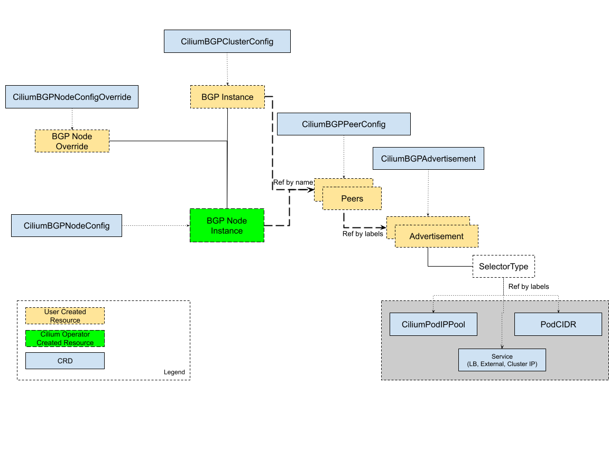

## BGP 이용 네트워크 구성

### 개요

- Cilium이 BGP( Border Gateway Protocol ) 를 사용하여 연결된 라우터에 경로를 광고할 수 있는 방법을 제공
- BGP 피어, 정책 및 광고를 구성하는 유연한 방법을 제공하는 사용자 정의 리소스 세트로 관리


### 주요 구성요소



- CiliumBGPClusterConfig: 여러 노드에 적용되는 BGP 인스턴스와 피어 구성을 정의
- CiliumBGPPeerConfig: 공통적인 BGP 피어링 설정입니다. 여러 피어에서 사용
- CiliumBGPAdvertisement: BGP 라우팅 테이블에 삽입되는 접두사를 정의
- CiliumBGPNodeConfigOverride: 노드별 BGP 구성을 정의하여 더욱 세부적인 제어를 제공


### BGP Network 구성 실습

- 상단의 ToR Switch 역할을 해줄 VM(router)를 하나 추가 후 기본 라우팅 설정을 진행한다.
- 초기 설정한 클러스터와 다른 네트워크 대역을 만들고 워커 노드를 추가한다.
- Router VM에 frr 툴 설치 및 설정

  ```
  router bgp 65000
  bgp router-id 192.168.60.200
  bgp graceful-restart
  no bgp ebgp-requires-policy
  bgp bestpath as-path multipath-relax
  maximum-paths 4
  network 10.10.1.0/24
  neighbor CILIUM peer-group
  neighbor CILIUM remote-as external
  neighbor 192.168.60.100 peer-group CILIUM
  neighbor 192.168.60.101 peer-group CILIUM
  neighbor 192.168.160.100 peer-group CILIUM 
  ```

  ```bash
  systemctl daemon-reexec && systemctl restart frr
  systemctl status frr --no-pager --full
  ```

- BGP Node Label 설정

  ```bash
  kubectl label nodes cilium-control cilium-worker01 cilium-worker02 enable-bgp=true
  kubectl get node -l enable-bgp=true
  ```

- Cilium BPG 설정 (router 정보를 입력 후 어떤 IP 정보를 교환할 것인지 설정)

  ```yaml
  apiVersion: cilium.io/v2
  kind: CiliumBGPAdvertisement
  metadata:
    name: bgp-advertisements
    labels:
      advertise: bgp
  spec:
    advertisements:
      - advertisementType: "PodCIDR"
  ---
  apiVersion: cilium.io/v2
  kind: CiliumBGPPeerConfig
  metadata:
    name: cilium-peer
  spec:
    timers:
      holdTimeSeconds: 9
      keepAliveTimeSeconds: 3
    ebgpMultihop: 2
    gracefulRestart:
      enabled: true
      restartTimeSeconds: 15
    families:
      - afi: ipv4
        safi: unicast
        advertisements:
          matchLabels:
            advertise: "bgp"
  ---
  apiVersion: cilium.io/v2
  kind: CiliumBGPClusterConfig
  metadata:
    name: cilium-bgp
  spec:
    nodeSelector:
      matchLabels:
        "enable-bgp": "true"
    bgpInstances:
    - name: "instance-65001"
      localASN: 65001
      peers:
      - name: "tor-switch"
        peerASN: 65000
        peerAddress: 192.168.60.200  # router ip address
        peerConfigRef:
          name: "cilium-peer"
  ```

- Control Node에서 연결상태 확인

  ```bash
  ss -tnp | grep 179
  cilium bgp peers
  cilium bgp routes available ipv4 unicast
  kubectl get ciliumbgpadvertisements,ciliumbgppeerconfigs,ciliumbgpclusterconfigs
  kubectl get ciliumbgpnodeconfigs -o yaml | grep -A6 peeringState
  ```

- Router Node에서 연결 상태 확인

  ```bash
  ip -c route | grep bgp
  vtysh -c 'show ip bgp summary'
  vtysh -c 'show ip bgp'
  ```

- BGP로 학습한 라우팅 정보 확인

  ```bash
  # router node
  ip -c route | grep bgp
  172.20.0.0/24 nhid 96 via 192.168.60.100 dev eth1 proto bgp metric 20 
  172.20.1.0/24 nhid 94 via 192.168.60.101 dev eth1 proto bgp metric 20 
  172.20.2.0/24 nhid 92 via 192.168.160.100 dev eth2 proto bgp metric 20 
  ```

- TCPDUMP 정보 확인

  ```bash
  # control node
  tcpdump -i eth1 tcp port 179 -w /tmp/bgp.pcap
  # router node
  systemctl restart frr && journalctl -u frr -f
  # bgp.type == 2
  termshark -r bgp.pcap
  ```

- control node, worker01~02 node routing table 정보 추가

  ```bash
  # control node
  ip route add 172.20.0.0/16 via 192.168.60.200
  sshpass -p 'vagrant' ssh vagrant@cilium-worker01 sudo ip route add 172.20.0.0/16 via 192.168.60.200
  sshpass -p 'vagrant' ssh vagrant@cilium-worker02 sudo ip route add 172.20.0.0/16 via 192.168.160.200
  ```

  - 각 노드에서는 bgp update 정보를 받았지만 bgp가 직접 커널의 라우팅 정보를 수정하지 않기 때문에 수동으로 설정 필요

  - ToR Switch를 default gateway로 설정되어 있는 환경인 경우 이 과정은 불필요 (이미 router에서는 BGP로 경로 값이 학습되어 있기 때문)

  - 또는 default gateway가 tor 스위치로 향하지 않는 환경인 경우 수동으로 경로 설정이 필요함

- 정상 통신 확인

  ```bash
  kubectl exec -it curl-pod -- sh -c 'while true; do curl -s --connect-timeout 1 webpod | grep Hostname; echo "---" ; sleep 1; done'
  ```

### 참고

- 노드가 많은 대규모 클러스터의 경우, api 서버에 부하 유발할 수 있으니, bgp status reporting off 권장

  ```bash
  # CiliumBGPNodeConfig Status 정보 확인
  kubectl get ciliumbgpnodeconfigs -o yaml | yq
  # bgpControlPlane.statusReport.enabled=false 설정
  helm upgrade cilium cilium/cilium --version 1.18.0 --namespace kube-system --reuse-values \
  --set bgpControlPlane.statusReport.enabled=false
  kubectl -n kube-system rollout restart ds/cilium
  # CiliumBGPNodeConfig Status 정보 확인
  kubectl get ciliumbgpnodeconfigs -o yaml | yq
  ```

## LB IP BGP 광고

- LB IPAM 설정

  ```yaml
  apiVersion: "cilium.io/v2"
  kind: CiliumLoadBalancerIPPool
  metadata:
    name: "cilium-pool"
  spec:
    allowFirstLastIPs: "No"
    blocks:
    - cidr: "172.16.1.0/24"
  ```

  ```bash
  kubectl get ippool
  ```

- Cluster Type 서비스 LB Type 변경

  ```bash
  kubectl patch svc webpod -p '{"spec": {"type": "LoadBalancer"}}'
  kubectl get svc webpod 
  ```

  ```bash
  kubectl -n kube-system exec ds/cilium -c cilium-agent -- cilium-dbg service list | grep -A2 LoadBalancer
  16   172.16.1.1:80/TCP      LoadBalancer   1 => 172.20.1.20:80/TCP (active)        
                                            2 => 172.20.2.107:80/TCP (active)      
  ```

- BGP Announce 설정

 ```yaml
 apiVersion: cilium.io/v2
  kind: CiliumBGPAdvertisement
  metadata:
    name: bgp-advertisements-lb-exip-webpod
    labels:
      advertise: bgp
  spec:
    advertisements:
      - advertisementType: "Service"
        service:
          addresses:
            - LoadBalancerIP
        selector:             
          matchExpressions:
            - { key: app, operator: In, values: [ webpod ] }
  ```

  ```bash
  kubectl get CiliumBGPAdvertisement
  ```

  ```bash
  kubectl exec -it -n kube-system ds/cilium -- cilium-dbg bgp route-policies
  cilium bgp routes available ipv4 unicast
  ```

- router 에 추가된 라우팅 경로 확인

  ```bash
  sshpass -p 'vagrant' ssh vagrant@cilium-router ip -c route
  ...
  172.16.1.1 nhid 133 proto bgp metric 20 
        nexthop via 192.168.60.101 dev eth1 weight 1 
        nexthop via 192.168.60.100 dev eth1 weight 1 
        nexthop via 192.168.160.100 dev eth2 weight 1 
  ...
  ```

  ```bash
  sshpass -p 'vagrant' ssh vagrant@cilium-router "sudo vtysh -c 'show ip route bgp'"
  sshpass -p 'vagrant' ssh vagrant@cilium-router "sudo vtysh -c 'show ip bgp summary'"
  sshpass -p 'vagrant' ssh vagrant@cilium-router "sudo vtysh -c 'show ip bgp'"
  sshpass -p 'vagrant' ssh vagrant@cilium-router "sudo vtysh -c 'show ip bgp 172.16.1.1/32'"
  ```

- 통신 테스트 (control node)

  ```bash
  root@cilium-control:~# LBIP=$(kubectl get svc webpod -o jsonpath='{.status.loadBalancer.ingress[0].ip}')
  root@cilium-control:~# curl -s $LBIP
  Hostname: webpod-697b545f57-7cnln
  IP: 127.0.0.1
  IP: ::1
  IP: 172.20.1.20
  IP: fe80::883d:f5ff:fe10:373e
  RemoteAddr: 192.168.60.100:35352
  GET / HTTP/1.1
  Host: 172.16.1.1
  User-Agent: curl/8.5.0
  Accept: */*

  root@cilium-control:~# curl -s $LBIP
  Hostname: webpod-697b545f57-9glcn
  IP: 127.0.0.1
  IP: ::1
  IP: 172.20.2.107
  IP: fe80::3455:45ff:fe8d:83bc
  RemoteAddr: 192.168.60.100:47042
  GET / HTTP/1.1
  Host: 172.16.1.1
  User-Agent: curl/8.5.0
  Accept: */*
  ```

- 통신 테스트 (router node)

  ```bash
  root@cilium-router:~# LBIP=172.16.1.1
  root@cilium-router:~# curl -s $LBIP
  Hostname: webpod-697b545f57-9glcn
  IP: 127.0.0.1
  IP: ::1
  IP: 172.20.2.107
  IP: fe80::3455:45ff:fe8d:83bc
  RemoteAddr: 192.168.60.100:45870
  GET / HTTP/1.1
  Host: 172.16.1.1
  User-Agent: curl/8.5.0
  Accept: */*

  root@cilium-router:~# curl -s $LBIP
  Hostname: webpod-697b545f57-7cnln
  IP: 127.0.0.1
  IP: ::1
  IP: 172.20.1.20
  IP: fe80::883d:f5ff:fe10:373e
  RemoteAddr: 192.168.60.100:45882  # control 노드에는 라우팅 대상이 없지만 계속 이곳으로 라우팅 되는 상태 
  GET / HTTP/1.1
  Host: 172.16.1.1
  User-Agent: curl/8.5.0
  Accept: */*
  ```