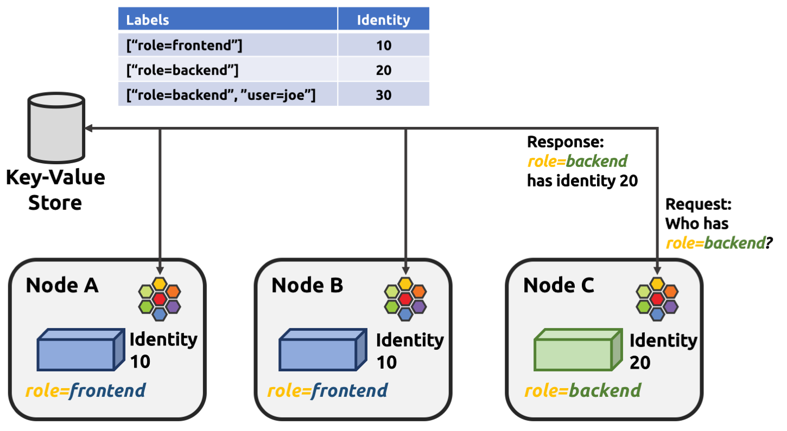

### Cilium 실 사용자 후기

#### [reddit : Cilium vs Calico K3S](https://www.reddit.com/r/kubernetes/comments/11pgmsa/cilium_vs_calico_k3s_what_do_you_use_and_why/?tl=ko)

- 온프레미스 / AWS에서 Cilium 사용 중

  - 클러스터 규모가 커서 kube-proxy가 iptables 규칙 따라가는데 걸리는 시간이 많이(70초 수준) 소요된다.

    - AWS : m6i.24xlarge(96v CPU, 384 Memory) ᳵ 350 ea / Pod ᳵ 15,000 ea

    - 온프레미스 : Node ᳵ 400 ea / Pod ᳵ 36,000 ea / Service ᳵ 27,000 ea

  - L7 네트워크 정책을 유용하게 쓰고 있다.

- 설정이 쉽지 않아서 각 기능들을 올바르게 이해하고 사용해야 한다. 러닝 커브를 극복하고 나면 사용하기 좋다.

### BPF Maps

eBPF(Extended Berkeley Packet Filter)에서 데이터를 저장하고 관리하기 위해 사용되는 자료 구조다. 저장할 수 있는 데이터의 양에 제한이 있다.

#### 1. BPF Maps 저장소 구조

- key : value 구조로 데이터 저장

- Hash Map, Array Map, Per-CPU Map, LRU Map 4가지 유형의 Map 지원

  - Hash Map : 키를 해시하여 저장하는 방식

  - Array Map : 정수 인덱스를 사용하여 값을 저장하는 배열 형태

  - Per-CPU Map : 각 CPU 마다 별도의 데이터를 저장하는 방식

  - LRU(Least Recently Used) Map : 메모리가 부족할 때 가장 오랫동안 사용되지 않은 데이터를 삭제하는 방식

#### 2. 데이터 관리

- 커널 내에서 실행되기 때문에 매우 빠르고 효율적으로 데이터 접근 가능

- 각 맵에는 저장할 수 있는 데이터의 양에 제한이 있음

- eBPF 프로그램은 BPF 맵에 데이터를 읽고 쓰는 작업을 수행

- 컨테이너 ID를 기반으로 라우팅 기능 지원

- HTTP, gRPC, Kafka와 같은 API 프로토콜을 구문 분석



### Cilium 구조

### Cilium 리소스 목록

#### 1. Cilium으로 배포되는 리소스

| Resource   | Name            | Description                                                                                |
| :--------- | :-------------- | :----------------------------------------------------------------------------------------- |
| daemonset  | cilium-envoy    | 트래픽 관리 (L7 트래픽 처리, 로드밸런싱, rate limiting, circuit breaking 등)               |
| daemonset  | cilium          | Cilium Agent로서 네트워크 정책 적용, 파드 간 네트워킹, eBPF 프로그램 로드 등 수행          |
| deployment | cilium-operator | Clustor 전체 Cilium 관리, CRD 처리, 네트워크 정책 검증, IPAM 관리                          |
| deployment | hubble-relay    | Hubble 모니터링 데이터 수집/중계(전달), Hubble CLI 및 UI 통신 브릿지 역할 수행             |
| deployment | hubble-ui       | 모니터링 대시보드(메트릭 정보, 네트워크 플로우 정보, 네트워크 정책, 트러블 슈팅 화면) 제공 |

#### 2. Cilium Custom Resource Definition (CRD)

- CRD 종류

| Name                             | Description                                                                        | Default |
| :------------------------------- | :--------------------------------------------------------------------------------- | :-----: |
| ciliumcidrgroups                 | CIDR(범위) 그룹을 정의하여 네트워크 정책에서 IP 주소의 범위를 관리하는데 사용한다. |         |
| ciliumclusterwidenetworkpolicies | 클러스터 전체에 적용되는 네트워크 정책 생성에 사용한다.                            |         |
| ciliumnetworkpolicies            | 개별 리소스에 적용되는 네트워크 정책 생성에 사용한다.                              |         |
| ciliumendpoints                  | Cilium이 관리하는 엔드포인트(Pod, 서비스)의 정보를 관리하는데 사용한다.            |    ○    |
| ciliumexternalworkloads(beta)    | Kubernetes 클러스터 외부의 워크로드(VM 등)를 관리(액세스 제어)하는데 사용          |         |
| ciliumidentities                 | Pod의 레이블, ID을 관리한다. (동일한 라벨을 가진 PoD는 같은 ID 부여)               |    ○    |
| ciliuml2announcementpolicies     | 서비스의 ExternalIP/LBIP에 대한 ARP 쿼리에 응답하도록 설정하는데 사용한다.         |         |
| ciliumloadbalancerippools        | 로드 밸런서타입 서비스의 IP 풀을 정의하는데 사용한다.                              |         |
| ciliumnodeconfigs                | Cilium 노드의 설정을 정의하는데 사용한다.                                          |         |
| ciliumnodes                      | Cilium에서 관리하는 노드의 정보를 관리한다.                                        |    ○    |
| ciliumpodippools                 | Pod에 할당되는 IP 주소 풀을 관리한다.                                              |         |

### cilium ipam - kubernetes scope mode

- `Kubernetes Controller Manager`에 할당된 CIDR 확인

```bash
$ kubectl describe pod -n kube-system kube-controller-manager-control | grep -A10 Command
    Command:
      kube-controller-manager
      --allocate-node-cidrs=true
      --authentication-kubeconfig=/etc/kubernetes/controller-manager.conf
      --authorization-kubeconfig=/etc/kubernetes/controller-manager.conf
      --bind-address=127.0.0.1
      --client-ca-file=/etc/kubernetes/pki/ca.crt
      --cluster-cidr=10.100.0.0/16
      --cluster-name=kubernetes
      --cluster-signing-cert-file=/etc/kubernetes/pki/ca.crt
      --cluster-signing-key-file=/etc/kubernetes/pki/ca.key
```

- cilium 설치

```bash
helm install cilium cilium/cilium --version 1.17.5 --namespace kube-system \
--set k8sServiceHost=10.0.0.10 --set k8sServicePort=6443 \
--set ipv4NativeRoutingCIDR=10.0.0.10/16 \
--set kubeProxyReplacement=true \
--set routingMode=native \
--set autoDirectNodeRoutes=true \
--set bpf.masquerade=true \
--set ipam.mode=kubernetes \          # IPAM 지정
--set k8s.requireIPv4PodCIDR=true \   # K8S Pod CIDR OPTION
--set installNoConntrackIptablesRules=true \
--set operator.replicas=1
```

- Cilium CLI 이용 IPAM mode 체크

```bash
$ cilium config view | grep ipam
ipam                                              kubernetes
```

- Cilium Node에 할당된 PodCIDR 체크

```bash
$ kubectl get ciliumnode node01 -o jsonpath='{.spec.ipam}'
{ "podCIDRs": ["10.100.1.0/24"], "pools": {} }
```
