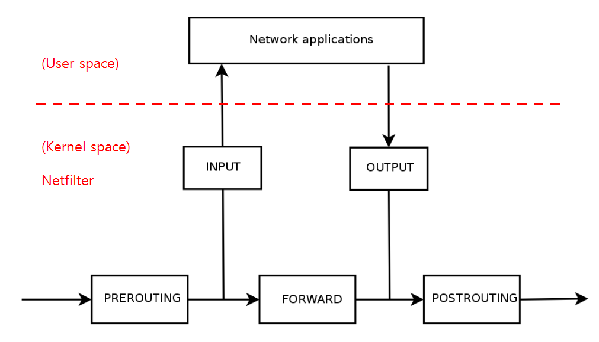

## Netfilter

리눅스 커널에 통합되어 있는 프레임워크다. 네트워크 패킷이 시스템에 들어오고 나가는 과정에서 특정 지점을 Hook Point로 선정해서 패킷을 가로채고 처리할 수 있도록 구성되어 있다.

### Netfilter 구성요소

#### Hooks

패킷이 커널의 특정 위치에 도달했을 때 동작하는 실행 지점이다. 5개의 Hook Point가 있는데, INPUT, OUTPUT, FORWARD, PREROUTING, POSTROUTING이 있다.

#### Tables

규칙들을 그룹화해서 관리하기 위한 공간이다. filter, nat, mangle, raw, security 테이블이 있다.

#### Chains

- 테이블 내에서 규칙들이 순서대로 처리되는 흐름이 정의되어 있는데, Hook Point에 연결되어 있는 체인의 규칙들이 순서대로 평가된다.

- 각 테이블에는 고유한 체인 집합을 가진다. filter에는 INPUT, OUTPUT, FORWARD 체인을 가질 수 있다.

#### Rules

패킷을 어떻게 처리할지 정의한 규칙이다.

#### 구조

- PREROUTING : 인터페이스를 통해 들어온 패킷을 가장 먼저 처리 (DNAT: 목적지 주소 변경)

- INPUT : 인터페이스를 통해 호스트 PC의 프로세스로 패킷이 전달되기 전에 처리(차단/허용)

  - 패킷을 받아 처리할 프로세스가 내 시스템에서 동작하는 경우 INPUT Hook을 지나 User Space의 프로세스로 전달

- OUTPUT : 해당 프로세스에서 처리한 패킷을 밖으로 나가는 패킷에 대한 처리(차단/허용)

- FORWARD : 다른 호스트로 통과시켜 보낼 패킷에 대한 처리(차단/허용).

  - 방화벽이나 IPS 등과 같이 내가 수신하는 패킷이 아니고 지나가는 패킷을 처리

- POSTROUTING : 인터페이스를 통해 나갈 패킷에 대한 처리 (SNAT: 출발지 주소 변경)

## iptables

단순히 Netfilter에 규칙을 밀어 넣고, 현재 규칙 목록을 조회하는데 사용되는 User Space툴이다. iptables를 이용하면 커널에서 동작하는 Netfilter에 규칙을 추가, 삭제, 수정, 조회할 수 있다.
