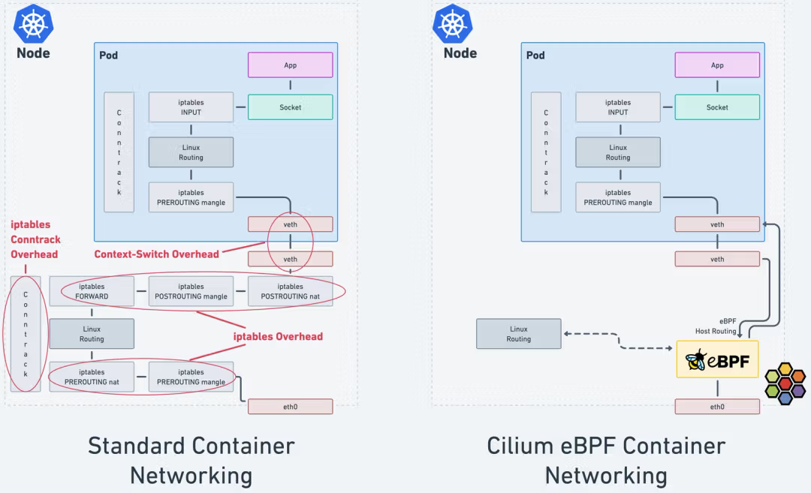
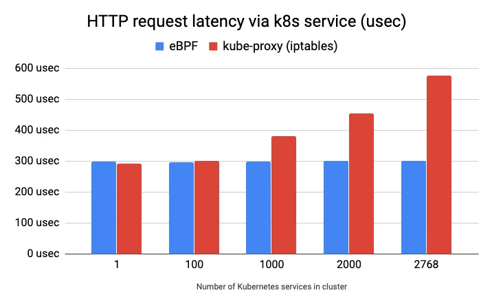
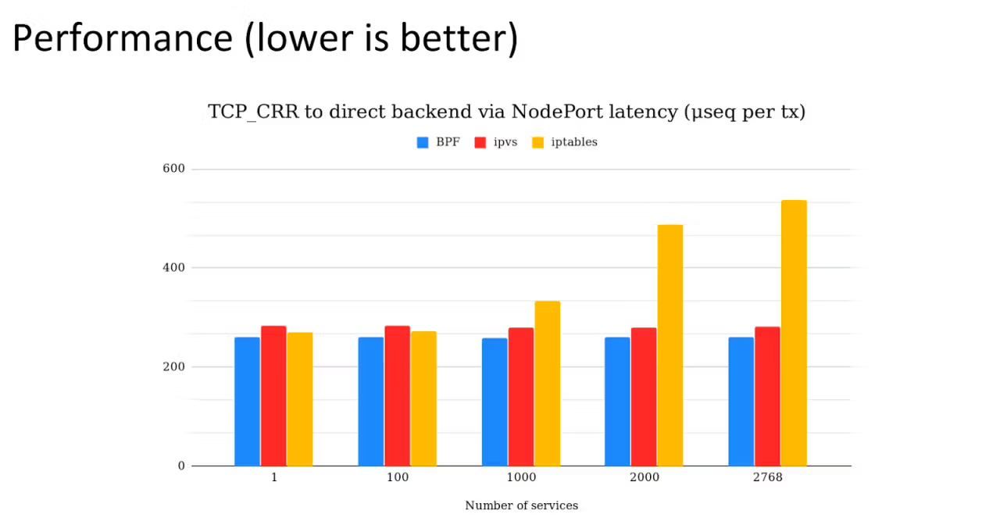

#### iptables의 문제점 (eBPF 성능이 더 좋은 이유)

- 패킷 별로 iptables에 할당 된 모든 필터, 라우팅 규칙을 스캔하면서 일치하는 규칙을 발견할 때까지 반복해서 하나씩 대조한다.

- iptables는 새 규칙 추가할 때 마다 전체 규칙 목록을 교체해야 한다.

- KubeCon 발표에서 kube-proxy의 성능을 분석한 결과 서비스의 수가 증가함에 따라 예츨 불가능한 지연 시간과 성능 저하를 보여주는 결과가 제시되었다.

  - 규칙의 수가 증가함에 따라 필터링, 라우팅하는 비용이 선형적으로 증가한다.

  - 2만개(16만개의 규칙)의 서비스가 배포되어 있을 때 새로운 규칙을 추가하는데 5시간이 소요되었다.

  - 결과적으로 트래픽이 많거나 iptables 규칙 변경이 많은 시스템에서는 성능 보장이 어렵다.

- L7 프로토콜에 대한 인식이 불가능하고, IP/PORT 기반으로 라우팅하는 매커니즘으로 동작한다.

  - 쿠버네티스 환경에서 개별 IP의 수명이 비교적 짧다.

    - 한 컨테이너가 몇 초만 사용되었다가 사라진다면, 시스템에 상당히 큰 부담을 줄 수 있다.

    - 매칭할 새로운 IP/Port가 발견될 때 마다 규칙을 추가하고, 체인이 변경된다.

    - 이 점은 성능 상 컨테이너 환경에 적합하지 않다.

  - 클러스터의 모든 노드가 최신 IP 컨테이너 맵핑된 상태를 지속적으로 파악해야 하기 때문에 클러스터 간의 네트워크를 운영해야 할 때는 어려운 문제점이 된다.

- 서비스의 개수가 증가하면 기하급수적으로 증가하는 iptables의 규칙을 모두 이해하기는 불가능해진다. 운영자가 관리에 어려움을 느끼게 된다.

- [iptables와 netfilter의 동작원리 (패킷 처리 흐름)](./Appendix%2002.%20iptables%20ans%20netfilter.md.md)

#### eBPF vs iptables traffic flow

- iptables conntrack overhead:

  - 네트워크 연결 상태를 추적해 보안과 세션 관리를 용이하게 해준다.

  - 연결이 많아지면 자원 소모량이 늘어나면서 CPU, Memory 사용 증가와 함께 지연시간이 증가하게 된다.

- iptables overhead:

  - 패킷을 규칙과 일치시키는 과정에서 발생하는 CPU와 메모리 사용의 추가적인 부담

  - 규칙이 많거나 연결 추적을 사용하면 오버헤드가 증가

- Context-switch overhead:

  - 여러 프로세스 간에 작업을 전환할 때 발생하는 성능 손실

  - 작업 전환이 많아질수록 실제 연산 시간보다 전환에 소요되는 시간이 늘어나 시스템 성능 저하

- 오른쪽에서 Cilium은 각 쿠버네티스 노드에 eBPF를 이용해 iptables의 오버헤드를 우회 → 오버헤드와 컨텍스트 스위칭 요구 사항을 최소화

- 효율적인 패킷 처리를 통해 지연 시간과 CPU 오버헤드 감소

#### eBPF 성능 벤치마크 테스트

- HTTP GET request에 대한 지연 시간 측정을 위해 원격 호스트에서 10만개의 순차 request를 ab로 측정한 값이다.

- eBPF의 시간 복잡도는 서비스 수 증가에 영향 없이 안정적으로 유지되지만 iptables는 서비스 수가 증가함에 따라 지연 시간이 증가 한다.

- TCP의 연결/요청/응답(CRR) 테스트에서도 eBPF가 가장 우수한 성능을 보여준다.

- IPVS mode kube-proxy와 비교해서도 더 나은 성능을 보여준다.

  > IPVS 모드는 커널 레벨에서 로드밸런싱을 수행하여 높은 성능과 확장성을 제공

