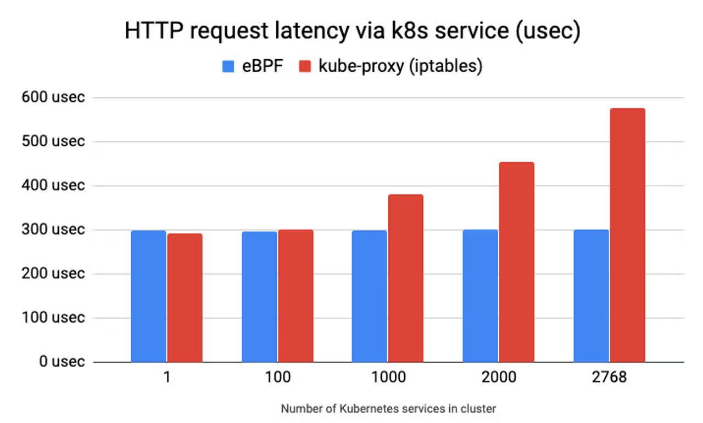
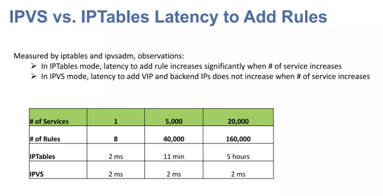

**Table of Contents**
---
- [**Table of Contents**](#table-of-contents)
- [eBPF가 iptables 보다 더 성능이 좋은 이유](#ebpf가-iptables-보다-더-성능이-좋은-이유)
  - [iptables의 특징](#iptables의-특징)
  - [iptables 특징으로 인해 발생하는 주요 이슈](#iptables-특징으로-인해-발생하는-주요-이슈)
  - [eBPF 성능 분석 관련 자료](#ebpf-성능-분석-관련-자료)
    - [HTTP Request latency 성능](#http-request-latency-성능)
    - [iptables latency to add rules](#iptables-latency-to-add-rules)
    - [TCP CRR 성능 테스트](#tcp-crr-성능-테스트)
    - [참고 자료](#참고-자료)
- [iptables/netfilter 동작 원리](#iptablesnetfilter-동작-원리)
  - [iptables와 netfiler](#iptables와-netfiler)
  - [netfilter 구성요소](#netfilter-구성요소)
  - [netfilter 트래픽 처리 흐름](#netfilter-트래픽-처리-흐름)
- [eBPF vs iptables traffic flow](#ebpf-vs-iptables-traffic-flow)
  - [iptables conntrack overhead](#iptables-conntrack-overhead)
  - [iptables overhead](#iptables-overhead)
  - [Context-switch overhead](#context-switch-overhead)
- [Cilium과 Flannel CNI의 iptables 비교](#cilium과-flannel-cni의-iptables-비교)

## eBPF가 iptables 보다 더 성능이 좋은 이유

### iptables의 특징

- iptables는 새 규칙 업데이트 진행 시 전체 규칙 목록을 교체한다.

- 패킷이 들어왔을 때 Linked list 로 구성된 iptables chain의 모든 규칙을 스캔한다. _※ 시간복잡도: O(n)_

- L7 프로토콜에 대한 인식이 불가능하고, IP/PORT 기반으로 라우팅하는 매커니즘으로 동작한다.

### iptables 특징으로 인해 발생하는 주요 이슈

- 시스템의 규모가 크고 대규모 트래픽을 처리하는 시스템에서 iptables의 규칙이 많아 질 수록 지연 시간이 선형적으로 증가 한다.

- 운영/관리자가 기하급수적으로 증가하는 iptables의 규칙을 모두 이해하기는 불가능하고, 운영 부담으로 이어진다.

- 쿠버네티스에서 개별 IP의 수명 주기는 비교적 짧은데 비해 IP/Port 기반 규칙 관리하는 매커니즘은 주기적인 iptables 규칙 업데이트를 발생 시킨다.

### eBPF 성능 분석 관련 자료

#### HTTP Request latency 성능

- HTTP GET request에 대한 지연 시간 측정을 위해 원격 호스트에서 10만개의 순차 request를 ab로 측정한 값이다.

- eBPF의 시간 복잡도는 서비스 수 증가에 영향 없이 안정적으로 유지되지만 iptables는 서비스 수가 증가함에 따라 지연 시간이 증가 한다.

  
  <p><a href="https://isovalent.com/blog/post/why-replace-iptables-with-ebpf/#like-a-glove-why-is-ebpf-the-standard-for-kubernetes-networking">https://isovalent.com/blog/post/why-replace-iptables-with-ebpf/#like-a-glove-why-is-ebpf-the-standard-for-kubernetes-networking</a></p>

#### iptables latency to add rules

- 5천 개의 서비스가 구성되어 있을 때 iptables rule 이 추가되는데 11분이 지연이 발생한다.

- iptables의 문제점을 해소하기 위해 도입된 ipvs의 경우 많은 부분의 성능 이슈를 해소하는 것으로 보인다.

  
  <p><a href="https://www.slideshare.net/slideshow/scale-kubernetes-to-support-50000-services/77112281#20">https://www.slideshare.net/slideshow/scale-kubernetes-to-support-50000-services/77112281#20</a></p>

#### TCP CRR 성능 테스트

- TCP의 연결/요청/응답(CRR) 테스트에서도 eBPF가 가장 우수한 성능을 보여준다.

- IPVS mode kube-proxy와 비교해서도 더 나은 성능을 보여준다.

  > IPVS 모드는 커널 레벨에서 로드밸런싱을 수행하여 높은 성능과 확장성을 제공

  

#### 참고 자료

- [Scale Kubernetes to support 50000 services](https://www.slideshare.net/slideshow/scale-kubernetes-to-support-50000-services/77112281#3)

- [What is Kube-Proxy and why move from iptables to eBPF?](https://isovalent.com/blog/post/why-replace-iptables-with-ebpf/#like-a-glove-why-is-ebpf-the-standard-for-kubernetes-networking)

- [CNI Benchmark: Understanding Cilium Network Performance](https://cilium.io/blog/2021/05/11/cni-benchmark/#env)

- [Liberating Kubernetes From Kube-proxy and Iptables - Martynas Pumputis, Cilium](https://www.youtube.com/watch?v=bIRwSIwNHC0)

- [Kubecon China 2025 with bytedance - PDF](https://static.sched.com/hosted_files/kccncchn2025/64/Kubecon%20China%202025%20with%20bytedance.pdf)

## iptables/netfilter 동작 원리

### iptables와 netfiler

- iptables는 User Space에서 동작하고, netfilter는 Kernel Space에서 동작한다.

- netfilter는 커널에 통합되어 있는 프레임워크 인데, 네트워크 패킷이 시스템에 들어오고 나가는 과정에 특정 지점을 Hook Point로 지정해 패킷을 가로채고 처리할 수 있다.

- iptables는 netfilter에 규칙을 밀어 넣고, 설정되어 있는 규칙 목록을 조회하는 용도로 사용한다.

### netfilter 구성요소

- Hooks : 패킷이 커널 특정 지점에 도달했을 때 동작하는 실행 지점이다. INPUT, OUTPUT, FORWARD, PREROUTING, POSTROUTING 5개가 존재한다.

- Tables : 규칙들을 그룹화해서 관리하기 위한 공간이다. filter, nat, mangle, raw, security 테이블이 있다.

- Chains : 테이블 내 순서대로 처리되는 규칙의 집합이다. 테이블 마다 고유한 체인 집합을 가진다. filter에는 INPUT, OUTPUT, FORWARD 체인을 가질 수 있다.

- Rules : 패킷을 어떻게 처리할지 정의한 규칙이다.

### netfilter 트래픽 처리 흐름


|   netfilter hook   | iptables chain | description                                                                                                |
| :----------------: | :------------: | :--------------------------------------------------------------------------------------------------------- |
| NF_IP_PRE_ROUTING  |   PREROUTING   | 인터페이스를 통해 들어온 패킷 처리 (ex: 목적지(DNAT) 주소 변경)                                            |
|   NF_IP_LOCAL_IN   |     INPUT      | 인터페이스를 통해 호스트 PC의 프로세스로 패킷이 전달되기 전에 처리(차단/허용)                              |
|                    |                | 패킷을 받아 처리할 프로세스가 내부 시스템에서 동작하는 경우 INPUT Hook을 지나 User Space의 프로세스로 전달 |
|  NF_IP_LOCAL_OUT   |     OUTPUT     | 해당 프로세스에서 처리한 패킷을 밖으로 나가는 패킷 처리(차단/허용)                                         |
|   NF_IP_FORWARD    |    FORWARD     | 다른 호스트로 통과시켜 보낼 패킷에 대한 처리(차단/허용).                                                   |
|                    |                | 방화벽이나 IPS 등과 같이 내가 수신하는 패킷이 아니고 라우팅 해야 하는 패킷 처리                            |
| NF_IP_POST_ROUTING |  POSTROUTING   | 인터페이스를 통해 나갈 패킷에 대한 처리 (SNAT: 출발지 주소 변경)                                           |

## eBPF vs iptables traffic flow

- Cilium은 eBPF를 이용해 iptables의 오버헤드를 우회한다.

- 효율적인 패킷 처리를 통해 지연 시간과 CPU 오버헤드 감소


### iptables conntrack overhead

- 네트워크 연결 상태를 추적해 보안과 세션 관리를 용이하게 해준다.

- 연결이 많아지면 자원 소모량이 늘어나면서 CPU, Memory 사용 증가와 함께 지연시간이 증가하게 된다.

### iptables overhead

- 패킷을 규칙과 일치시키는 과정에서 발생하는 CPU와 메모리 사용의 추가적인 부담

- 규칙이 많거나 연결 추적을 사용하면 오버헤드가 증가

### Context-switch overhead

- 여러 프로세스 간에 작업을 전환할 때 발생하는 성능 손실

- 작업 전환이 많아질수록 실제 연산 시간보다 전환에 소요되는 시간이 늘어나 시스템 성능 저하

## Cilium과 Flannel CNI의 iptables 비교

- flannel 설치 후 통신 테스트용 pod와 service type 리소스 배포 결과

  - 리소스 조회

    ``` bash
    $ kubectl get po,svc -owide
    NAME                          READY   STATUS    RESTARTS      AGE   IP            NODE          NOMINATED NODE   READINESS GATES
    pod/curl-pod                  1/1     Running   9 (29m ago)   21d   10.244.0.5    flannel-ctr   <none>           <none>
    pod/webpod-697b545f57-7rsn9   1/1     Running   2 (46h ago)   21d   10.244.2.10   flannel-w2    <none>           <none>
    pod/webpod-697b545f57-85vnd   1/1     Running   3 (46h ago)   21d   10.244.1.5    flannel-w1    <none>           <none>

    NAME                 TYPE        CLUSTER-IP     EXTERNAL-IP   PORT(S)   AGE   SELECTOR
    service/kubernetes   ClusterIP   10.96.0.1      <none>        443/TCP   21d   <none>
    service/webpod       ClusterIP   10.96.65.151   <none>        80/TCP    21d   app=webpod
    ```

  - iptables 정보 조회

    ```bash
    $ iptables -t nat -S
    -P PREROUTING ACCEPT
    -P INPUT ACCEPT
    -P OUTPUT ACCEPT
    -P POSTROUTING ACCEPT
    -N FLANNEL-POSTRTG
    -N KUBE-KUBELET-CANARY
    -N KUBE-MARK-MASQ
    -N KUBE-NODEPORTS
    -N KUBE-POSTROUTING
    -N KUBE-PROXY-CANARY
    -N KUBE-SEP-7FOLOTID7YCXSOEJ
    -N KUBE-SEP-7XV6E3CD3HB2CMLM
    -N KUBE-SEP-DFSYEE766Q4KZDEE
    -N KUBE-SEP-DOVWEW33RROJFUEM
    -N KUBE-SEP-NBAMRQIHYPBRH37V
    -N KUBE-SEP-PBFVJUGNX7I4VSY2
    -N KUBE-SEP-U7HH75UFG3U5VGYY
    -N KUBE-SEP-VIIO3RTAMBOZLGQX
    -N KUBE-SEP-XABH6FUURDMVT5Y2
    -N KUBE-SERVICES
    -N KUBE-SVC-CNZCPOCNCNOROALA
    -N KUBE-SVC-ERIFXISQEP7F7OF4
    -N KUBE-SVC-JD5MR3NA4I4DYORP
    -N KUBE-SVC-NPX46M4PTMTKRN6Y
    -N KUBE-SVC-TCOU7JCQXEZGVUNU
    -A PREROUTING -m comment --comment "kubernetes service portals" -j KUBE-SERVICES
    -A OUTPUT -m comment --comment "kubernetes service portals" -j KUBE-SERVICES
    -A POSTROUTING -m comment --comment "kubernetes postrouting rules" -j KUBE-POSTROUTING
    -A POSTROUTING -m comment --comment "flanneld masq" -j FLANNEL-POSTRTG
    -A FLANNEL-POSTRTG -m mark --mark 0x4000/0x4000 -m comment --comment "flanneld masq" -j RETURN
    -A FLANNEL-POSTRTG -s 10.244.0.0/24 -d 10.244.0.0/16 -m comment --comment "flanneld masq" -j RETURN
    -A FLANNEL-POSTRTG -s 10.244.0.0/16 -d 10.244.0.0/24 -m comment --comment "flanneld masq" -j RETURN
    -A FLANNEL-POSTRTG ! -s 10.244.0.0/16 -d 10.244.0.0/24 -m comment --comment "flanneld masq" -j RETURN
    -A FLANNEL-POSTRTG -s 10.244.0.0/16 ! -d 224.0.0.0/4 -m comment --comment "flanneld masq" -j MASQUERADE --random-fully
    -A FLANNEL-POSTRTG ! -s 10.244.0.0/16 -d 10.244.0.0/16 -m comment --comment "flanneld masq" -j MASQUERADE --random-fully
    -A KUBE-MARK-MASQ -j MARK --set-xmark 0x4000/0x4000
    -A KUBE-POSTROUTING -m mark ! --mark 0x4000/0x4000 -j RETURN
    -A KUBE-POSTROUTING -j MARK --set-xmark 0x4000/0x0
    -A KUBE-POSTROUTING -m comment --comment "kubernetes service traffic requiring SNAT" -j MASQUERADE --random-fully
    -A KUBE-SEP-7FOLOTID7YCXSOEJ -s 10.244.2.5/32 -m comment --comment "kube-system/kube-dns:metrics" -j KUBE-MARK-MASQ
    -A KUBE-SEP-7FOLOTID7YCXSOEJ -p tcp -m comment --comment "kube-system/kube-dns:metrics" -m tcp -j DNAT --to-destination 10.244.2.5:9153
    -A KUBE-SEP-7XV6E3CD3HB2CMLM -s 10.244.2.6/32 -m comment --comment "kube-system/kube-dns:metrics" -j KUBE-MARK-MASQ
    -A KUBE-SEP-7XV6E3CD3HB2CMLM -p tcp -m comment --comment "kube-system/kube-dns:metrics" -m tcp -j DNAT --to-destination 10.244.2.6:9153
    -A KUBE-SEP-DFSYEE766Q4KZDEE -s 10.244.2.6/32 -m comment --comment "kube-system/kube-dns:dns-tcp" -j KUBE-MARK-MASQ
    -A KUBE-SEP-DFSYEE766Q4KZDEE -p tcp -m comment --comment "kube-system/kube-dns:dns-tcp" -m tcp -j DNAT --to-destination 10.244.2.6:53
    -A KUBE-SEP-DOVWEW33RROJFUEM -s 10.244.2.5/32 -m comment --comment "kube-system/kube-dns:dns-tcp" -j KUBE-MARK-MASQ
    -A KUBE-SEP-DOVWEW33RROJFUEM -p tcp -m comment --comment "kube-system/kube-dns:dns-tcp" -m tcp -j DNAT --to-destination 10.244.2.5:53
    -A KUBE-SEP-NBAMRQIHYPBRH37V -s 10.244.1.4/32 -m comment --comment "default/webpod" -j KUBE-MARK-MASQ
    -A KUBE-SEP-NBAMRQIHYPBRH37V -p tcp -m comment --comment "default/webpod" -m tcp -j DNAT --to-destination 10.244.1.4:80
    -A KUBE-SEP-PBFVJUGNX7I4VSY2 -s 10.244.2.5/32 -m comment --comment "kube-system/kube-dns:dns" -j KUBE-MARK-MASQ
    -A KUBE-SEP-PBFVJUGNX7I4VSY2 -p udp -m comment --comment "kube-system/kube-dns:dns" -m udp -j DNAT --to-destination 10.244.2.5:53
    -A KUBE-SEP-U7HH75UFG3U5VGYY -s 192.168.20.100/32 -m comment --comment "default/kubernetes:https" -j KUBE-MARK-MASQ
    -A KUBE-SEP-U7HH75UFG3U5VGYY -p tcp -m comment --comment "default/kubernetes:https" -m tcp -j DNAT --to-destination 192.168.20.100:6443
    -A KUBE-SEP-VIIO3RTAMBOZLGQX -s 10.244.2.7/32 -m comment --comment "default/webpod" -j KUBE-MARK-MASQ
    -A KUBE-SEP-VIIO3RTAMBOZLGQX -p tcp -m comment --comment "default/webpod" -m tcp -j DNAT --to-destination 10.244.2.7:80
    -A KUBE-SEP-XABH6FUURDMVT5Y2 -s 10.244.2.6/32 -m comment --comment "kube-system/kube-dns:dns" -j KUBE-MARK-MASQ
    -A KUBE-SEP-XABH6FUURDMVT5Y2 -p udp -m comment --comment "kube-system/kube-dns:dns" -m udp -j DNAT --to-destination 10.244.2.6:53
    -A KUBE-SERVICES -d 10.96.0.10/32 -p tcp -m comment --comment "kube-system/kube-dns:metrics cluster IP" -m tcp --dport 9153 -j KUBE-SVC-JD5MR3NA4I4DYORP
    -A KUBE-SERVICES -d 10.96.0.10/32 -p udp -m comment --comment "kube-system/kube-dns:dns cluster IP" -m udp --dport 53 -j KUBE-SVC-TCOU7JCQXEZGVUNU
    -A KUBE-SERVICES -d 10.96.0.10/32 -p tcp -m comment --comment "kube-system/kube-dns:dns-tcp cluster IP" -m tcp --dport 53 -j KUBE-SVC-ERIFXISQEP7F7OF4
    -A KUBE-SERVICES -d 10.96.0.1/32 -p tcp -m comment --comment "default/kubernetes:https cluster IP" -m tcp --dport 443 -j KUBE-SVC-NPX46M4PTMTKRN6Y
    -A KUBE-SERVICES -d 10.96.65.151/32 -p tcp -m comment --comment "default/webpod cluster IP" -m tcp --dport 80 -j KUBE-SVC-CNZCPOCNCNOROALA
    -A KUBE-SERVICES -m comment --comment "kubernetes service nodeports; NOTE: this must be the last rule in this chain" -m addrtype --dst-type LOCAL -j KUBE-NODEPORTS
    -A KUBE-SVC-CNZCPOCNCNOROALA ! -s 10.244.0.0/16 -d 10.96.65.151/32 -p tcp -m comment --comment "default/webpod cluster IP" -m tcp --dport 80 -j KUBE-MARK-MASQ
    -A KUBE-SVC-CNZCPOCNCNOROALA -m comment --comment "default/webpod -> 10.244.1.4:80" -m statistic --mode random --probability 0.50000000000 -j KUBE-SEP-NBAMRQIHYPBRH37V
    -A KUBE-SVC-CNZCPOCNCNOROALA -m comment --comment "default/webpod -> 10.244.2.7:80" -j KUBE-SEP-VIIO3RTAMBOZLGQX
    -A KUBE-SVC-ERIFXISQEP7F7OF4 ! -s 10.244.0.0/16 -d 10.96.0.10/32 -p tcp -m comment --comment "kube-system/kube-dns:dns-tcp cluster IP" -m tcp --dport 53 -j KUBE-MARK-MASQ
    -A KUBE-SVC-ERIFXISQEP7F7OF4 -m comment --comment "kube-system/kube-dns:dns-tcp -> 10.244.2.5:53" -m statistic --mode random --probability 0.50000000000 -j KUBE-SEP-DOVWEW33RROJFUEM
    -A KUBE-SVC-ERIFXISQEP7F7OF4 -m comment --comment "kube-system/kube-dns:dns-tcp -> 10.244.2.6:53" -j KUBE-SEP-DFSYEE766Q4KZDEE
    -A KUBE-SVC-JD5MR3NA4I4DYORP ! -s 10.244.0.0/16 -d 10.96.0.10/32 -p tcp -m comment --comment "kube-system/kube-dns:metrics cluster IP" -m tcp --dport 9153 -j KUBE-MARK-MASQ
    -A KUBE-SVC-JD5MR3NA4I4DYORP -m comment --comment "kube-system/kube-dns:metrics -> 10.244.2.5:9153" -m statistic --mode random --probability 0.50000000000 -j KUBE-SEP-7FOLOTID7YCXSOEJ
    -A KUBE-SVC-JD5MR3NA4I4DYORP -m comment --comment "kube-system/kube-dns:metrics -> 10.244.2.6:9153" -j KUBE-SEP-7XV6E3CD3HB2CMLM
    -A KUBE-SVC-NPX46M4PTMTKRN6Y ! -s 10.244.0.0/16 -d 10.96.0.1/32 -p tcp -m comment --comment "default/kubernetes:https cluster IP" -m tcp --dport 443 -j KUBE-MARK-MASQ
    -A KUBE-SVC-NPX46M4PTMTKRN6Y -m comment --comment "default/kubernetes:https -> 192.168.20.100:6443" -j KUBE-SEP-U7HH75UFG3U5VGYY
    -A KUBE-SVC-TCOU7JCQXEZGVUNU ! -s 10.244.0.0/16 -d 10.96.0.10/32 -p udp -m comment --comment "kube-system/kube-dns:dns cluster IP" -m udp --dport 53 -j KUBE-MARK-MASQ
    -A KUBE-SVC-TCOU7JCQXEZGVUNU -m comment --comment "kube-system/kube-dns:dns -> 10.244.2.5:53" -m statistic --mode random --probability 0.50000000000 -j KUBE-SEP-PBFVJUGNX7I4VSY2
    -A KUBE-SVC-TCOU7JCQXEZGVUNU -m comment --comment "kube-system/kube-dns:dns -> 10.244.2.6:53" -j KUBE-SEP-XABH6FUURDMVT5Y2
    ```

- cilium 설치 후 통신 테스트용 pod와 service type 리소스 배포 결과

  - 리소스 조회

    ``` bash
    $ kubectl get po,svc -owide
    NAME                          READY   STATUS    RESTARTS      AGE     IP             NODE         NOMINATED NODE   READINESS GATES
    pod/curl-pod                  1/1     Running   3 (10h ago)   5d23h   172.20.2.97    cilium-ctr   <none>           <none>
    pod/webpod-697b545f57-ggx49   1/1     Running   5 (14h ago)   46h     172.20.0.113   cilium-w1    <none>           <none>
    pod/webpod-697b545f57-qgl6m   1/1     Running   1 (27h ago)   6d2h    172.20.1.222   cilium-w2    <none>           <none>

    NAME                 TYPE        CLUSTER-IP     EXTERNAL-IP   PORT(S)   AGE     SELECTOR
    service/kubernetes   ClusterIP   10.96.0.1      <none>        443/TCP   7d1h    <none>
    service/webpod       ClusterIP   10.96.88.175   <none>        80/TCP    6d17h   app=webpod
    ```

  - iptables 정보 조회

    ```bash
    $ iptables -t nat -S
    -P PREROUTING ACCEPT
    -P INPUT ACCEPT
    -P OUTPUT ACCEPT
    -P POSTROUTING ACCEPT
    -N CILIUM_OUTPUT_nat
    -N CILIUM_POST_nat
    -N CILIUM_PRE_nat
    -N KUBE-KUBELET-CANARY
    -A PREROUTING -m comment --comment "cilium-feeder: CILIUM_PRE_nat" -j CILIUM_PRE_nat
    -A OUTPUT -m comment --comment "cilium-feeder: CILIUM_OUTPUT_nat" -j CILIUM_OUTPUT_nat
    -A POSTROUTING -m comment --comment "cilium-feeder: CILIUM_POST_nat" -j CILIUM_POST_nat
    ```
- cilium은 iptables 대신 eBPF 프로그램을 사용하기 때문에 iptables의 nat 테이블 내에는 조회되는 데이터가 없다.