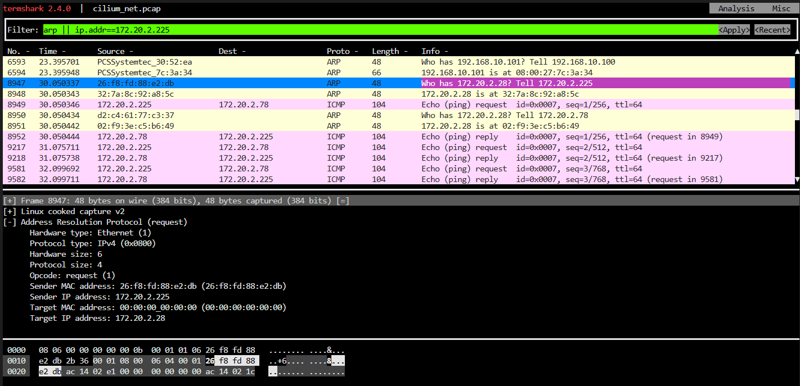
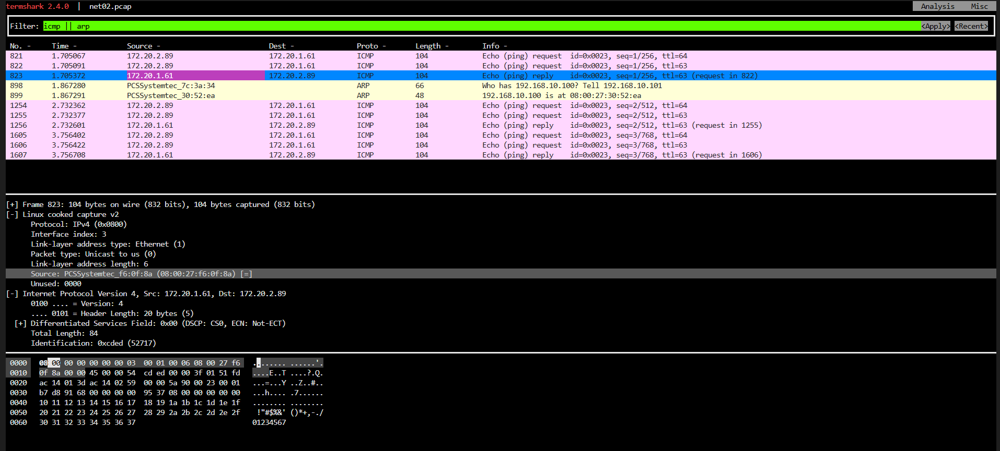

# native routing mode 실습

- 실습 구성에서 router 에는 w0, w1, ctr 노드에 할당된 pod cidr쪽으로 라우팅하도록 경로 설정이 되어 있지 않아서 curl-pod가 w0 에 배포된 web pod로 통신이 안됨


# Overlay netowrk mode

- overlay network 모드에서는 


# Service LB IPAM

- LB IPAM은 External IP 할당까지만 해준다.
- 기본적으로 클러스터 내부에서는 해당 IP로 바로 통신이 가능하다.
- 하지만, 외부에서 해당 IP로 통신하려면 L2 Announcement / BGP 기능 추가가 필요하다


## cilium-agent 정보 

- cilium agent 접속해서 ip 정보 확인하면 호스트의 인터페이스 구조가 동일하게 보임

- cilium-ctr 호스트 인터페이스 정보

  ```bash
  $ ip -c -br addr show
  lo               UNKNOWN        127.0.0.1/8 ::1/128 
  eth0             UP             10.0.2.15/24 metric 100 fd17:625c:f037:2:a00:27ff:fe6b:69c9/64 fe80::a00:27ff:fe6b:69c9/64 
  eth1             UP             192.168.10.100/24 fe80::a00:27ff:fe30:52ea/64 
  cilium_net@cilium_host UP             fe80::60c5:aeff:fef1:83ca/64 
  cilium_host@cilium_net UP             172.20.2.28/32 fe80::f04c:d8ff:fe04:dc41/64 
  lxc_health@if6   UP             fe80::6cdc:33ff:fe8d:f1df/64 
  lxcf3b98343c33e@if8 UP             fe80::3cb7:32ff:fef2:fc78/64 
  ```

- cilium-ctr의 cilium-agent 정보 조회

  ```bash
  $ kubectl get po -owide -A | grep ctr
  default              curl-pod                                  1/1     Running   2 (13h ago)     5d7h    172.20.2.15      cilium-ctr   <none>           <none>
  kube-system          cilium-envoy-v85ns                        1/1     Running   3 (13h ago)     6d8h    192.168.10.100   cilium-ctr   <none>           <none>
  kube-system          cilium-operator-65bf748b8d-82j8r          1/1     Running   2 (13h ago)     6d1h    192.168.10.100   cilium-ctr   <none>           <none>
  kube-system          cilium-zhgcg                              1/1     Running   2 (13h ago)     4d13h   192.168.10.100   cilium-ctr   <none>           <none>
  ```

- cilium-agent 인터페이스 정보

  ```bash
  # kubectl exec -it cilium-zhgcg -n kube-system -- ip -c -br addr show
  Defaulted container "cilium-agent" out of: cilium-agent, config (init), mount-cgroup (init), apply-sysctl-overwrites (init), mount-bpf-fs (init), clean-cilium-state (init), install-cni-binaries (init)
  lo               UNKNOWN        127.0.0.1/8 ::1/128 
  eth0             UP             10.0.2.15/24 metric 100 fd17:625c:f037:2:a00:27ff:fe6b:69c9/64 fe80::a00:27ff:fe6b:69c9/64 
  eth1             UP             192.168.10.100/24 fe80::a00:27ff:fe30:52ea/64 
  cilium_net@cilium_host UP             fe80::60c5:aeff:fef1:83ca/64 
  cilium_host@cilium_net UP             172.20.2.28/32 fe80::f04c:d8ff:fe04:dc41/64 
  lxc_health@if6   UP             fe80::6cdc:33ff:fe8d:f1df/64 
  lxcf3b98343c33e@if8 UP             fe80::3cb7:32ff:fef2:fc78/64
  ```

- cilium agent에서 관리되고 있는 endpoint 정보를 조회하면 라벨 중에 host, control-plane 으로 잡혀 있는 항목이 있는데, 이 엔드포인트 정보로 세부 정보를 조회할 경우 cilium_host 인터페이스 정보가 확인된다.

  ```bash
  c0 endpoint get 3315 | grep -A20 networking
        "networking": {
          "addressing": [
            {}
          ],
          "host-mac": "f2:4c:d8:04:dc:41",
          "interface-name": "cilium_host",
          "mac": "f2:4c:d8:04:dc:41"
        },
  ```

- MAC Address 가 같은 걸 확인할 수 있다.

  ```bash
  $ ip -c addr | grep -A5 cilium_host@
  5: cilium_host@cilium_net: <BROADCAST,MULTICAST,NOARP,UP,LOWER_UP> mtu 1500 qdisc noqueue state UP group default qlen 1000
      link/ether f2:4c:d8:04:dc:41 brd ff:ff:ff:ff:ff:ff
      inet 172.20.2.28/32 scope global cilium_host
        valid_lft forever preferred_lft forever
      inet6 fe80::f04c:d8ff:fe04:dc41/64 scope link 
        valid_lft forever preferred_lft forever
  ```


- lxc_health의 ip는 각 노드의 상태 정보를 agent에서 확인하기 위해 구성되는 노드의 veth 다.
- 아래 명령으로 검색해보면 수시로 agent가 상태검사를 하고 잇는 것을 볼 수 있다.

```
k logs -n kube-system cilium-zhgcg | grep Ping
k logs -n kube-system cilium-zhgcg | grep "direct route"
```


## ebpf connection flow

- cilium_host, cilium_net 인터페이스에 적용된 프로그램 정보 조회

```bash
root@cilium-ctr:~# c0bpf net show | grep cilium_host
cilium_host(5) tcx/ingress cil_to_host prog_id 621 link_id 13 
cilium_host(5) tcx/egress cil_from_host prog_id 629 link_id 14 
root@cilium-ctr:~# c0bpf net show | grep cilium_net
cilium_net(4) tcx/ingress cil_to_host prog_id 638 link_id 15 
```

- 프로그램 ID 값을 기준으로 정보 조회


```bash
root@cilium-ctr:~# c0bpf prog show id 621
621: sched_cls  name cil_to_host  tag bd1e63099132556c  gpl
        loaded_at 2025-08-03T22:01:14+0000  uid 0
        xlated 344B  jited 201B  memlock 4096B  map_ids 35
        btf_id 279
root@cilium-ctr:~# c0bpf prog show id 638
638: sched_cls  name cil_to_host  tag bd1e63099132556c  gpl
        loaded_at 2025-08-03T22:01:14+0000  uid 0
        xlated 344B  jited 201B  memlock 4096B  map_ids 35
        btf_id 298
```

- cil_to_host 함수에서 사용하는 BTF 데이터 타입 정보 조회 (btf_id 값 이용 조회)

```bash
$ bpftool btf dump id 298 format raw
[1] FUNC 'cil_to_host' type_id=20 linkage=global
[2] INT 'int' size=4 bits_offset=0 nr_bits=32 encoding=SIGNED
[3] INT 'unsigned int' size=4 bits_offset=0 nr_bits=32 encoding=(none)
[4] TYPEDEF '__u32' type_id=3
[5] INT '__ARRAY_SIZE_TYPE__' size=4 bits_offset=0 nr_bits=32 encoding=(none)
[6] ARRAY '(anon)' type_id=4 index_type_id=5 nr_elems=5
[7] ARRAY '(anon)' type_id=4 index_type_id=5 nr_elems=4
[8] FWD 'bpf_flow_keys' fwd_kind=struct
[9] PTR '(anon)' type_id=8
[10] UNION '(anon)' size=8 vlen=1
        'flow_keys' type_id=9 bits_offset=0
[11] INT 'unsigned long long' size=8 bits_offset=0 nr_bits=64 encoding=(none)
[12] TYPEDEF '__u64' type_id=11
[13] FWD 'bpf_sock' fwd_kind=struct
[14] PTR '(anon)' type_id=13
[15] UNION '(anon)' size=8 vlen=1
        'sk' type_id=14 bits_offset=0
[16] INT 'unsigned char' size=1 bits_offset=0 nr_bits=8 encoding=(none)
[17] TYPEDEF '__u8' type_id=16
[18] STRUCT '__sk_buff' size=192 vlen=34
        'len' type_id=4 bits_offset=0
        'pkt_type' type_id=4 bits_offset=32
        'mark' type_id=4 bits_offset=64
        'queue_mapping' type_id=4 bits_offset=96
        'protocol' type_id=4 bits_offset=128
        'vlan_present' type_id=4 bits_offset=160
        'vlan_tci' type_id=4 bits_offset=192
        'vlan_proto' type_id=4 bits_offset=224
        'priority' type_id=4 bits_offset=256
        'ingress_ifindex' type_id=4 bits_offset=288
        'ifindex' type_id=4 bits_offset=320
        'tc_index' type_id=4 bits_offset=352
        'cb' type_id=6 bits_offset=384
        'hash' type_id=4 bits_offset=544
        'tc_classid' type_id=4 bits_offset=576
        'data' type_id=4 bits_offset=608
        'data_end' type_id=4 bits_offset=640
        'napi_id' type_id=4 bits_offset=672
        'family' type_id=4 bits_offset=704
        'remote_ip4' type_id=4 bits_offset=736
        'local_ip4' type_id=4 bits_offset=768
        'remote_ip6' type_id=7 bits_offset=800
        'local_ip6' type_id=7 bits_offset=928
        'remote_port' type_id=4 bits_offset=1056
        'local_port' type_id=4 bits_offset=1088
        'data_meta' type_id=4 bits_offset=1120
        '(anon)' type_id=10 bits_offset=1152
        'tstamp' type_id=12 bits_offset=1216
        'wire_len' type_id=4 bits_offset=1280
        'gso_segs' type_id=4 bits_offset=1312
        '(anon)' type_id=15 bits_offset=1344
        'gso_size' type_id=4 bits_offset=1408
        'tstamp_type' type_id=17 bits_offset=1440
        'hwtstamp' type_id=12 bits_offset=1472
[19] PTR '(anon)' type_id=18
[20] FUNC_PROTO '(anon)' ret_type_id=2 vlen=1
        'ctx' type_id=19
```


## cil_to_host 함수 조회

- to-host 함수는 cilium_host, cilium_net 인터페이스에 할당된다.

```bash
int cil_to_host(struct __ctx_buff *ctx)
{
	__u32 magic = ctx_load_meta(ctx, CB_PROXY_MAGIC);
	__u16 __maybe_unused proto = 0;
	struct trace_ctx trace = {
		.reason = TRACE_REASON_UNKNOWN,
		.monitor = 0,
	};
	int ret = CTX_ACT_OK;
	bool traced = false;
	__u32 src_id = 0;
	__s8 ext_err = 0;
```

- `cil_to_host` 함수 분석

  ```c
  int cil_to_host(struct __ctx_buff *ctx)
  ```

  - int는 cil_to_host가 반환하는 데이터의 타입이다.
  - cil_to_host는 함수의 이름이다.
  - `struct`는 C언어에서 서로 다른 여러개의 데이터 타입(정수, 문자, 배열 등)을 커스텀하게 정의할 때 사용되는 구조체다.
  - `*`를 지정해서 `__ctx_buff`라는 이름의 `struct` 구조체가 저장된 메모리의 주소를 ctx 포인터 변수를 생성한다. (ctx에 __cux_buff의 메모리 주소가 저장된다.)
  - 이 후부터 __ctx_buff 구조체의 메모리 주소에 접근할 때 함수 내에서는 ctx 변수명을 이용한다.
  - `cil_to_host()` 함수는 커널의 TC 훅(Hook) 포인트에서 네트워크 트래픽이 발생하여 트리거될 때, 커널에서 보내주는 네트워크 패킷 컨텍스트의 주소를 `__ctx_buff` 포인터로 받아서 사용한다.

- 함수 내부의 첫 부분을 보면 `ctx_load_meta()` 함수를 이용해서 실제로 사용할 __u32 타입의 magic이라는 변수를 생성해서 ctx 안의 특정 값을 사용하는 것을 볼 수 있다.

    ```c
    #include </bpf/ctx/skb.h>
    ...
    {
      __u32 magic = ctx_load_meta(ctx, CB_PROXY_MAGIC);
      ...
    ```

  - `ctx_load_meta()` 함수에 ctx 값을 전달해서 return 받은 값을 magic에 저장해서 사용하게 되는데 magic 변수의 데이터 타입이 __u32다.
  - `ctx_load_meta()` 함수는  `/var/lib/cilium/bpf/include/bpf/ctx/skb.h` 코드에 할당되어 있고 `bpf_host.c` 파일의 상단에서 include 되어 있다.
  - `ctx_load_meta()` 함수의 내부를 보면 `ctx` 포인터 변수를 전달 받아서 `__sk_buff` 구조체의 내부에 있는 `cb[]`배열의 값을 `->` 기호로 접근해서 가져온다.
  - `cb[]` 배열 안에서도 off 라는 인덱스에 저장된 값을 가져와서 `ctx_load_meta` 함수를 호출한 곳으로 return 한다.

      ```bash
      ctx_load_meta(const struct __sk_buff *ctx, const __u32 off)
      {
        return ctx->cb[off];
      }
      ```

  - 여기서 인덱스 값으로 사용되는 `off` 값은 `ctx_load_meta()`함수를 실행할 때 전달하는 `CB_PROXY_MAGIC` 변수임을 알 수 있는데,
  - 이 값은 eBPF에서 커널 코드와 통신할 때 사용되는 사전에 정의된 상수 값으로 추정된다.
  - 사전에 정의된 상수 값들은 `/var/lib/cilium/bpf/lib/common.h` 파일에 정의되어 있다.

- 그 다음 몇 가지의 변수들을 추가로 초기화 한다.

  ```c
  __u16 __maybe_unused proto = 0;
  struct trace_ctx trace = {
		.reason = TRACE_REASON_UNKNOWN,
		.monitor = 0,
	};
	int ret = CTX_ACT_OK;
	bool traced = false;
	__u32 src_id = 0;
	__s8 ext_err = 0;
  ```

  - `__maybe_unused` 지시자는 `proto` 변수가 미사용 될 경우 경고 메세지를 생성하지 않도록 설정할 때 사용한다.
  - `trace_ctx` 구조체 타입의 변수 trace를 생성한다.
  - trace 변수 내부의 `reason`, `monitor` 멤버의 값을 0 또는 `TRACE_REASON_UNKNOWN` 값으로 초기화 한다.
  - 나머지도 동일한 형식으로 변수를 초기화 한다.


## termshark 



```bash
 k get po -owide
NAME                      READY   STATUS        RESTARTS        AGE     IP             NODE         NOMINATED NODE   READINESS GATES
curl-pod                  1/1     Running       5 (3h44m ago)   7d1h    172.20.2.40    cilium-ctr   <none>           <none>
pod-01                    1/1     Running       1 (3h44m ago)   4h44m   172.20.2.89    cilium-ctr   <none>           <none>
pod-02                    1/1     Running       1 (3h44m ago)   4h44m   172.20.2.80    cilium-ctr   <none>           <none>
```

- PCSSYSTEMtec_ MAC 주소의 정체

  - PCSSYSTEMtec_ MAC(OUI) 주소는 "08:00:27"로 시작하는 MAC 주소
  - MAC 주소의 앞 6자리는 제조사 코드 (OUI)이며, 뒤 6자리는 장치 고유 식별 코드
  - 뒤에 붙는 나머지 MAC 주소는 물리장치의 고유 식별 코드


    


# flannel test


- 각 서버의 정보 조회
```bash
#k get po -owide
NAME                      READY   STATUS    RESTARTS        AGE     IP            NODE          NOMINATED NODE   READINESS GATES
curl-pod                  1/1     Running   0               8m32s   10.244.0.7    flannel-ctr   <none>           <none>
webpod-697b545f57-7rsn9   1/1     Running   4 (9m35s ago)   22d     10.244.2.16   flannel-w2    <none>           <none>
webpod-697b545f57-85vnd   1/1     Running   4 (16m ago)     22d     10.244.1.6    flannel-w1    <none>           <none>
# k get svc
NAME         TYPE        CLUSTER-IP     EXTERNAL-IP   PORT(S)   AGE
kubernetes   ClusterIP   10.96.0.1      <none>        443/TCP   22d
webpod       ClusterIP   10.96.65.151   <none>        80/TCP    22d
```

- curl-pod 에서 cluster type service의 도메인 정보로 통신 시도하면 응답이 온다.
```bash
#k exec -it curl-pod -- curl webpod
Hostname: webpod-697b545f57-85vnd
IP: 127.0.0.1
IP: ::1
IP: 10.244.1.6
IP: fe80::6c9c:39ff:fe9d:c5e5
RemoteAddr: 10.244.0.7:35830
GET / HTTP/1.1
Host: webpod
User-Agent: curl/8.14.1
Accept: */*
```


- 최초 10.96.0.10 으로 DNS 질의 시도 후 webpod service ip로 통신 시도하는 것 확인
- dump에 찍히는 ip는 pod의 ip가 아니라 service ip가 찍힘
- webpod service ip `10.96.65.151` 그대로 찍어도 마찬가지
```bash
# k exec -it curl-pod -- tcpdump -i any -q -nn
13:35:38.166570 eth0  Out IP 10.244.0.7.36701 > 10.96.0.10.53: UDP, length 73
13:35:38.166648 eth0  Out IP 10.244.0.7.36701 > 10.96.0.10.53: UDP, length 73
13:35:38.167349 eth0  In  IP 10.96.0.10.53 > 10.244.0.7.36701: UDP, length 121
13:35:38.167453 eth0  In  IP 10.96.0.10.53 > 10.244.0.7.36701: UDP, length 166
13:35:38.167540 eth0  Out IP 10.244.0.7.35830 > 10.96.65.151.80: tcp 0  # 10.96.65.151 == webpod service ip(cluster type)
13:35:38.167984 eth0  In  IP 10.96.65.151.80 > 10.244.0.7.35830: tcp 0
13:35:38.168019 eth0  Out IP 10.244.0.7.35830 > 10.96.65.151.80: tcp 0
13:35:38.168058 eth0  Out IP 10.244.0.7.35830 > 10.96.65.151.80: tcp 70
13:35:38.168208 eth0  In  IP 10.96.65.151.80 > 10.244.0.7.35830: tcp 0
13:35:38.168503 eth0  In  IP 10.96.65.151.80 > 10.244.0.7.35830: tcp 318
13:35:38.168511 eth0  Out IP 10.244.0.7.35830 > 10.96.65.151.80: tcp 0
13:35:38.168618 eth0  Out IP 10.244.0.7.35830 > 10.96.65.151.80: tcp 0
13:35:38.168772 eth0  In  IP 10.96.65.151.80 > 10.244.0.7.35830: tcp 0
13:35:38.168776 eth0  Out IP 10.244.0.7.35830 > 10.96.65.151.80: tcp 0
```

- 10.96.0.10 은 coredns의 service ip
```bash
k get svc -A -owide | grep 10.96.0.10
kube-system   kube-dns     ClusterIP   10.96.0.10     <none>        53/UDP,53/TCP,9153/TCP   22d   k8s-app=kube-dns
```


- 특정 webpod로 보내면?
```bash
# k exec -it curl-pod -- curl 10.244.2.16
Hostname: webpod-697b545f57-7rsn9
IP: 127.0.0.1
IP: ::1
IP: 10.244.2.16
IP: fe80::20c5:22ff:fea7:7046
RemoteAddr: 10.244.0.7:57976
GET / HTTP/1.1
Host: 10.244.2.16
User-Agent: curl/8.14.1
Accept: */*
```
```bash
14:01:26.687401 eth0  Out IP 10.244.0.7.57976 > 10.244.2.16.80: tcp 0
14:01:26.687980 eth0  In  IP 10.244.2.16.80 > 10.244.0.7.57976: tcp 0
14:01:26.688004 eth0  Out IP 10.244.0.7.57976 > 10.244.2.16.80: tcp 0
14:01:26.688054 eth0  Out IP 10.244.0.7.57976 > 10.244.2.16.80: tcp 75
14:01:26.688312 eth0  In  IP 10.244.2.16.80 > 10.244.0.7.57976: tcp 0
14:01:26.688973 eth0  In  IP 10.244.2.16.80 > 10.244.0.7.57976: tcp 324
14:01:26.688985 eth0  Out IP 10.244.0.7.57976 > 10.244.2.16.80: tcp 0
14:01:26.689350 eth0  Out IP 10.244.0.7.57976 > 10.244.2.16.80: tcp 0
14:01:26.689587 eth0  In  IP 10.244.2.16.80 > 10.244.0.7.57976: tcp 0
14:01:26.689593 eth0  Out IP 10.244.0.7.57976 > 10.244.2.16.80: tcp 0
14:01:31.768957 eth0  In  ARP, Request who-has 10.244.0.7 tell 10.244.0.1, length 28
14:01:31.768998 eth0  Out ARP, Reply 10.244.0.7 is-at fe:d7:62:a7:ae:53, length 28
14:01:31.769952 eth0  Out ARP, Request who-has 10.244.0.1 tell 10.244.0.7, length 28
14:01:31.770105 eth0  In  ARP, Reply 10.244.0.1 is-at ae:71:7c:a9:15:0a, length 28
```